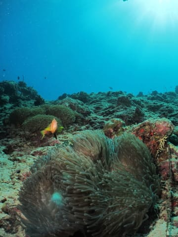

# 2012年　子連れモルジブ　ダイビング旅行記　その12

📅 投稿日時: 2012-10-31 00:47:06

🏷️ カテゴリ: [ダイビング日記](ce3a7a8d424d112fce83ee85c81a0e344.md)

あー．

なんだか．

スキーレポートと交互に，ダイビングレポートが入っていて．

見事に季節感を失わせるブログと化してますが．

まぁ，春と秋が無い，私の行動パターンが見事に現れてますね…

ってことで．

また，モルジブレポートの続き，行きます…

-------

って感じで．

3日目の1本目，ネリバル・ティラへエントリー．

エントリー後，-25m程度の砂地に下りますが…

ををっ！

ここは，ハゼ天国ではないかっ！

赤い涙を流しているような，モルジブ固有種のオーロラゴビーをはじめ…

白黒シマシマのドラキュラゴビーなど．

ハゼポイント～（はぁと），天国っ！

って喜びながら．

我がダイコンの「ダイ子ちゃん」は，まだ無限圧潜水時間をたっぷり示していたので．

ついつい深場でいっぱいハゼを撮影してしまっていた私だった…．

んで，次は緩やかなスロープに沿って深度を上げて行きます．

うーん．

もう少し透明度がいいとうれしいんだけどな～．

まぁ，透視度15m．雨季のモルジブの平均かな．

基本的には，魚影が濃いんですけどね～．

もう少し抜けててくれるといいなぁ．

あとは，このあたりの平均的なキンギョハナダイの群れやら…

ハナビラクマノミさん．

モンハナシャコ

オオモンカエルアンコウ君

…黒いのは写真栄えしないなぁ…

なんかを見つつ，深度をさらに上げて行きますが．

なんだか．最後の安全停止で．

残圧30を思いっきり切っているんですけど～っ！

し，しまったっ！

…ハゼポイントのボトムで，粘りすぎた…

安全停止をかねた，最後の5mでの5分間．

残圧計が，限りなく0に近づいていくのをひやひや見ながら．

「エグジットサイン，まだか～」

と，ガイドが浮上サインを出すのをドキドキで待つ間．

残圧系は0をさしたけど．

とりあえず，まだエアが出る状態で浮上サイン．

た，助かった～．

浮上途中に，エアがほぼ止まっちゃったけど，そのときには水深1m．

何とか無事に浮上！

＃無事じゃないだろ

ということで．

本日は1本目から，ちょっと違う意味でのエキサイティングダイビングだったのでした．

＃一応，バディのオクト(予備エア)はいつでも確保できるポジションにはいましたが…

＃よい子はまねをしないように
