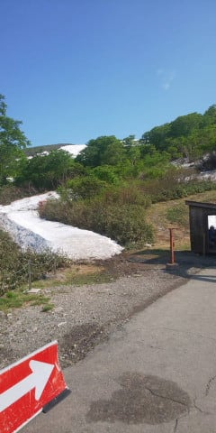
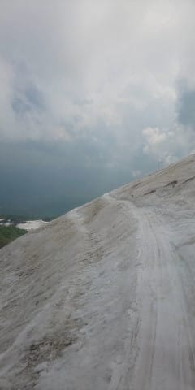

# 6月5日(金)の月山スキー場の状況，特派員の方から写真を送ってもらいました…！

📅 投稿日時: 2020-06-08 00:07:39

この週末．

…疲れていたのか，なぜか土曜は

11時間，そして日曜は14時間も寝て

しまった…

という．

なぜそんなに寝られるのか不思議なほど

寝てしまった週末でした…

で．

昼間はまぁまぁ天気が良かったので，

バイクでお出かけしてきたのですが．

娘も「私もバイクに乗りたい！！」

とのことで．

娘をタンデムシートに乗っけて

ちょっと走ってきました…

中学生になっても，まだ父親と一緒に

バイクに乗ってくれるとは．

有り難いことです…

途中，普段ならかなり混雑している

某所を通り過ぎた際，

全く人がおらずガラガラだったので，

ちょっと立ち寄ってみたり．

ここしばらく，ずっと家に籠っていた

娘も私も，久しぶりに自然の空気に

触れられて，リフレッシュできました…

ってなことで，本題へ．

今さら感もありますが，先週金曜に月山で

滑ってきたという特派員の方が，

人づてで私に写真を送ってくださいました～！

特派員の方，ありがとうございます…

というわけで．

本日は，6月5日（金）の月山の写真をば…

まず．

月山のリフトの山麓駅舎前ですが…

うーむ．

例年に比べると，雪が少ないか…

リフトは，残念ながらもう板を脱いでの

乗り降りとなるようです（涙）

6月の第1週くらいなら，まだ板を

履いて乗り降りできる年も多いん

ですけどね…

ただ，リフト乗り場前までは滑って

来れるようですね～．

とはいえ．

リフト乗り場までのこの一本道．

雪が消える時は一気に消えるので．

うーん．あと1週間もってくれれば

上出来という感じかな…

で．

雪の多い年には，この時期でもリフト降り場に

雪がありますが．

今年はダメみたいですね…

月山看板の下，完全に雪が消えてます（涙）

リフト降り場から，ここまで歩いて

登ってこないと雪にたどり着けません…

で．

ゲレンデですが…

沢コースはまだ問題なく行ける

みたいですね．

大斜面へのトラバースコースですが，

例年一番最初にヤバくなる部分．

もう結構土が出てきてますね…（涙）

でも，トラバースコースはクラックも

入ってないみたいで…

大斜面もまだ6月上旬なので．

全然大丈夫そうですね…！！

大斜面の途中部分も，まだまだ雪は

大丈夫そうですが…

金曜日ってこともあり，人が少ないからか，

コブはそれほど深くなっていない

感じに見えますね．

大斜面全体の写真はこんな感じですが．

昨年の6月9日の写真はこんな感じなので…

まぁ，大体去年と同じくらいの感じなのかな？？

でも，[去年は6月9日でも，板を履いてリフトに
乗り降りできた](ed53b0cebf70638a49d4da46aaccdbd8c.md)んだけどなぁ…

ってなことで．

なんとなく，昨年と同じ程度の雪は

残ってそうな月山．

昨年は，6月26日まで大斜面が滑れたので．

…このままならば，今シーズンもなんとか

6月20日の週まで，大斜面で滑れるはず！（祈）

## 💬 コメント一覧

### 💬 コメント by (おばりん)
**タイトル**: Unknown
**投稿日**: 2020-06-09 10:21:53

少ないですね。

コブじゃなくてミゾです。

少ない面積にミゾを掘るのはやめて欲しいです。

コブは自然に出来ます。昔は全面がコブになった…

私的に哀れな月山です。

### 💬 コメント by (オヤジスキーヤー)
**タイトル**: Unknown
**投稿日**: 2020-06-09 22:09:30

数年ぶりにコメントしてを…

月山雪解け早し！です

自身先週木曜にも行って、本日も。ガーン！リフト小屋迄の道、ほぼ雪無くなりました。滑り出し部分も先週より上に…そして、大斜面中央下部藪更に進出…

沢コースから乗り場への分岐の所に岩が頭をだしてます

早目に是非お越し下さい

### 💬 コメント by (Skier_S)
**タイトル**: 月山，やっぱり雪が少ない感じですか…
**投稿日**: 2020-06-10 02:43:40

＞おばりんさま

そうですね…大斜面は，コブというよりライン溝になりますね．

あの斜面と雪質だと，滑るとすぐコブになるので，

溝を掘るつもりが無くてもコブコブになりますよね…

＞オヤジスキーヤーさま

をを！数年ぶりのコメント，ありがとうございます！

月山行ってらしたんですね…

もう，リフト乗り場までの雪消えそうですか！

…20日は，リフト降りてからと乗るまでにかなり歩く

最終形態になってそうですね…（涙）

沢コースもあと数日で終わりでしょうか．

20日は，大斜面滑れたとしても藪漕ぎ必須かな…（泣）

### 💬 コメント by (オヤジスキーヤー)
**タイトル**: Unknown
**投稿日**: 2020-06-10 04:40:19

雪が少ないのにここ数日の暑さのせい…？

藪軍の勢力恐るべし！です

とは言え、徒然スキーヤー様がいらっしゃる迄何とか持ちこたえる事祈念致します

自身、東北在住なのですが、未だ自粛対象エリアナンバー車普通に居ます

大半の方は、徒然スキーヤー様の様にきちんとルールを守って自粛して下さってるのに…

気持ちは分かるんですが、我慢して来た身としては…

モラルの問題ですね

### 💬 コメント by (Skier_S)
**タイトル**: ＞オヤジスキーヤーさま
**投稿日**: 2020-06-11 03:56:52

これから1週間，さらに気温上がりそうなので．

雪，解けちゃいそうです…（涙）

うーむ．

月山，自粛対象ナンバー車が結構いるんですか！？？

…東北在住で，引っ越しか何かで自粛地ナンバーの人だと

信じたいところ…

