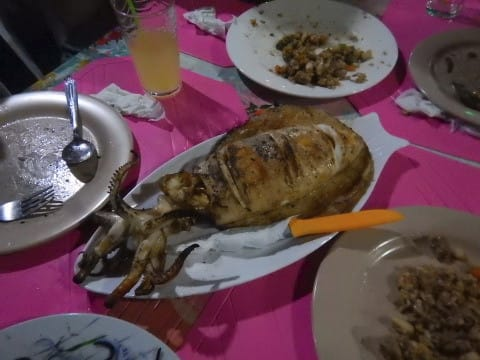

# 2018年8月，モアルボアルで小5の娘をダイバー化！その10…ダイビング1日目終了！

📅 投稿日時: 2019-07-20 01:42:22

ってなわけで．

車（?）記事を一回挟みましたが．

本日もダイビング日記です～！

---

ということで．

エグジットしたのは，ショップの

目の前．

ショップに係留されているボートに

一旦上がって．

最後は，また器材の片付けの練習．

そうそう．

ファーストステージのダストキャップを

忘れないようにね！

で．

まだまだ講習は続きます．

このあとは，ショップへ戻り．

今度は，器材のメンテナンス．

洗い方を教わってますね…

そうですよ～．

BCの洗い方はちゃんと

習っておかないと…

さらにそのあとは，今日の復習と

ログブックの記録と，

やることはてんこ盛り．

…ってな感じで．

今日の実習，すべて終了！

いやーー．

小学生に，Cカード取得は難しいかな～？

と思ってたけど．

自宅でe-Learningでやった学科は

難しかったものの．

現地の実習は，インストラクターのアサミさんが

良かったのか，

小学生でも全然問題ないな．

むしろ，娘は今日一日，すごい楽しんでた

みたいだったなぁ…

という感じで．

一旦ホテルへ戻ったあと．

シャワーを浴びたら，

今日潜ったメンバーと落ち合って，

夜ご飯を食べに，Go!

やってきたお店は，モアルボアルに来たら

必ず寄る，Little Corner.

シーフードのおいしいお店です！

ここに来たら絶対に頼むべき，

超濃厚なネットリしたイカスミが

大量にまぶされている，イカスミ

スパゲッティ―は外せないし…

大量に盛られたチャーハン．

そして，今日はイカがお勧めということで．

イカのグリルをいただいて…

今日潜ったメンバーで，

一日を振り返りながら過ごしたのですが．

もう，この日の話題は，

ジンベエザメとの遭遇に尽きましたね…

もう，ジンベエザメ以外，何見たっけ？

って感じだったけど．

…目の前をゆったりと泳いで行った

ジンベエの話に盛り上がりながら，

夜遅くまで，みんなで語り続けたのでした…
