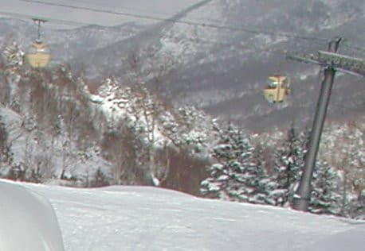

# 焼額山スキー場の歴史を振り返ってみる5…平日運休などが増えたものの．何とか頑張った2007年まで

📅 投稿日時: 2020-09-30 01:03:28

🏷️ カテゴリ: [スキー雑談](c1f9d2cb7478308da16419928ea3945e9.md)

ということで．

[第1回](ecf9ef2318d00e5a9f4905a77d965f4f6.md)　オープン直後の焼額

[第2回](ecbab91b3def3f225ca2f665143d0d3fc.md)　バブル時代の第2ゴンドラ側ができるまで

[第3回](ee5b743600a6fe727ce465ad2a03c1625.md)　オリンピックまでの拡大期

[第4回](ed91f8f5b9a240a0fb9ec5089bf2122a3.md)　志賀全域の，1999年と現在の比較

と，語り続けてきた焼額山スキー場の

歴史．

これまでは，順調に拡大を続け．

長野オリンピックでピークを迎えた

ころまでの歴史でしたが．

1993年ごろには就職氷河期も始まり，

1997年に山一證券も破綻するなど，

1998年の長野オリンピックの頃には，すでに

景気後退によるスキー客減少が進んでいて．

お客さんが減っていくのにつれ．

高速リフトに比べると，搭乗率が

目立って減っていったペアリフト．

とみにオリンピックが終わってから，

お客さんががっくりと減ってしまった

ペアリフトは，休日のみ運転とか，

繫忙期のみ運転とか，営業する日数が

だんだん減っていき．

2000年以降は，1ロマ，2ロマ，3ロマ，

5ロマはよっぽどな繫忙期じゃないと，

動いているのをほとんど見ないような

状況になってきていたのでした…

そして，衝撃の2002年を迎えます…！

○19年目　2002シーズン

なんと．

2ロマBの廃止を除くと，

これまで拡大一方だった焼額山．

…ついに，焼額のリフトが1本，マップから

抹消されました…っ！！

…そして，焼額マニアッククイズ～！

これが，2002年のマップですが

焼額で一番最初に運休になったのは，

どのリフトだったのでしょうか！？？

…分かりにくいかもしれないので，

焼額山単独のスキーマップの向きと

合わせてみましょう…

実は，リフトが1本マップから落ちた

だけじゃなく．

いくつかのコースがマップから消えてます！

正解は…

そうです！水色で示した第3ロマンスと，

赤色で示したそれを挟む2本のコース，

第3ロマンスAコースと第3ロマンスBコース

が，マップから抹消されたのでした！

ってなことで．焼額マップから一番最初に

消えたのは，第3ロマンスだったのですが…

左側の2000年マップと右の2002年マップを

比べると．

水色で囲った2本のコースが完全に抹消され．

矢印で示した第3ロマンスも消されてます…

実はこの数年後に，第3ロマンスリフトと

Aコースは，奥志賀連絡用として復活する

のですが．

一度はGSコース途中から奥志賀へ滑り込む

奥志賀連絡コースは，完全無整備で放置

されていたのでした…！

奥志賀へは，山頂を歩いて行き来する

しかなくなり．

すごい不便だった思い出があります…

あ，あと．

2002年のマップを見て気づくように，

サウス側の第4ロマンスから，ナイターマークが

消えました．

ナイターはイースト側，第3高速1本のみに

なりました…

…そうそう，あと，この年だったか

この前の年に，

第2高速横

アリエスカ→レストラン獅子にリニューアル

2ロマ前

1F:和食ななかまど，2F:獅子→1F和食ななかまど，2F:無料休憩所

になったんじゃなかったかな…

（このあたり，記憶あいまい）

ということで．

ついに，焼額山の規模縮小が始まったのか…？

という，戦慄が走った年だったのでした．

○20年目　2003シーズン

全体的な縮小傾向で，寂しさが忍び寄り始めた

2002シーズンとはうって変わり．

この年，焼額好きを狂喜乱舞させるGoodニュースが

飛び込んできたのでした…

それは．

焼額第1ゴンドラが．

4人乗りから8人乗りに架け換えられました！！！！

（4人乗りの旧第1ゴンドラ）

（今なじみの8人乗り第1ゴンドラ）

輸送力が一気に倍以上に上がるとともに，

速度も4m/sから6m/sに1.5倍！

山頂まで9分近くかかっていたものが，

5分ちょいで到着するようになり．

「めちゃくちゃ速い…！！」

と，感動した思い出があります．

（今は減速運転が通常になったので，山頂まで7－8分かかるけど）

八海山や富良野スキー場が，ゴンドラを廃止して

ロープウェーに架けかわっていく中，

焼額はよくも新型ゴンドラにかけ替えてくれたものよ…

と，みんなで感激したものです．

…私が1ゴンの住人になったのは，この年からです（笑）．

○21年目　2004シーズン

この年は2003シーズンと何も変わらず．

3ロマが抹消された以外，すべてのリフトは

マップには残っているけど．

相変わらず1ロマ，5ロマはほぼ

営業されない年でした…

確か，この年かその前の年から，

2ロマ沿いのコースはパークとして

営業をするようになり．

2ロマだけはちゃんと運転していた

思い出があります…

○22年目　2005シーズン

実質上，1ロマA，Bと5ロマはもう

廃止になったも同然だな…

と思い始めてきたこの年．

Goodニュースが！

なんと．3ロマ復活！！

それと同時に，廃止になった

第3ロマンスA，Bコースが奥志賀

連絡用コースとして復活！

搬器が残っていたので，復活するん

じゃないかな～．

と，かすかに期待していただけに，

復活は嬉しかったですね～！！！

滑走用コースとしてではなく，

奥志賀と行き来するためにコース1本，リフト

1本復活させた感じですね…

○23年目　2006シーズン～24年目　2007シーズン

この年は，2005シーズンと変わらず．

3ロマが復活し，コースマップ上は

ピークの11本体制に戻ったけど．

相変わらず1ロマA，Bと5ロマは動いてるのを

見たことなく，ほぼ廃止状態の年でした…

あ，オリンピックコースからミドルコース上部へ

下りる，焼額で最高の非圧雪コースだった，

今は無きエキスパートコースがオープンしたのは

このあたりの時期だった気がします．

この頃のマップを見ると，今よりも

リフトがいっぱいあったんだな～…

って感じがしますね（笑）．

このマップを見ると，この年は

今の奥志賀連絡コースはオープンせず，

第3Bコース(今のGSコースのコブの先に

続いていたコース)だけオープンして

いたんだったかな？

とりあえず．

バブルが崩壊した後も，2007年までは．

実質上の運休リフトはあったものの，

焼額スキー場のマップ上は，

最大時のリフト11本体制をキープ

し続けていたのでした…

（[まだ続く…次回](eb31fb252fb6d7fa185336a9d094eaf1a.md)は現在の5本体制になるまでの最終回！）

## 💬 コメント一覧

### 💬 コメント by (FCAMEL)
**タイトル**: 焼額山前史
**投稿日**: 2020-09-30 02:55:54

お久しぶりです。FCAMELです。 

遅ればせながらですが、私もこのシリーズとても楽しく拝見しています。 

いろいろ疑問に思っていたことが解決して楽しいですね。ありがとうございます。 

そこでSさんの企画に花を添える（？）勝手タイアップ企画「焼額山前史」をふんだんな収集資料を駆使してコメント欄で実施 しようと思ったのですが、コメント欄って画像貼れなんですね、、、断念しました。残念。

で、概要だけ

志賀高原のスキーリゾートとしての開発は和合会設立の昭和2年頃から始まるのですが、

手元にある昭和8年の鉄道局のスキー案内地図「志賀高原を中心として」にはすでに焼額山がツアーコースとして記載されています。

当時焼額山から奥志賀にかけてはスキーフィールドというよりはツアーコースなのですが、地図上高天が原から焼額山までひかれているスキーコースは、、、そう、現在のパノラマ、白樺コースです。

ほとんどスキーのできない小林秀雄が深田久弥に連れられ「天狗の湯」主人の主催したツアーに参加、発哺から焼額山、奥志賀を経てカヤノ平を目指し、遭難しかけたのがこの頃です（昭和7年）。

Sさんの記事で現在の焼額山が東側から開発されたことはよくわかったのですが、焼額山の元祖スキーコースはやはりパノラマ、白樺といえるのではないでしょうか！！！　（←だからなんなんだ）

### 💬 コメント by (アリス)
**タイトル**: 焼額山の歴史
**投稿日**: 2020-09-30 11:52:54

Skier_S様

焼額山のオープン～現在までの歴史が全容を理解できました。

昔は第三ロマンスで奥志賀との往復が可能だったとは・・・

今は、GSコースから滑り込み、帰りは頂上をスケーテイングでハアハア言いながら漕ぎで・・・

志賀高原へ来るスキーヤーは皆さん体力があるんだな～と感心していましたが、途中からだったんですね。

オリンピックコースにもリフトが・・・これも驚きでした。

スキー産業を経営する側に立てば、衰退は残念ですが一スキーヤーとしては休日でもリフト待ちがないのは幸いですね。

### 💬 コメント by (Goku)
**タイトル**: Unknown
**投稿日**: 2020-09-30 19:06:21

今の八人乗りに１ゴンが変わったときは感動モノでしたね。

あまりの速さにビックリしました。

今ではほとんど減速運転で、MAXスピードにしてくれないのが残念です(T_T)

### 💬 コメント by (Skier_S)
**タイトル**: この記事書くのにすごい時間がかかってます（涙）
**投稿日**: 2020-10-01 00:32:02

＞FCAMELさま

お久しぶりです～！

歴史系と言えば，やはりFCAMELさん！

…でも，コメント欄，写真貼れないんです…

志賀高原，すでに昭和2年には開発されてたんですか．

それも，昭和8年には焼額までツアーしてたんですね…

発哺温泉くらいまでしか道が無かったと思うので，ものすごい山奥の

イメージですよね．

そして，パノラマ，白樺…

下るにはいいですが，そのコースで焼額山頂に登るのはきつそうですね（笑）．

＞アリスさま

そうなんです．

第3リフトで，奥志賀に簡単に往復できたんです．

…でも，第3ロマンスが長すぎて，乗ってるのが

かったるくなるので

第3をグルグル回したい…と思わないのが欠点で，

結局奥志賀から帰ってくる人のみのリフトになったのが

欠点だったでしょうか．

オリンピックコースの1ロマBは，ついこないだまで残ってた

イメージがあるので，驚かれる方にびっくりしてしまう感じです（笑）．

しかし，ホントにスキー場にもう少しお客さんが戻ってこないと，

ヤバいですよね…

＞Gokuさま

1ゴンが8人乗りじゃなかったら，私は志賀高原にここまで

通ってなかったかも…

トップスピードで1ゴンが動いていた頃が懐かしい…

またトップスピードで運転してほしいですね～…

