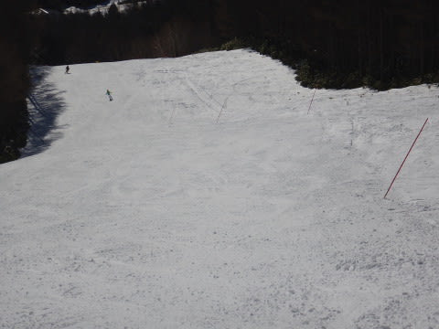

# 12月3日（日）の焼額はすっきり晴天！…だけど，おかげで人工雪の無いエリアはちょっと雪がヤバくなってきた

📅 投稿日時: 2017-12-05 01:13:45

🏷️ カテゴリ: [2018スキー滑走日記](c11b88dc181f34079ab41db74a3587646.md)

えー．

ニュースなんかでやってますが．

これからしばらく，寒い日が続きそうで．

特に，この図で赤矢印で示した，5日～7日の

期間，かなり冷えそう！

特に6日は，平年より6度ほど低いという

激冷えになりそうだし…

そして，水色で示した9日も，冷えますね！

…ただ．

しかし．

ところが．

気温は激冷えが続くというのに．

ずっと西風が続きそうな気配で．

志賀高原はあんまりドサドサ降らなさそうです…

雪は降るけど，そんなに積もらなさそう．

…白馬方面や日本海近辺のスキー場は積もる感じですが．

5日あたり，結構な積雪がありそうな感じですが．

志賀はあんまり積もらなさそう…（残念）

まあ．

でも．

人工降雪機はフル活動できる感じですし．

天然雪も全く積もらないわけでもないので．

今週末も，まぁまぁの冷え冷えコンディションで

楽しめそうかな～．

また詳細な天気予想は水曜深夜にやるとして．

本日は，日曜の志賀高原，詳細レポートをば…

えー．

まず．

朝イチの焼額第2ゴンドラオープン前の列に並んで，

山頂に向かうわけですが．

朝から晴天の今日，昨日より人がちょっと

多いかな？

山頂へ到着すると．

ふーむ．

気温は－3度ですか…

日曜は気温が上がるという予想通り，

土曜よりは気温が高めの朝ですね…

んでも．

見よ！！

この晴天ピカピカの朝イチのゲレンデを！！

そして，このシマシマ具合を！！

…いつもの年なら．

オープンのこの週は，人工降雪のエリアがぎりぎり

滑れるレベルで．

こんなに気持ちよい晴天シマシマを滑れるなんて，

普段のオープンの年では考えられないのだ！

いや，最高っ！

シマシマ最高！！

と．

思っていたものの…

今日も，人工降雪エリアには

ちょっと雪のコロコロが…（ちょい涙）．

まぁ．

でも，許す．

ゴンドラのコースを，この時期にこんな感じで

幅いっぱい滑れるんだから．

許す！←だから，なんでそんなに上から目線なの？

朝イチはコース上の人も少なく，超快適っ！

北アルプスもすっきり見えるし．

最高のスキー日和ですな！

と，思っていたら．

10時ごろには，ちょっと人が増えてきたかな…

でも，まあ幅いっぱい滑れるし．

ゴンドラ待ちも搬器2－3台程度待つくらいで，

そんな長い待ち時間はなかったし．

それほど気になる人口密度ではなかったかな～．

ただ．

気温が昼間にはプラスになり．

強い日差しが降り注いでいるので…

人工雪を打っていない，ゴンドラ山頂～

第2高速降り場までのパノラマコースの，

急斜面落ち込み部分．

……あり？？

ありりりりり～？？？

…かなり土が出てきました…（涙）

人工雪をつけてある，第2高速沿いの

唐松コースには，ブッシュはなかったのですが…

唐松コースは，朝は結構氷のコロコロが

ばらまかれている，ジャガイモ畑状態（残念）．

昼になると，南斜面で日当たりが良いので．

氷コロコロは緩みきって，滑りやすくなりましたが…

でも．

日当たりのよい南斜面の唐松コース．

最後の落ち込み部分は．

まだ，この写真の左半分しか雪がついてないのね…

だけども．

リフト乗り場近辺は完全真っ白だし．

リフトもガラガラで，悪くない感じ！

そして．

ゴンドラ側のコースの下半分，第4ロマンス降り場

より下のサウスコース．

ここも人工降雪があるので．

ブッシュの心配は無いけど．

下地が結構硬めで．

エッジを立ててない板だと，ところどころ

ズルッと行くところもあったかな～．

で．

午後も遅くになってくると．

コースがあれ始め．

その結果…

うぎゃーーー！！

人工雪のない急斜面部分．

さらにブッシュエリアが広がってきたよ…（涙）

こんなブッシュエリアが，そこかしこに

かなり広がってきて．

うーむ．

このまま降らなかったら，あと数日で

コースが滑れなくなりそうかも…

という感じ．

でも．

急斜面部分以外は，人工降雪が無くても

気持ちいい感じだし．

山頂付近は，午後になっても雪がいいままだったので．

うーん．

急斜面のブッシュエリアが，惜しいっ！！

ってな感じで．

一部惜しいところもあったけど．

終日晴天の，12月オープン週と考えれば

恵まれたコンディションで．

今日も日が暮れていく中．

ゲレンデに人がいなくなる，夕方の

ラストまで．

たっぷり滑って帰ったのでした…

…で．

この後．

一瞬，

まだ営業している一の瀬に，

また瞬間移動しようか…？

…と，思ったけど．

短いペアリフトしかうごいてなくて楽しくないし．

めんどくさいからやめておこう…

と，思った私も．

やはり，Skilineの呪縛から離れたのかもしれない…

＃そういや，この土曜のヤケビ．

＃昨シーズン志賀高原総滑走標高差

＃ランキング9位までが，まうちゅうさん

＃一人を除いて揃っていた気がする…

いやー．

でも．

ヤケビオープン週からゴンドラが動き．

それも土日揃って晴天で．

恵まれてる．

今シーズン，ホントに恵まれてる…

## 💬 コメント一覧

### 💬 コメント by (Goku)
**タイトル**: Unknown
**投稿日**: 2017-12-05 19:17:01

日曜日はお世話になりました～♪

動画はまたＵＳＢに入れて持っていきますね。

今日の長野、里は雨・・・（山は白っぽかった）

山が今晩からどれだけ降ってくれるのか期待したいところです。

では、また週末～♪

### 💬 コメント by (Skier_S)
**タイトル**: Gokuさま
**投稿日**: 2017-12-06 02:04:21

こちらこそ，ありがとうございました．

動画楽しみにしています～！！

しかし，長野は今日は雨だったんですね…

