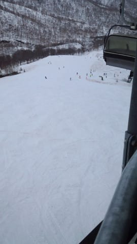

# 5月13日（土）のかぐらスキー場は…強風で一瞬ゴンドラが止まったり，リフトが減速運転だったけど…雨はひどくなく，雪たっぷり！

📅 投稿日時: 2017-05-16 01:58:37

🏷️ カテゴリ: [2017スキー滑走日記](c7d777cecfc91bdf0fa464ad62c6d49ab.md)

しかし．

眠い時の布団というのは．

なぜ，あれほどまでに逆らいがたい，

恐怖の魔力を発揮するのでしょうか…

…ということで．

昨日は夜10時前に完落ちしていたSkier_Sです．

ってなわけなので．

一日遅れてしまい．

「え？いまさら？」

という感じも無くはないですが．

土曜日のかぐらスキー場の詳細レポートをば…

まず．

この日．

朝8時に到着した，どしゃ降り＆強風の奥志賀で．

[強風のため志賀高原全面運休という衝撃の事実](e9c73c6de5ae77a84110cb54887e96426.md)を

知らされ．

あまりもの不運さに悶絶しながら

1時間ほど天候回復待ちをしたものの…

全くリフトが動く気配がなく．

「こ，このままでは…

　このままでは，往復のガソリン代と高速道路代と，

　長時間運転してきた努力が．

　全く無駄になってしまう！」

というわけのわからない理由で．

奥志賀高原から，朝から通常営業のかぐらへ移動するという

暴挙（？）に出たわけですが．

実は．

知っている人は知っている．

志賀高原～苗場間の直線距離．

思っているよりすごく近いんですね～．

奥志賀の麓からかぐらスキー場山頂までの直線距離は

なんと，わずか18km程度．

東京駅～川崎駅くらいの距離しかないんですね～．

だもんで．

移動にそれほど時間がかからなさそうなものですが．

車で移動しようとすると…

こんな感じでぐるっと回らなきゃならず．

その移動距離，下道を約120km…（涙）．

まぁ，信号も少ない道路なので．

快適に走れますが．

9時に奥志賀を後にし，かぐら到着が11:20…（泣）．

午前中が無駄になったよ…（涙）．

とりあえず．

到着時点でのかぐらスキー場．

雨は小降りだったものの…

強風でゴンドラ運休中（涙）．

ただ，山頂のかぐら高速リフトは動いているようで．

ゴンドラも，風が弱まれば再開らしく．

ロープウェーで小雨降るみつまたゲレンデに出てみると．

うむ．

さすがにみつまたの大会バーン側は雪がかなり解けて

コースが閉鎖されてますが．

滑走可能なファミリーコース側は．

をを！

ほぼ幅いっぱい，雪がついてるじゃないですか！

…ただ．

雪が残るよう，幅5mほどに雪寄せしてあり．

雪寄せしてない側は一段低く，雪が汚れてますが…

ちなみに，雪寄せしてある幅は，これだけの厚みで

雪があるので，まだかなり雪は

もちそうですね～．

で．

雪寄せしてない側は，ごく一部ピスラボが

出ちゃってた部分もありましたが…

でも，この汚れた側も，硫安が効いてて

かなり板が滑り．

そして，幅が広いので…

見た目より楽しめるじゃありませんか！

リフト乗り場近辺も，まだ雪はたっぷりあるし．

フラットで人も少なく，硫安が効いてて固い斜面を

しっかり飛ばせるので…

ゴンドラ運休で上には上がれないけど，

この，みつまただけでも楽しいかも！？？

ということで．

「悔しくなんかないもん！

　みつまただけで十分楽しいから，

　ゴンドラ動いてなくても悔しくないもん！」

と，つぶやきながらみつまたを滑っていた

わけですが…

（新緑に覆われ，とてもスキーに来たと思えない…）

午後1時前に，風が弱まったために

ゴンドラが営業再開！

喜び勇んでゴンドラ乗り場へ向かいます．

みつまたゲレンデから，ゴンドラ乗り場へ向かう

道はまだ雪がたっぷりついていて．

来週も，ピスラボを滑らずに済みそうな

くらいの雪の量ですね…

ゴンドラ乗り場前も，まだまだ雪たっぷり！

風が強く，超減速運転のゴンドラに乗って．

やってきました，かぐらゲレンデ！

いやーーー．

ここも，雪たっぷり！

いつもなら，コース幅が狭くなっている

和田小屋前～かぐら高速乗り場の間も，

完全に全面雪が覆ってますし…

かぐらメインバーンも幅いっぱい滑れて．

全くブッシュが出てくる気配なし！

そして，テクニカルコースも…

コブ溝に土が出てくる気配はまだなくて．

…写真は無いですが．

全面コブのジャイアントコースも，

コブの底が抜けているのは数か所のみで，

ほぼ問題なく滑れます！

いやーー．

今年はやっぱり雪がおおいなぁ…

そして．

かぐら高速リフトは強風でずっと減速運転だったけど．

雨降りの午後というのもあって．

待ち時間は，せいぜい搬器3-4台待つかどうか．

タイミングによっては，待ちゼロ！

ゴンドラが営業開始した，午後1時以降は

雨もほとんど止んでおり，

濡れることなく滑れましたね～．

で．

悪天候で人が少なかったのもあり…

かぐらリフトの営業終了の16時になっても，

メインバーンはコブコブになっていなかったという…

いや，この時期としては珍しい！

雪も，雨で汚れが流れたからなのか．

張り付いたり粘ったりする雪じゃなくて，

結構滑り良くて．

いやーーー．

午後だけとはいえ．意外と楽しめたなぁ．

うむ．

満足じゃ！

ということで．

かぐらの営業が終わったので，みつまたへ向かって

下山しますが…

ゴンドラコースも，まだまだ

雪がいっぱいありますね～．

ゴンドラ乗り場まで来ても，

ほぼコース全面雪があるし，

みつまたゲレンデ側のリフト乗り場も，

5月中旬としては最高レベルの積雪では！？？？

いやー．

今シーズン．

志賀高原はかなりの積雪だったけど．

かぐらの積雪もかなりのモノですね～…

あと2週間は，問題なく楽しめそうな感じ！

ただ，この日は悪天候で駐車場の車の入りも少なく．

ガラガラで楽しめたけど…

天気がいい日は混むんだろうなぁ…

ということで．

奥志賀も昨日で終わってしまったようなので．

来週もかぐらで滑る予定です～

PS.今回の写真はかなり古いスマホで

　撮ったもので，

　やっぱり画質はイマイチ．

　雪面の凸凹とかが写らない…（涙）

　今日，かぐらスキー場に電話してみたけど，

　やはりデジカメは見つかってないようです…（泣）．

## 💬 コメント一覧

### 💬 コメント by (Goku)
**タイトル**: お疲れさまでした～
**投稿日**: 2017-05-16 19:13:32

直線だと１８キロ、だけど１２０キロ・・・

何と不条理なことでしょう。

雪がなくて、秋山郷経由ならもう少し早く着いたかも知れませんね(笑)

それと、その昔『極楽スキー』にあった『西武スーパースキーネットワーク計画』が実現していたら、奥志賀からロープウェイでみつまた・かぐらまで行けたのに～。ざんねん・・・

それにしても、常識を越えた素晴らしいスキーヤー魂に拍手！

### 💬 コメント by (しんちゃん)
**タイトル**: 布団の魔力
**投稿日**: 2017-05-16 22:05:50

お布団、きもちいいですよね。たまにはゆっくり休んでくださいね。

信号が少ないにしても120km下道2時間爆走とは･･･

映画「私をスキーに連れってて」志賀万座爆走ドライブを彷彿とさせるスキーヤー魂(*_*;

神にしかできない、「神業」です。

### 💬 コメント by (Skier_S)
**タイトル**: 不条理な移動距離です（笑）
**投稿日**: 2017-05-17 01:37:18

＞Gokuさま

直線距離だと，ホントすぐそこなんですけどね～．

秋山郷経由だと，道が狭くて曲がりくねって

いるので，逆に時間がかかる気もします…

…しかし，志賀とかぐらがゴンドラで

つながってたら，すごかったでしょうね～．

＞しんちゃんさま

いやーー．

久しぶりにぐっすり寝ましたよ～！

下道120kmを走って，かぐらで滑ったあと．

帰りの高速代をケチるため，

帰り道も自宅までの距離の半分以上を

下道爆走で帰ったのはナイショです…←ナイショになってないから

