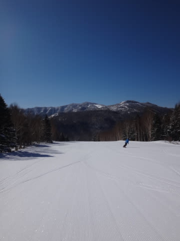

# 3月26日，土曜日の志賀高原詳細モード…冷え冷え最高圧雪でスタート，3月下旬とすればベストな一日！

📅 投稿日時: 2016-03-28 02:22:44

えー．

本日は日曜というのに．

色々都合があってスキーに行けなかった（涙），Skier_Sです…

＃仕事が休みなのにスキー場に行かなかったのはどれだけぶりか…

ってわけで．

昨日は日帰りなのにナイターまで滑るという

暴挙により，速報モードやむなしの状況だったので．

本日は，土曜の志賀高原ゲレンデ状況の詳細モードです…

さてさて．

速報モードで報告したように，晴天で迎えた土曜の朝．

いつも通り，焼額第1ゴンドラでてっぺんに上がると…

気温は-8度！

…これは．水曜に．

　土曜：朝は-7～8度くらいまで冷え込む，冷え冷えの朝！

と予想した気温ドンピシャですね．

…自分の天気の予想精度，素晴らしいですね～！！←自画自賛

そしてゲレンデは…

うほう！

冷え冷え雪が圧雪された，

今シーズンではまだ1-2回しかお目にかかってないような，

やわらかフカフカ圧雪ですよっ！！

…これは，最高シマシマですよっ！！

ものすごくエッジがしっかり食いつく，

今シーズンほとんど体験できなかった，

柔らかい圧雪ですよっ！！！

天気もいいし…

あぁ…

シアワセ…

まさか雪不足の今シーズン，3月下旬になって

こんないいコンディションが滑れるとはっ！！

なんてシアワセなんでしょう！

天気が良いのに気温も低く，

雪はそんなに荒れてこないし…

午前10時以降，何本かはゲレンデの人口密度も上がってきたけど…

そして，ゴンドラ待ちも今日は短く．

あぁ…

思い出したくもない5重苦だった先週から比べると．

なんて恵まれているんでしょう…

でも．

気温がそれほど上がらなかった今日ですが．

さすがに日差しが強かったため…

あららら？

第1ゴンドラ側のGSコース．

ザブザブってほどではないけど，途中から下は

強い日差しで雪がチョット重くなってきました…

とはいえ．

山頂近辺からの上半分は，昼を過ぎても雪質がそれほど

ひどくならず．

うーむ．

3月下旬と考えれば．

異常暖冬の今シーズンに限らなくても．

これほど雪質が良いのは，恵まれている方ですね～！

で．

午前中に日が当たる，東斜面の1ゴン側GSコースではなく．

2ゴン側のパノラマ～サウスコースへ行くと…

ををを！

午後というのに，雪質がひどくなってないじゃないですか！

3月下旬の午後で，こんなにフラットで，

雪が緩んでないなんて…

ってことで．

この日は．

ピカピカ晴天にもかかわらず，

午後になってもこんな感じの，結構いい感じの雪質で．

さらに，フラットで大回りやりたい放題の，

第2ゴンドラをグルグルしていてたのでした…

で．夕方のラスト1本は．

昼間にちょっと雪が緩んだ第1ゴンドラ側の

GSコースに戻ってくると…

あぁ…

昼間に緩んだ雪が，ザラメ状に固まってますね…

ゲレンデもやっぱり荒れてたし．

この日は，やっぱり第2ゴンドラが正解だったなぁ…

と，焼額のラストゴンドラ終了まで，滑り続けたのでした…

ちなみに．

この日は．

先週に引き続き，オリンピックコースが雪不足で

クローズだっただけではなく…

さらに，先週は滑れたミドルコース，スーパ―ジャイアント

スラロームコースも，雪不足のためもうクローズに

なってしまいました…（涙）．

うーむ．

焼額は残念なことに4月3日で営業終了予定だけど．

そのくらいがちょうどいい感じの雪の量なのかも…（泣）．

で．

まだ終わらない．

今日も，まだ終わらない．

焼額営業終了後，最近では恒例になってしまった

「瞬間移動」を繰り出し，一の瀬ファミリーへ移動．

一の瀬ファミリーの最終営業まで，ラスト2本を滑りましたが…

一の瀬ファミリー正面バーン上部は，焼額と

うってかわって．

先週同様の，いい感じのツルツルアイスバーンが

いっぱいの，エキサイティングな斜面でした…

で．

はい．

まだまだ続きますよ～！

昨日報告の通り．

日帰りというのに．

これだけで終わらず，ナイター参戦です．

…18:30のナイター開始時は，空にまだ明るさが残る

時期になってきましたね～…．

ナイターは，ちょっと固めのところもあったけど．

朝イチと同じく，気持ちよいシマシマっ！！

人も結構少なめで，気持ちよく大回りできるよっ！！

…あぁ．

こんな気持ちいいダイヤモンドナイターが．

今日で今シーズン最後なんて…っ！！

勿体ないっ！！！

…

と．

帰りの運転のことを全く考えず，

ナイター最終リフトの21:00までしっかり滑ってしまい．

…帰宅の運転で，死ぬかと思ったSkier_Sだったのでした…

## 💬 コメント一覧

### 💬 コメント by (ぴよ＠太田市)
**タイトル**: 土曜日のかぐら
**投稿日**: 2016-03-28 08:56:56

土曜日のかぐらも”ウホウホシマシマ”の全く同じ状況でしたよ！

エッジが引っ掛かり過ぎて、激しい挙動で転倒しそうになりました(^.^；/

でももうこんな状態、今シーズン最後かも．．．

### 💬 コメント by (Skier_S)
**タイトル**: ぴよ＠太田市さま
**投稿日**: 2016-03-29 01:44:49

かぐらも良かったですか！

…でも，間違いなく．

今シーズン最後のベストコンディションだと

思います…

来シーズンまで，もうこんな状況はしばらく

滑れなさそうです…（涙）

