# 2018年8月，子連れ座間味で小5の娘とファンダイビング！その12…ダイビング2日目，終了

📅 投稿日時: 2019-09-18 01:12:07

🏷️ カテゴリ: [ダイビング日記](ce3a7a8d424d112fce83ee85c81a0e344.md)

ということで．

この3連休，ちょっといろいろ

お出かけし．

水族館とかも行ってきて．

実に久しぶりに，イルカショーとか

見てきたのですが．

…撮ってきたイルカショーの

写真を見てみると，

イルカが水中を泳いでいる写真は

ほとんどなく．

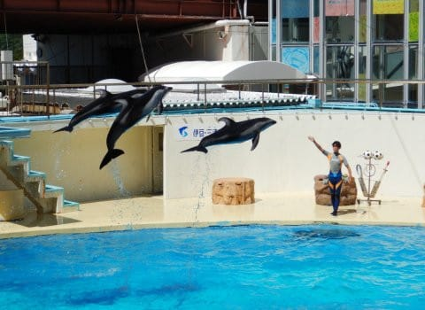

ほぼすべてが空中を飛んでいる写真

だったので．

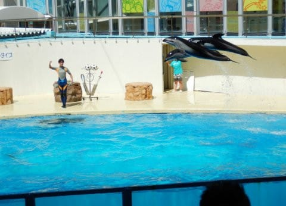

なんだか，イルカって，

鳥のように空を飛ぶ

生き物みたいに見えますね…

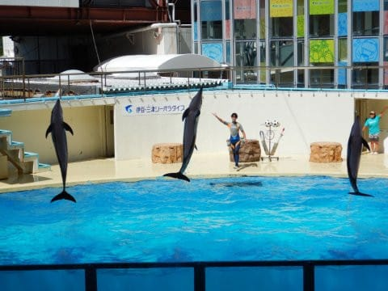

…この写真なんて．

トレーナーさんの右手のパワーで

空中浮遊しているように見えます…←いや，そんな風には見えないですが

って，どうでもいい話題をした後は．

いつも通り人気のない，

座間味ダイビング旅行記です～！

…いや．ホントにアクセス少ないんですよ…（涙）

----

ってな感じで．

今日の3本目のダイビングが終わり．

これにて，本日のダイビング，終了！

エグジットすると，ボートは

直ちに港へ向かって戻り始めます…

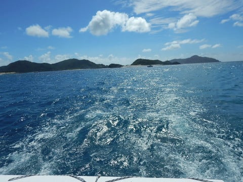

娘は，午後は他の子どもたちと

ずっと遊んでいたので．

もうすっかり打ち解けてます．

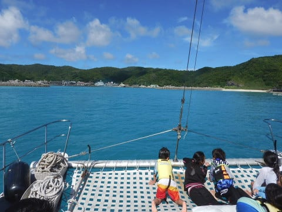

最後の3本目のポイントは，

港からすぐだったので…

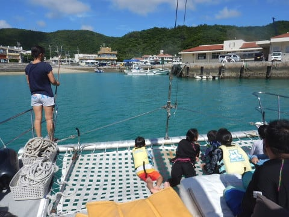

ボートはわずか5分ちょいで，

港に戻ってきました…

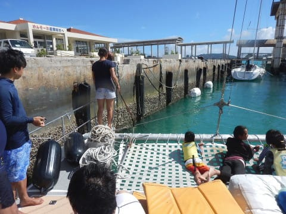

港について，船から降りても．

仲良くなった子供たちは，

なかなか別れづらいようで．

しばらくボート際で

一緒におしゃべりしてました…

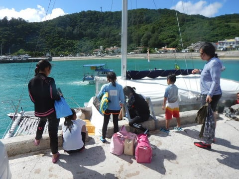

午後3時半ごろ．

港から歩いて宿に戻りますが…

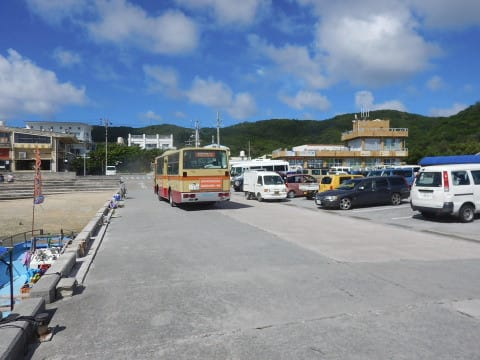

（相変わらず，一部の神奈川県民が

　反応しそうなバスを使っている

　座間味の町営バス）

宿に戻り，いつも通り

ウェットスーツを洗って，

シャワーを浴びたら．

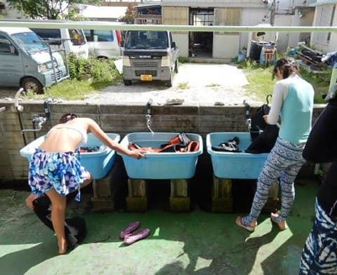

今日，初めて水中カメラを

もって潜った娘．

「今日はお散歩せずに，

　撮った写真見る～！！」

とのことで．

いつもの夕食前のお散歩には

出掛けずに，

部屋で水中写真の鑑賞会と

なったのですが．

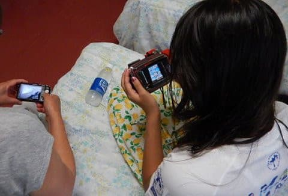

…意外とこの，娘が使った

OlympusのTG-2.

水中写真の色の再現性，いいなぁ…

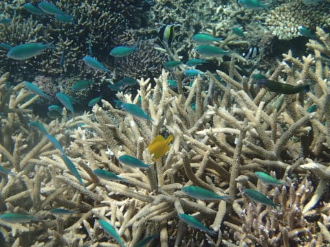

こんないいカメラをタダで譲って

もらっちゃったんだけど，良かったん

だろうか…？

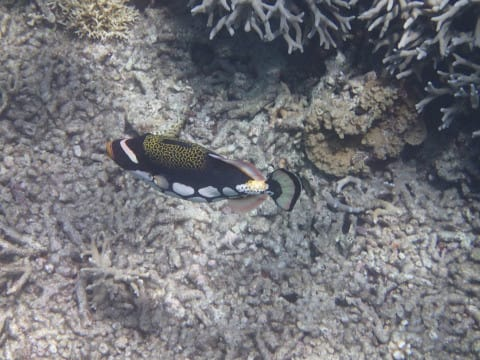

でも．

わが娘．

水中写真初日にしては，

結構上手く撮れてるかな？

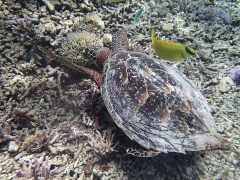

残念ながら，ほとんどの写真が

見下ろしアングルなのが

惜しいけど．

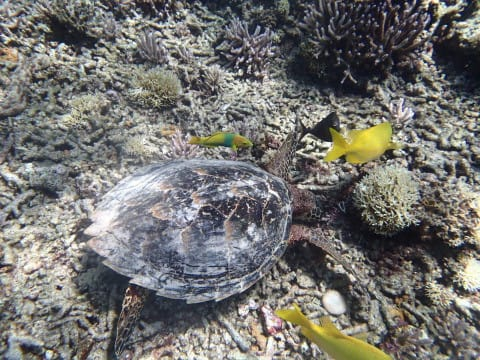

まぁ，10歳児が水中で撮ったと

考えれば，まぁ良く撮れてる

方かな…

ってな感じで．

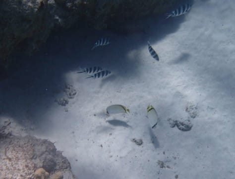

予想よりきれいに撮れていた，

娘の写真にちょっと驚いた

のですが．

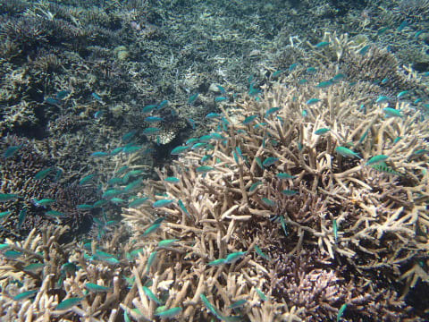

写真鑑賞会後は，夕日も暮れて，

夕食タイムです…

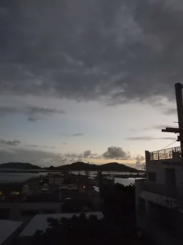

今日も山盛りたくさんの

ペンション星砂さんの夕食．

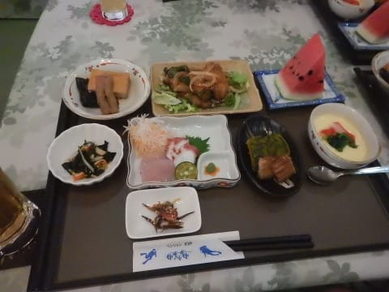

娘の子供用料理も，郷土料理

たっぷりのゼイタクお膳です．

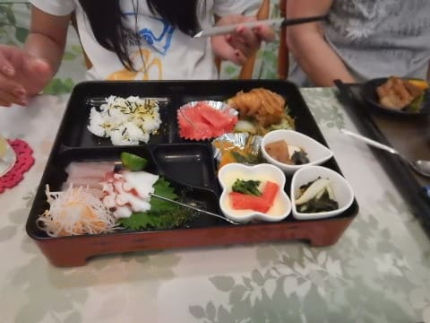

ってことで．

ゼイタク料理を前に，生ビールで

乾杯して．

ゆっくりと夕食を楽しんで．

その後，夜9時ごろまで，

親子でログづけをして．

夜9時過ぎには，いつも通り

みんな寝たのでした…

私だけはみんなが寝た後に，一人起きて

夜11時ごろまでBlogを書いてましたが…
