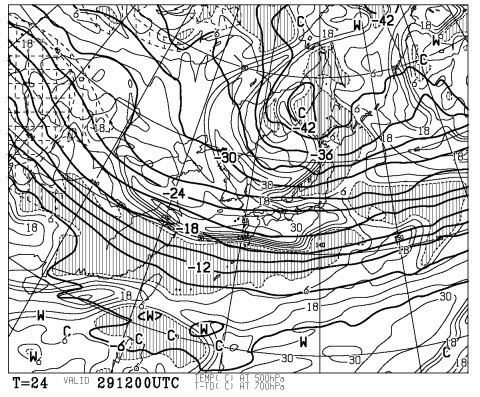
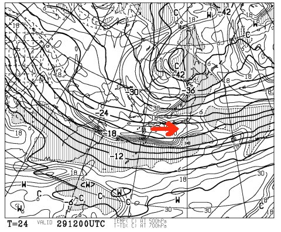

# 年末年始のスキー場の天気は？

📅 投稿日時: 2011-12-29 01:45:20

あー．

今日，仕事納めって人も多いと思います．

んで，明日からスキーって人も多いと思います．

で，だ．

気になるのは，この年末・年始休みの天気なわけだな．

このクリスマス休暇で．

日本海側の新潟方面や白馬山麓は結構積もったみたいですが．

…志賀高原より南，信州のスキー場はあと一息，ってところですか．

中央道沿いのスキー場やら，上信越道でも佐久～上田のスキー場は

まだ滑れないコースが結構ありますね…

今回のクリスマス寒波．

信州に予想より雪をもたらさなかったという，ちょっと残念な

結果ではあったのですが．

んじゃー，これから年末年始休みは降るのかいな？

という疑問がわきあがってくるわけですな．

では．

占って進ぜよう～．

…

…

…

30日までは，日本海側は雪になるであろうぞよ～

特に，29日の夜は結構積もるであろう～

30日朝は，日本海側のスキー場はぱふぱふパウダーを楽しめるぞよ～

…(でも．信州はそれほど積もらないよ～）

31，1日は気温も上がり，日本海側の雪は弱まるであろう～

晴れ間も覗くかも～

…（信州は当然降らないよ～）

2日夜以降，また冬型に入り，日本海側は雪が降るであろう～

ただ，2日以降の天気は，まだ不確定要素が高いぞよ～

…（信州は降らなさそうだよ～）

…

…

だめじゃん．

信州（涙)．

寒気は入ってくれてるんだけど…

信州にどかっと降る天気図になっていない．

風が西から入って，信州まで雪雲が届かないパターン．

…見る人が見れば，この図の700hpa湿数分布で

「信州に雪雲が届かない…」

と分かるはず．

…っていっても，「分からないんだけど」という人が多数だと思うので．

簡単に解説すると．この図で湿数の大きいエリア(網掛けになっていない，白いエリア)が，

冷たい空気が吹き込んでる部分です．

すなわち，この図では…

こんな感じで，冷たい空気が西から信州に入っている，ということ．

この場合，信州へ向かう雪雲は北アルプスでブロックされるので，

北アルプスより東の，信州内陸まで雪雲は届きません．

…この，冷たい空気が真北くらいから入ると，志賀高原も雪に

なるんですが…

うーーむ．

外れて欲しいんだけどな．この予想．
