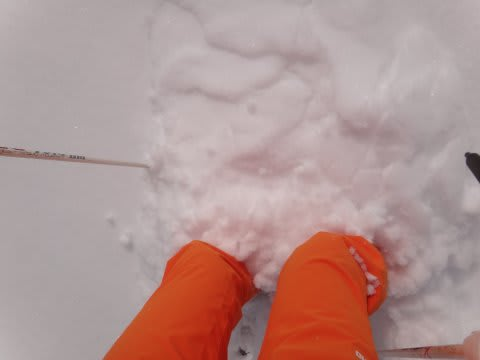
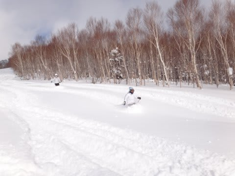
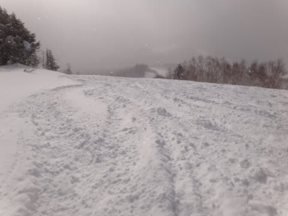
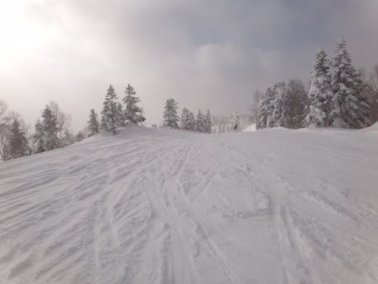
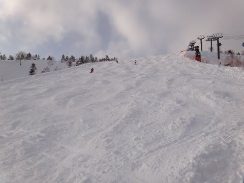
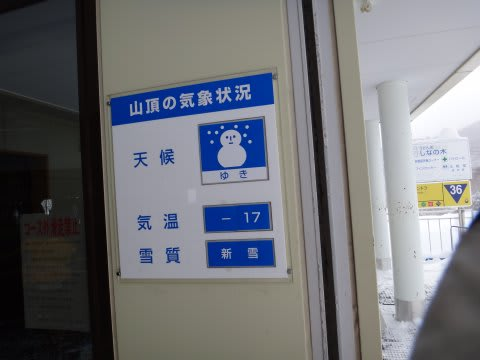
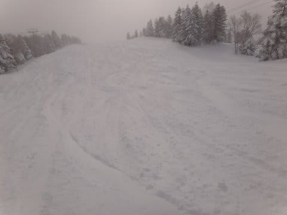
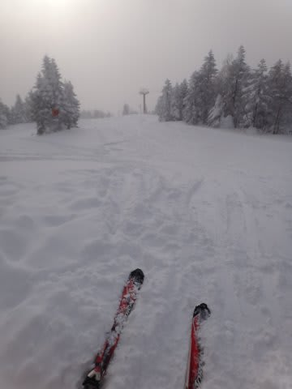
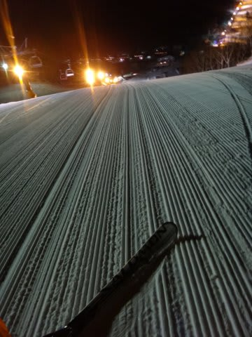

# 1月14日土曜日の焼額の速報

📅 投稿日時: 2012-01-15 00:13:03

えー．

昨日ぎりぎりに天気図の状況が変わって，

「お，朝までに積もりそうか？」

という予想通り．

朝には雪が止んだのですが，朝までに20～30cmの新雪となりました．

圧雪バーン上も，10cmくらい積もっていたでしょうか…

非圧雪バーンは，朝のうちは膝下のパフパフパウダー！

うーん．でも，膝下か…

今シーズン，まだ腰パフに当たってないな．

人が少なく，一気に食い荒らされることはなく，2時間くらいはいろんなところで新雪が楽しめたかな．

ただ，おおむね新雪を楽しんだあと，圧雪バーンに戻ると…

圧雪の上に積もった雪がでこぼこしてて，難しい，面白くない

バーンに…

ちょっと滑りにくいんですけど．

今日はとりあえず楽しかったのは朝だけかな～．

昼ごろには，[ここ](edf0ec2de0415962cd2ee9d5a8b1c01f0.md)での予想通り，日もさしてきました．

日がさしても気温は低く雪は緩まなかったですね…

でも，ゲレンデ全面，圧雪の上にところどころ吹きだまりの

ような雪の塊があったり，コブになっていたりで

ちょっと微妙…

救いは，ゲレンデがガラガラだったことでしょうか．

土曜の昼間というのに，ゴンドラに人が乗ってない搬器が

あるくらい．

どうしてこんなに人が少ないの？

とりあえず．

朝イチのパフパフの幸せと，がらがらバーンが楽しめたことで，

今日はよしとしておこう．

あ．そうそう．

ダイヤモンドナイターは，人が少なくシマシマで

最高でしたよ～！

…でも，寒かったけど…
