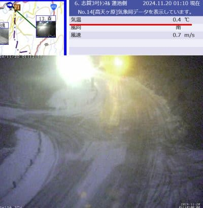

# 11月22日に菅平スキー場オープン！オープン日は無料らしい…そして志賀，かぐらは人工降雪中だけど明日朝までかな…

📅 投稿日時: 2024-11-20 02:42:16

🏷️ カテゴリ: [日記](cc4b5682fb7b8b144980957a978653fb0.md)

今日もいろいろ仕事がヤバいので（涙）

手短に更新…

冷え込みが続く志賀高原ですが．

焼額は，真冬のような風景になってますね～！！

（[焼額山スキー場Facebook](https://www.facebook.com/yakebitaiyama/videos/2016395665474305/)より）

そして，かぐらエリアも19日は終日フル稼働で

人工降雪機を動かしていたようです…！

（[かぐらスキー場ライブカメラ](https://www.princehotels.co.jp/ski/kagura/livecamera/)より）

…これらを見ていると，今週末にはオープン

するスキー場が出てくるんじゃないか？

と思っちゃいそうですが．

実は，19日深夜…というか，20日に日付が

変わったころには冷え込みも終わり，

志賀高原でも気温はプラスまで上がって

ます（泣）

（[北信建設事務道路気象状況カメラ](http://hokushin.pref-nagano-roadcamera.jp/)より）

20日の朝までは何とか人工降雪機が動かせる

かもしれないけど…

前の記事に書いたように，やっぱり20日から

気温が上がって．

次に気温が下がるのは，22日深夜ですね…

20，21，22日は人工降雪は厳しそう．

次に冷えるのは，22日夜から24日の夜まで

2日間．

この2日間はまた人工降雪機が動かせそうなので．

24～25日ごろにはオープンできるスキー場が

出てくるかな？？？

でも，その後…

今の天気図のままなら，26日はまた気温が

上がって，さらに雨になりそう（泣）

まぁ，まだ雨になるのは確定ではないです．

予想天気図のスプレッドがかなり大きく，

まだかなり予想精度は低い状態です…

ということで．今週末の23日までに新たな

スキー場オープンはかなり厳しそうな

感じですが…

その中で，アイスクラッシュがある菅平は

22日オープンの宣言を引き下げてません！

菅平は，アイスクラッシュ＆人工降雪の

ミックスで，予定通り22日の金曜にオープン

するようです！！

（[菅平高原スノーリゾートホームページ](https://sugadaira-snowresort.com/476/)より）

そしてなんと．

22日の金曜はリフト代金が無料のようです…！！

金曜に休みの人は，行ってみる価値があるかも…

ということで．

20日から気温は上がるけど，次の

23，24日の冷え込みはあるし．

また26，27日ごろに気温が上がりそうだけど…

その後もまた気温が冷えそうという

予想なので．

12月には，かなりのスキー場がオープン

できることを信じてます～！！
