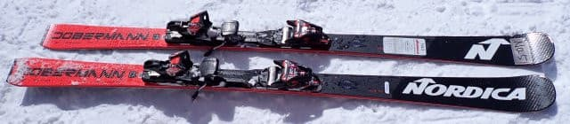
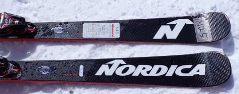
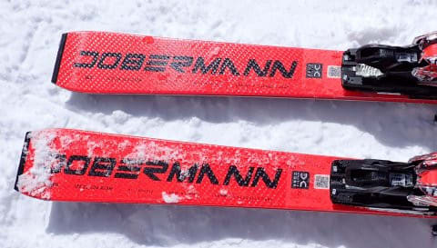
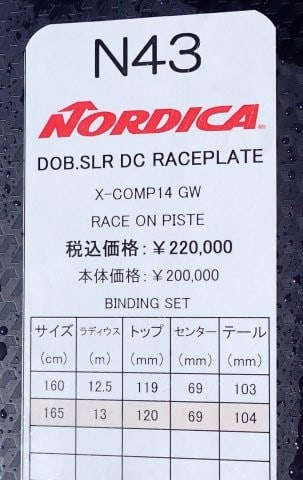
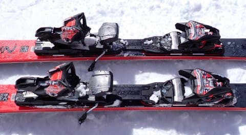

# 2024シーズンモデルのスキー板，試乗レポートその8…NORDICA DOBERMANN SLR DC Raceplate

📅 投稿日時: 2023-05-29 04:04:25

🏷️ カテゴリ: [スキー板試乗](c0bd8048615710cee890e403a36cc9a2b.md)

この週末は，久しぶりにスキーに行かない

週末だったので…

たまっていた仕事を一気にやっつけて，

平日は楽をしようと思っていたのに…

私のメインマシンだった古いWin8のPC．

さすがにサポート切れのWin8を使い

続けるのはやばい…と思いつつも，

スキーシーズンで時間がなくそのままに

していたものをようやっと買い替えたので，

その環境構築だとか．

あとは板のワクシング，スキーウェアの

手洗いやら，夏物の服の入れ替えやら，

娘の勉強を見たりしてたら終わって

しまいました…

明日までに絶対やらないと死ぬ宿題は

なかったものの．

来週締切のいくつか抱えている宿題を

一つもやっつけられなかったので…

来週も，平日は楽ができなさそう（涙）

せっかくの週末なのに，大量の雑用を

していただけで，どこにも出かけず，

仕事も進まずに終わってしまった（泣）

あぁ…週末は2日では足りない．

週休5日制にならないかな？？

ってなことで本題へ．

今日も2024シーズンモデルのスキー板の

試乗レポート．

今回はノルディカ編です．

では，どうぞ～！

〇NORDICA DOBERMANN SLR DC Raceplate 165㎝

基礎小回り

ノルディカのドーベルマンシリーズは，

この上にガチ競技用，ピストンプレート付きの

DOBERMAN SL WC があって．

SLRはそれをゲレンデ用にチューンした

モデルになりますが…

SLRも強いRaceplateと，弱めのFDTプレート付きが

あるようですが．

こちらは強い方のプレートがついたモデルになります．

履いてみたところ…

SLモデルをゲレンデ用にチューンしたモデル

ということなので．

SLモデルより優しくなってる板だと

思うところ…

これ，HEADのSL競技用，e-SL RD FISより

フレックス強いんじゃない？？

という張りの強さ．

ガッチリ強く，足元にずっしりとした

安定感を感じる，結構過激な板です．

しっかりした張りがあるんだけど…

粘るしたわむし曲がるし，

強い圧を受けてグリップめちゃくちゃ

強いし．

強烈なトップスピードの中，強いグリップで

過激な横Gを受けながらたわみに沿って

板が走っていく，かなり過激な戦闘マシンです．

SL板のデチューンどころか，一部メーカーの

競技用SLモデルより強いかも…！？？

強い圧が溜まっていく中で，メタルの

ビンビンした返りがあるので，強い横Gに

負けて切り替えに手間取ることもなく，

適切に板のたわみを解放してやれば，

板が勝手に切り替えをしてくれて，

板が走っていきます．

板の返りも，返りが早すぎて反対方向に

吹っ飛んでいく反復横飛び系じゃなく，

適切に返ってきて，板が進む方向に

スッと走っていくような，気持ちよく

板が加速していく返り．

右ターン，左ターンと強烈なグリップで

エッジのたわみに沿ってスッとまわって

行き，そこの繋ぎで板が進む方向に

気持ちよく加速していく，

かなり快感度の高い板…

これ，むちゃくちゃ楽しい…っ！！

そして，板のフレックスが強いので．

R=13mだけど，そんなに踏まなければ

大回りに近い中回りまで引っ張れます．

まぁ，スピードを出した小回りが

一番気持ちいいけど，スピード耐性も

高いので，縦目に落とした大回りっぽい

ところまで問題なく行けます．

ただ…

この板の本領を発揮するのは，かなり

スピードを出した領域．

板の重さとグリップの強烈さもあり，

かなりの脚力を必要とします．

あと，ブーツもフレックス130は最低必要．

出来れば140かそれ以上…

私の140のHEADブーツもぎっちりつぶれる

ほどの強烈な横Gを食らいます．

弱いブーツだと，ブーツがつぶれきってしまう

ので，板の本当の性能を出しきれないかも．

あと，ブーツが横Gをサポートしきれず，

滑っていて疲れるんじゃないかな？

さらに…

スピードが低い領域で滑っても楽しくないし．

ずらした滑りをしようと思うと，グリップの

強さと板の重さで厳しいです．

なので．この板はいろんな小技が使えて，

どんなゲレンデでも自由に…という板ではなく，

この板のピンポイントにハマる，強烈な

スピードでカッツリカービングをかまして

いくという滑りをした時に，楽しさが

あふれ出る板．

むしろ，どんな滑りでもつぶしが効くという

点においては，HEADのe-SL RD FISの方が

上かも？？

でも，楽しい．

めっちゃ面白い板．

履きこなせる人はかなり選びそうだし，

どこでも滑れるという，つぶしが効く

板でもないけど…

この板もかなり気に入りました…！！！

## 💬 コメント一覧

### 💬 コメント by (愛読者)
**タイトル**: Unknown
**投稿日**: 2023-05-29 20:06:23

板をへたらすのが朝飯前のＳさんですが、先日のレポートでブーツのシェルがへたったという話を初めて聞きました。普通は、その前にインナーがへたって終わりなのに。今度は、エキップさんで新しいHeadブーツにフォーミング仕様にしてもらい、シェルが先か、インナーが先か究極の耐久テストをしていただけないでしょうか？

### 💬 コメント by (炎の北海道民)
**タイトル**: Unknown
**投稿日**: 2023-05-30 00:17:45

S様

今年もあっという間のスキーシーズンでした。

最近、私のスキー板の嗜好が変わりつつある様で、アトミック なら以前はREDSTERだったのが、今はマーベリックとかバックランド、オガサカ ならTCシリーズではなくKeo‘s xx、ストライクなブランドはvector glideで、Cordvaなんてぜひ乗ってみたいです。ただ、今だに毎回負けたのが悔しくて、翌年のマスターズに参戦するために4年ほど前のREDSTERは現役で使ってますが。本当は、vector glideの板で優雅に？滑りたいところです。

来年度はぜひvectorの試乗記もお願いします。

### 💬 コメント by (愛読者)
**タイトル**: Unknown
**投稿日**: 2023-05-30 08:05:57

Sさんに悪魔の誘いを持ちかけてすみません。でも、スキーにしても車にしてもプロと言われる方々は、忖度ありの、表現力乏しく、こちらが知りたいことをレポートしてくれないのです。お忙しいと思いますが、新聞よりSさんの日記が朝の楽しみですので連戦をよろしくお願いします。

### 💬 コメント by (Skier)
**タイトル**: コメント回答遅れました…！
**投稿日**: 2023-05-31 00:30:52

＞愛読者さま

コメント回答遅れました…

ブーツのシェルもヘタる，とは聞いてましたが，ホントにヘタったのを初めて体験しました…

でも，REXXAMはインナーがもうかなりヘタっていたのですが，それでも使い続けていたら

シェルのへたりも感じるようになってきたので，インナーとシェルだと間違いなく

インナーが先にヘタると思います…

また，ブーツのレポートはこれからもいろいろ予定してます．

2シーズン経ったHEADブーツのレポートも執筆中ですので，お楽しみに！

### 💬 コメント by (Skier_S)
**タイトル**: ＞炎の北海道民さま
**投稿日**: 2023-05-31 00:33:59

スキーシーズン，あっという間でしたね…

私はまだ月山があるので終わってませんが(笑)．

VectorGlideですか！昔はいたときいい板だと思ったんですが，最近試乗する機会がなく…

私も最近，メイン板をセミファット系に変えようかな？という衝撃の試乗板があったので，

また試乗レポートを楽しみにお待ちください…

