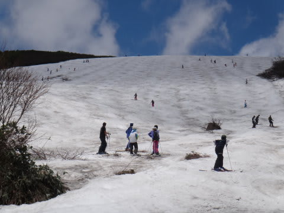

# 6月16日速報…月山は絶好のスキー日和っ！

📅 投稿日時: 2013-06-17 01:25:12

🏷️ カテゴリ: [2013スキー滑走日記](c91dbe557f9a69230b1600e48622fdd61.md)

えーーー．

さすがに月山から帰宅すると，夜が遅いので…

本日も速報モードで．

今日は，朝方雲が多めでしたが…

時々雲がかかることがあるものの，基本的に，晴れの一日でした！

いやーーーー．

昨日は散々だったけど．

今日は最高！

で，大斜面は．

…この時期に，これだけ幅広いのは見たことがないくらいなんですが…

雪はたっぷり！

第一，この時期に，リフト乗り場まで滑りこめるし…

リフト降りてすぐに板が履けるのだ．

沢コースも雪がいっぱいあるし．

6月15日過ぎでこれは珍しい！

…でも．

やっぱり．

天気が良かった分．

…込んだのだ…

リフト待ちは最大10分超えましたね～．

平均10分近かったかも．

しかし．

しかし．

やっぱり．

これだけ雪があると，楽しいのだ．

まだ，シーズンが終わった感じがしないのだ．

…これは，もう一回行かねば…

ということで，再来週あたりにもう一回，月山アゲインです．

まだ，シーズン終わりませんよ～！

＃詳細レポートはまた明日…
