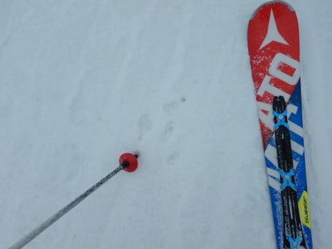

# 2019/2/23(土)の志賀高原スキー場は…予想外した(涙)．終日雪降りの一日．思ったほどひどくはなかったけど，全面硬めのバーンコンディション

📅 投稿日時: 2019-02-24 01:15:42

えー．

本日．

確か，誰かは

　天気は終日曇り．

　朝は小雪がぱらついてるかも…

　（中略）

　もしかすると，午後遅くは日も射すかも…

と，書いていたはずで．

朝は雪がぱらつくかも…

と書いてあったけど．

午後まで雪が降る

とは，予想していなかったはずなのに．

…午後まで雪が降る一日でした（涙）

そして．

午後遅くに日も射すかも…

と書いていたのに．

日が差したのは，午後4時ごろからでした（泣）．

とりあえず，午後4時ごろとはいえ，日が差したので．

ここは完全に外したわけではない…

と言いたいところではあるけど．

でも．

リフト営業時間中は，ほぼずっと，

雪降り～曇りの天気でした．

…予想，外した…(涙）

まぁ，そのおかげで．

アイスバーンの上にうっすら雪が積もり．

全面ツルツル鏡面アイスバーンという，

最悪の事態が避けられた気もするのですが…

とりあえず．

今日のレポートに行きますが．

本日朝．

志賀高原に登ってくる道路は…

なんだか，2月の志賀高原と思えないほど，

完全に雪がないですね（涙）

雨と，昨日の高温で解けちゃったのか…

ただ，スキー場のそばまで来ると，

結構凍っていたところがあったので，

運転は注意が必要ですよ～！

で．

いつも通り，朝8:30営業開始の

焼額ゴンドラにのって，山頂に

やってくると…

ふむ．

気温は-8℃と，結構冷え冷え！

そして，山頂は…

うっすらガスですか（涙）

バーンコンディションは．

最悪のアイスバーンを想定していたけど．

朝イチは，硬いもののガチガチじゃなく．

適度にエッジがかかる，ザラザラした感じに

固まったバーン．

朝にわずかに積雪があったこともあり．

思ったほどのツルツルアイスバーンではなく．

「殺人アイスバーンを覚悟してたけど，

　ツルツルガリガリじゃなくて．

　予想よりいいなあ…」

と，思っていたものの．

オープンから1時間も経つと，

GSコースは，だんだん人が増えてきて…

うむ．

ちょいと楽しくないぞ．

ってなことで．

オリンピックコースへ行くと…

けっこう硬めで，エッジを研いでないと

つらい感じのバーンだけど…

ふはははは．

エッジをしっかり研いである私の板なら，

問題ないのだ！

と．

硬めで手ごわい斜面のため，

全く人が滑っていない

オリンピックコースを，

「ガラガラだよ～♪」

と喜んで滑っていたのでした…

だけど．

オリンピックコース以外に行くと．

結構人が多くて．

そして，今日は白樺コースが

大会のためクローズだったこともあり．

2ゴン側のパノラマ～サウスコース．

ちょいと混み気味でしたね…

だもんで．

硬めに固まったコースは，多くの人に

磨かれてツルツルになっていきそうだけど．

だけど．

誰かの予想と違って．

終日雪がぱらついた本日．

時折強く降ることもあり…

おかげで，緩斜面は硬いバーンの上に，

まがりなりにもうっすら雪が乗ってくれて．

午前中の早い段階から，

コースがツルツルになることはなかったので．

天気予想を外してしまったけど，

いい方に外れたから良かったじゃないか

…と．

自分に言い訳しつつ，滑っていたの

でした…←でも，天気襲う外したことに変わりはないから(全員からのツッコミ）

本日は，昼間に一瞬日が差したタイミングも

あったものの…

基本的に終日，雪がぱらつく一日で．

幸い，ゴンドラ待ちはそれ程

無かったとはいえ…

急斜面のオリンピックコース以外．

人もそこそこ多くて．

さらに，

　昼間も気温はそれほど上がらず，

　むしろ下がっていき，昼間も-5℃程度をキープ．

というところは，まぁまぁ当たっていて．

昼になっても，朝とほとんど変わらない

-8℃という冷え冷え気温をキープ．

…3℃低い方にずれたので，ドンピシャ正解

とは言えないけど．

朝より気温が下がって冷え冷えってのは

当たったよ！！←予想を全部外したわけじゃないことを必死にアピール

硬いバーンが，昼間も冷え冷えで緩まず．

そして大勢が滑って，バーンが磨かれていくので…

午前中はまだマシだったコースも，

午後になってくると．

人が多いコースは，そこかしこが磨かれた

ツルツル氷状態に…（ちょい涙）

これで，うっすらでも雪が降ってくれたから，

ところどころ柔らかい雪が乗って，

全面ツルツルバーンにならなかったのが，

せめてもの救いか…

そして．

なぜか，皮肉にも，

午後4時過ぎの営業終了間際になって．

ようやく晴れてくるという，

誰かの日頃の行いが悪かったん

じゃないか…？←だから，それはあなたでしょ

という，嫌がらせのような時間差で

　もしかすると，午後遅くは日も射すかも…

っていう予想通りの天気となってきて．

ゴンドラ終了のラスト一本のみ，

日が差す中を滑れたのでした…

…ゴンドラ終了時に晴れやがって．

悔しい～！！！！

晴れたゲレンデ，もっと滑りた

かった～っ！！！

…

と，思っていたら．

…

…あれ？

なぜ，一の瀬にいるんだろう？？

焼額の営業終了まで滑って，16:30まで

焼額にいたはずなのに．

なぜ，一の瀬山頂に？？

…どうやら．

晴れたゲレンデでもっと滑りたい…っ！！

という執念が．

私を瞬間移動させてくれて．

16:50まで営業の一の瀬クワッドに

乗っていたようです！！

一の瀬も，エッジを研いでないと

手ごわい硬めのバーンだったけど．

パーフェクターは比較的エッジも

効いてくれるコンディションで．

ちょっとコロコロはあったものの．

晴れた中を滑れたよ～！！

うむ．

良かった．

最後に晴れた中滑れて，

良かった…

…

…

と言っておきながら．

まだ最後じゃない．

まだ終わらない．

今日もダイヤモンドナイターに繰り出します！！

…が．

え！？？？

なにこれ…

圧雪されてない！！？？

ががががーーーーん．

なんということだ…っ！！！

せっかくシマシマを楽しみにして．

安くない別料金のナイター料を払ってまで

来たというのに．

…ゲレンデがシマシマじゃないとは，

どういうことだ～っ！！！！！

この落胆を，どう言葉にすればよいのだろう…（激涙）

遅いペアリフトのファミリー側は

圧雪がかかっていたけど．

リフトが速くて，斜度も適度で

気持ちいいダイヤ側が圧雪されてないって．

なんの仕打ちだろう…（涙）

と，あふれ出る涙をぬぐいながら．

硬くてところどころツルツルで凸凹の

ナイターバーンを．

ラストの夜9時まで滑り続けたの

でした…←それでも最後まで滑るのね

でも．

ナイター中にちょっと積雪があり．

1cm程度とはいえ，積雪はあったし．

明日は朝から晴れそうなので．

明日の朝イチは意外といいコンディションかも？？

昼頃も，気温が上がりそうなので．

アイスバーンがちょっと緩んで，

滑りやすくなるといいな～．

そして．

ナイター後に必死にエッジを研いで，

お風呂入ってブログ書いたら

深夜1時（涙）

朝3時前に起きてきたのに…

## 💬 コメント一覧

### 💬 コメント by (まいる)
**タイトル**: Unknown
**投稿日**: 2019-02-24 22:16:29

かなりご無沙汰してます。

土日、私の仲間が恒例の志賀高原ツアーに行きました。

私は残念ながら都合により参加できず、今シーズン、志賀高原ではSさんと会えなそうです

### 💬 コメント by (Skier_S)
**タイトル**: ＞まいるさま
**投稿日**: 2019-02-25 02:00:24

あら？

今シーズンはまだ長いのですが，もう志賀高原には

いらっしゃらないのでしょうか…？

GWまでありますので，また機会を見つけて志賀高原に

来てください~！

