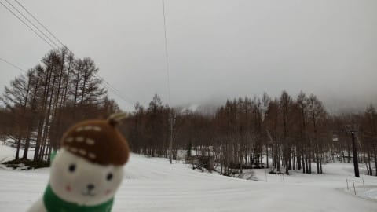

# 行く…明日は意地でも滑りに行く！土日とも天気は晴れ～曇り．気温は高いけど曇るとそこまで暑く感じないかも

📅 投稿日時: 2022-04-23 00:10:14

🏷️ カテゴリ: [日記](cc4b5682fb7b8b144980957a978653fb0.md)

ってなことで．

昨日から今朝にかけて著しくクリティカルで，

ほとんど寝てない状況ですが．

でも，滑りに行く！

土日は滑りに行くのだ！

…今回，一緒に車に乗りあって車を運転して

くれるって人がいるから行けるけど．

一人だったら絶対無理だったな…

ってなことで．

本日金曜の志賀高原は，朝から気温が

高かったものの…

曇り空だったので．

そこまで雪が融けなさそう…とおもいきや．

朝まで雨が降っていたらしく，ゲレンデは

かなり溶けた感じの茶色い雪(涙）

おこみんちゃんもふてくされて倒れるほどの

汚れた雪だったようです…

でも，ひどいストップ雪とかじゃなかった

みたいですが．

ちなみに，土日は基本的に曇り空，時折晴れ間．

土日とも，一瞬ポツポツと雨が降る可能性も…

で．

朝から気温は高く，雪は緩いです．

早朝のスタート一瞬がちょっとマシなくらいで，

あとはすぐザブザブになる気温ですので．

雪質には期待しないように…

いや．

しかし．

まだ仕事が終わってないのに，日曜帰宅後に

仕事すること覚悟で滑りに行くって…

そんなんで大丈夫か？？

果たして今週末滑りに行って，自分の体がもつのか？

スキー場について，無事滑れるのか？

乞うご期待！！←だから，何に？

ちなみに，あと2時間半後に出発です…

## 💬 コメント一覧

### 💬 コメント by (you160)
**タイトル**: Unknown
**投稿日**: 2022-04-23 18:04:16

S様

脱帽ですw

ちなみに、今朝、渋峠越えしました？　

こちらは本日、渋峠で滑っていたのですが、6時頃、特徴のよく似たレヴォーグが走り去ったのみて、もしや！？と思った次第です。

渋峠は朝カリカリも、次第に緩み、午後も多少荒れたくらいで、気持ちよく滑れましたが、横手山第2はお昼頃でザブザブな感じ、すぐに渋峠に戻りました。

明日は、焼額山予定です。

### 💬 コメント by (Skier_S)
**タイトル**: ＞you160さま
**投稿日**: 2022-04-23 20:19:56

草津越えで行きました～！

渋峠は6時くらいに通過したので，おそらく目撃したのは私の車かも…

明日焼額ですか！

早朝から小学生の焼額キッズと私は滑っていると思いますので，またお会いしましょう！

