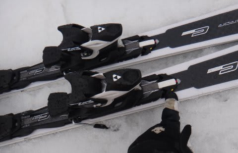

# 2014シーズンモデルのスキー試乗レポートその13…FISCHER編

📅 投稿日時: 2013-05-17 00:35:23

🏷️ カテゴリ: [スキー板試乗](c0bd8048615710cee890e403a36cc9a2b.md)

えー．

ってことで．

試乗レポート，続きます．

…もう，試乗してから1ヶ月以上経つので，

ネタ的にちとあれですが．

今回は，フィッシャー編．

プレミアムモデルの，C-LINEシリーズ2機種です．

では，どうぞ～！

---

FISCHER

C-LINE EMPEROR Racetrack Tune it 170cm

大回りベースオールラウンド．

Tune itってのは，レバー操作でビンディング部分のフレックスを調整できる

機能がついている板のようで…

これが，その調整用のレバーです．

強，中，弱の３ポジションに切り替えられます．

まず，中間ポジションで滑ってみますか…

ロングターンベースってだけあって，サイドカーブがすごくゆるい感じです．

R=17っていうけど，R=20mくらいに感じますね～．

角付けだけでは，結構まっすぐ走っていくので，

積極的に踏んでたわませて曲がっていく板です．

んで次は，一番ゆるいところに切り替えて滑ってみますと…

なんだか，トップとテールのグリップがずるずるに．

ちょっと頼りなさげな板になります．

…ちょっとこれは，あまり楽しくないですね．

ってことで，一番強くすると…

トップとテールのグリップがしっかり強くなります．

驚くほど性格が変わりますね～．ここまで変わるとは…．

で，一番強いポジションだと，たわませるように踏んでいっても板が

グリップするので，しっかりたわみを出せます．

たわませていくと，それに対応して回転半径が小さくなっていき，

ミドルターンまではいける感じです．

張りの強さ，グリップ共にホントにしっかりした大回り板の感じ．

ただ，荒れた斜面では，一番強くするとコントロールがつらいかな．

たわませられないと曲がらないので，ちと曲がりにくい．

うーん．

今回試乗した春のやわらかい雪では，あまり性能を出し切れないかな～．

とりあえず．

雪の状態のせいもあるのかもしれませんが．

この日のやわらかい雪では，

切り替えレバーで回転半径や使いやすさ調整できるのではなく，

グリップが強くなるかずるずるになるかを切り替えられるだけ…

って印象を受けてしまいました．

ちょいと残念．

C-LINE PRIME Racetrack Tune it 165cm

小回りベースオールラウンド．

この板も，レバー操作でフレックスを3種類に切り替えられるTune itがついてます．

で，滑ってみると…

…これは，いい．

ロングベースのEMPERORとはかなり違う印象．

この板は，サイドカーブよりもたわみで曲がる板．

たわみ量で，回転半径が決まる板です．

この，回転半径を決めるたわみ量を，レバーで選べる感じ．

一番強くすると，トップとテールの張りがかなり強くなり．

しっかり踏んでいってもたわみどまりがある，強い板に．

返りも早いです．結構鋭い小回りができます．

真ん中では，それほどがんばらなくても簡単にたわませられ，

気楽に小さい回転弧が描けます．

やわらかい雪だと，あんまり強くしてもたわみを出しにくいので，

このくらいがちょうどいいですね．

一番やわらかくすると…グリップがずるずるに弱まるので，

超低速で，ずらして滑りたいときなどにつかえます．

まったく予想外だったけど，振動吸収性も十分．

荒れた春の雪を気にせず，十分な安定感．

あららら～．

これは，うれしい予想外．

EMPERORは，レバー操作しても単にグリップの強弱だけが変わる感じでしたが，

このPRIMEは，レバー操作で板の使いやすさや攻撃性が切り替えられる感じ．

1本で3度おいしい，かなりいい板です．

＃でも，高すぎる…（涙)．
