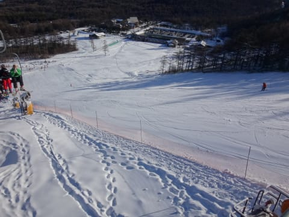

# 11/26(土)，2016/17シーズンのアサマ2000オープン日に行ってきたよ

📅 投稿日時: 2016-11-26 22:26:47

ということで．

長きにわたったスキー中断にも耐えて．←中1週間行ってなかっただけでしょ

実に2週間ぶりにゲレンデに戻ってきました…

はい．

そうです．

本日オープンの，アサマ2000に行ってきました～！！

…いや．

予想通り．

朝の登り坂は，途中から雪道っぽくなっていき．

最後のほうはかなり本格的積雪路です．

スタッドレスを履かないで走るのは，

不可能です．

何か物理現象を超えた車の操作方法を

習得している方以外，絶対にスタッドレス

必須ですので，ご注意を！

そして，朝イチ，ゲレンデに着くと…

うほう！！！

これは，予想以上の積雪っ！！

現在，早期営業時期でリフト券は3000円と

お安めになってますが…

なんと．

リフト営業は3時に終わっちゃいます．

うーむ．

ちと早すぎないかい？

ってことで，リフト開始8：30前

から並びますが．

晴天の朝日に照らされたゲレンデは…

ぐ，ぐふぅ．

早く，

早く滑らせろ！！！（じゅるるる）←よだれの垂れる音

状態！

そして，今シーズンの営業開始！！

朝イチのゲレンデは…

ゲレンデは…

ゲレンデは…

うははっはは！

すばらしいっ！

最高のかっとびバーン！！！

雪は，エッジが引っかかる感じの固まった人工雪の

上に，天然雪が乗っている感じで…

かなりスピードが出せる，

というより出ちゃう雪！

オープン日と考えると，コース幅も

比較的広く．

雪も厚いので，石ころを踏む心配なし！

新しいほうの板に出動願いました…

いや，これはいいんでないかい！？？

最高っ！！

…

…

と，2-3本滑ると．

…

あり？

ありり？

なんですか～！？

こりは？

なんと．

オープン後30分で，すでにリフト待ち10分

近く…（涙）

コースは気持ちいいんだけど．

最高に楽しいんだけど．

全然本数が滑れないのですが！？？

そして．

アサマ2000の定番．

昼近くになってくると…

そうです．

コースが荒れ始めてきて．

うっすら凸凹ができてきたかな～，

と思うと…

固い下地が顔を出す，小回り道っぽいのが

できてきます…

昼になると，エッジを研いでない板だと

死にます．

たぶん，死にます．

だのに．

いつもならリフト待ちが減っていく昼になっても…

あうーーん．

全くリフト待ちが減らないのですが（泣）

午前中はコンスタントにリフト待ち10分程度（涙）

そして，午後になると…

バーンの手ごわさ，150％アップ！

この写真は13：30ごろですが．

このころには，硬いのにところどころえぐれた感じで，

かなり荒れた小回り道と．

その間のもさもさ雪が溜まったエリアの

シマシマ状態に…

だのに．

だのに．

いつもならリフト待ちがなくなる午後になっても．

まだ7-8分の待ち時間があるのは，なぜだ？？

こんなバーン状況で，これだけリフトに

並んでいるのは，なぜだ？

…まぁ．

リフト待ちがあったとはいえ．

今日は一日，雪が緩むことなく．

そして，リフトストップまで天気が

良いままで．

夕方になっても，ゲレンデが混んだまま

だったのはちょっと残念だったけど…

今シーズン初の，広い中斜面を，

気持ちよく滑れたのでした…！

いやーーーー．

これで，空いていれば文句なしだったんだけどなぁ…

…明日，晴れてほしいなぁ…

せめて明日の午前中は，雨にならずにもってほしい…

で．

本日．

リフト営業終了3時ぎりぎりに，リフトに

乗りそびれ，すごい悔しがっていたら…

リフト故障か何かで，その直後に停止してしまい．

乗ってる人が救助されてました…

ふーーーん．

こんな風に救助するんだ～（ちょっと感動）

よっぽど訓練を積んでいるのか，

スタッフは，かなり手際よく

リフトに取り残された人を救助してましたね～

でも，故障だったのかなぁ？

真昼間だったらおおごとだったかと．

終了ぎりぎりだったのが不幸中の幸いか？

そして…

帰り道も本格雪道です．

明日の朝も，かなりの雪道だと思いますので，

間違ってもノーマルタイヤで来ないように…

＃そんな人いないと思うけど

## 💬 コメント一覧

### 💬 コメント by (Goku)
**タイトル**: Unknown
**投稿日**: 2016-11-27 07:30:10

お～！朝イチのゲレンデがチョー気持ちよさそう。

でも、凄い人ですね。熊の湯の比ではないです。

それにしてもせっかくのコンディションがこの雨で台無しに・・・ざんねん

私は雨予報なので今日は止めました。

### 💬 コメント by (yama)
**タイトル**: アサマ
**投稿日**: 2016-11-27 23:54:17

ご一緒させていただきありがとうございました。晴れて気持ちの良い一日でした。今日の熊の湯は夜半からの雨で天然雪はかなり消えてしまい所々ブッシュも出ていました。昼過ぎからは雨なのでゲレンデはガラガラですが今日は来なかったGOKUさんが正解だと思います｡りんごをゲットする必要があり、11時からの参戦でしたがマウチューさん、通りすがりさんとラスリフまで滑りました。また、毎週会えるのを楽しみにしています。

### 💬 コメント by (Skier_S)
**タイトル**: 日曜は，午前中は降らずに持ちました
**投稿日**: 2016-11-28 00:36:55

＞Gokuさま

土曜は，熊の湯も良かったみたいですね～

で，アサマ2000と同じく，混んだようですね～．

このあと，28，29日と冷えるのですが…

そのあとは…

うーむ．

来週のヤケビオープン，2高動くか微妙な

天気です．

＞yamaさま

昨日はご一緒いただきありがとうございました～！

また，柚子もいただきありがとうございます．

しかし，やっぱり，熊の湯もイマイチでしたか…

アサマも午後から雨でしたが，午前中は

かなり混みました（涙）．

しかし，もう志賀高原常連さんたちは

熊の湯登場ですね（笑）

私も来週からは志賀高原です．

また来週，よろしくお願いします～！

