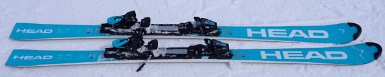

# 2024シーズンモデルのスキー板，試乗レポートその4…HEAD Worldcup REBEL e-SL RD FIS

📅 投稿日時: 2023-05-17 02:02:19

えー．

志賀高原に異常に忠誠心が高い某特派員．

今日も横手山で滑っていたようです…！

うーん．

あさイチは，かなり良さそうに見えますね…！

ただ，月曜までの雨で，やはり土曜までよりは

ちょっと幅が狭くなったみたいですが…

でもまだフラットで幅もあるし…

あさイチは硫安でガンガンに固めてあって，

良かったみたいです！！

リフト乗り場は，でもそろそろヤバくなって

きた感じですね…

午後はさすがに雪が緩んできたみたいですが…

平日というのもあり，午後は誰も人が

いませんね…！

なので．

休日のかぐらのように，全面ボコボコに

なることは無いみたいですね…

そして，かぐらからも写真が送られて

来ましたが．

こちらも雪が減って，コース幅がちょっと

土曜より狭くなったように見えますが…

まだこれだけ雪が残っていれば，

予想以上に残ってるかな…？

うーん．

17，18日と気温が上がるけど．

20，21日の週末まで，横手もかぐらも，

なんとか雪がもってほしいところ…

ってなことで，本題へ．

今日も2024シーズンモデルのスキー試乗レポート．

前回に続いて，ヘッド編です．

では，どうぞ～！

〇HEAD Worldcup REBEL e-SL RD FIS 165cm

SL競技用

前回のe-SL RD EVOが小回りセカンドモデルでしたが，

こちらはガチのSLトップモデル．

当然FISマークもついてるし，長さも165cmと

SLモデルで一般的な長さです．

EVOが長さ168cmとちょいと長めで，

返りもそこまで強くない感じに調整

されていて，小回りスペシャルというより

小回りベースでちょっとオールラウンド性を

持たせてあった感じですが…

こっちは本格的小回りモデルですね！

グリップ・返りの強さ＆速さともに，

EVOよりこっちの方が強い感じです！

今シーズンまでのHEADで感じた，

ちょっと角を立てるとたわみが出る前に

サイドカーブでクルッと回り始める

性格が弱まって，

この板もEVO同様，たわみが出てから

たわみに沿って曲がっていく感覚が

強まった気がします…

きれいにしなやかにたわんでくれて，

たわみの弧に沿ってガッツリグリップして

走っていく気持ちよさがあり，

たわみでまわって行くので，たわみ量で

弧の大きさがコントロールできるように

感じます…

今シーズンまでの，強い旋回性で

板なりに回される感じが弱まり，

乗り手のコントロール度が高まった，

しなやかさがある板に変わった感じです…！

しなやかさを感じながら，グリップは

むちゃくちゃしっかりしているし，

返りもEVOよりは早くてスパッと切り替え

られるし．

スピードを上げていくと，自然とターン弧が

小さくなり，傾きが大きくなっていく

カービング小回りマシンです．

ただ，返りの強さで吹っ飛んで反復横飛び

みたいになっちゃう感じは無く．

あくまで板のたわみに沿って板が走って，

きれいに身体の下で板が切り替わっていく，

快感度の高い深いターンができる小回り板！

履いてみると，SLモデルとしては軽快感もあるし，

エッジに沿って走っていく気持ちよい

深回りができる，かなりいい板です…！！

NordicaやFischerのSLモデルのような

ずっしり安定系というより，意外と軽快感を

感じる板です．

…ただ，当然SLトップモデルなので，

ある程度以上のスピードを出さないと

楽しくない板だし，グリップも強めなので，

履く人のレベルは選びそうですが…

しかし．

来シーズンのHEAD，どの板もしなやかさを増して

よくなってる気がする…！

## 💬 コメント一覧

### 💬 コメント by (愛読者)
**タイトル**: Unknown
**投稿日**: 2023-05-17 23:11:51

Kさんは、フィッシャーscproとこの板とどちらが魅力的ですか?

そういえば、sさんのscproそろそろ買い替え時ではないですか?

Ｓさんに煽られ買った私のウクライナ製scprは、とてもよかっつたです。私も試乗しましたが、この板いいですね。ここ2年で体重(脂肪)が15k増え95kgになったので、技術の進歩は、してないのに板の好みだけはSさんみたいに強い板が好きな傾向がに似て来たみたいで注目しています。

ところで、もしや、Ｓさん、すでにこのe-sl Rd　FISを物欲選手権で獲得しているのでは、、、

### 💬 コメント by (愛読者)
**タイトル**: Unknown
**投稿日**: 2023-05-17 23:14:27

眠たくてはなからSさんをKさんと呼んでしまいました。すみません。

### 💬 コメント by (Skier_S)
**タイトル**: ＞愛読者さま
**投稿日**: 2023-05-18 02:08:31

2024シーズンモデル同士で比較すると…

FISCHER SC PROよりHEAD e-SL RD FISの方がいい感じでした！

うーん．2024シーズンのSC，M/OプレートからMプレートに変わったせいか，

ちょっとしっとり感が減ったんですよね…

逆にHEADの方がしっとり感が増したんですよね．

お値段はHEADが安い方もあり，私が24シーズンモデルでどっちを買うか聞かれたら，

HEADを買っちゃいますね～！！

…でも．

e-SL RD FIS，買ってませんよ（笑）

これは買ってもいいな…と思いましたが．

SC Proはすごい値上がりしたっていうのもあり，24シーズンモデルより

23シーズンモデルの方が当たりだと思いました…

