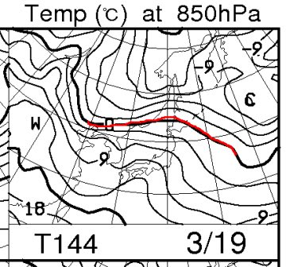
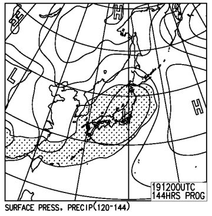
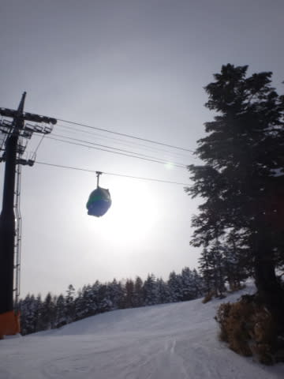
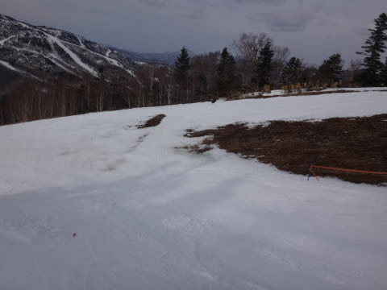

# 3月13日，日曜の志賀高原詳細…今シーズン最後の冷え冷え週末か？？今シーズンではマシなコンディション

📅 投稿日時: 2016-03-15 01:09:41

🏷️ カテゴリ: [2016スキー滑走日記](c70c67ed5248e9432b899dcd5747048bb.md)

えー．

今週末は，19日から3連休ですね～．

楽しみですね～！

…

…って…

…あれ？

…

…えええぇぇっ？？？

…

…このBlogの読者なら，これだけで何が起こるか，

わかってしまうはず……（涙）．

…いや，見てない．見てないぞっ！！

こんな天気図，見なかったことにしよう…

＃まだ19日の特定高度線ばらつきはこんな感じで大きいので，

＃予想はズレる可能性が…

＃いや，ズレるっ！ズレるはずだっ！！

…

…

…あれ？

なにか，幻覚を見たかな？

土曜日の志賀高原が雨になるような，

なんだか，恐ろしい幻覚を見たような気がするが…

きっと，気のせいにちがいない…．

ってことで．

気にせず，本題の．

昨日，日曜の詳細レポートへ行きましょうか．

えー．

日曜の朝は…土曜の晩から積雪があったようですが．

積もったのはこれくらいで…

…積雪は…1cmも無い感じですね…（涙）．

で．

いつも通りの焼額第1ゴンドラ山頂に出ると．

ふむ．

山頂の気温は-7℃．

意外と冷えてますね～．

で，天気はうす曇り．

この時期，このくらいの日差しの方が

雪が解けなくていい感じ…

んで．

ゲレンデは…

ふっふっふ．

ふははははははは．

うわははははははははは！

いい感じに締まったシマシマだっ！！

固めが好きな人には，最高のハイスピードバーンっ！！！

気温も低いので，午前中は緩むこともなく，

日が射す気持ちいい締まったバーンを，思う存分大回り！！

ふはははは．

今日も．　

　朝イチは締まった圧雪の，快適ハイスピードバーンが楽しめるかな…

という予想通りなのだっ！！

と，気持ちよく飛ばしていたら．

…ふむ…

さすがに10時を過ぎてくると，ちょっと人が増えてきたか…

んでも．

今日もゴンドラ待ちはほぼ無し．

待ちなく快適にゴンドラぐるぐる可能！

そして．

ちょうど昼間の気温が上がる時間に，太陽が雲に隠れてくれて．

まぁ，この時期は．

ピカピカ晴天よりも，ちょっと曇ってくれた方が

気温が上がらなくて…

だもんで，焼額第1ゴンドラのGSコース．

昼になってもこんないい感じの雪が続きます！

いや．

ところどころ固いものの，意外といいコンディションが続くなぁ…

…で．

この日は昼間は奥志賀に足を延ばしたりもしましたが…

なぜか，奥志賀第2ペア沿いのエキスパートコースは…

ありゃ．

固いっ！

かなりのアイスバーン…（涙）．

そして．

第2ペアのリフト下も，もう雪が薄くなりかけてるなぁ…（泣）．

ってことで．

午後はわがホームゲレンデ，ヤケビに戻ってきますが…

午後も天気は曇ったり…

晴れたりを繰り返す感じですが．

でも．

　　午前中から気温が上がっていくけど，プラス気温まで行かない．

　　日差しがあたらない斜面は冷えたまま．

という予想も見事にあてて．←誰も誉めてくれないので自分で誉めておく

焼額のGSコースは，終日いい感じの雪をキープ！

…ところどころ固かったところはあったものの…

でも，先週の．

涙を誘わずにいられない，べっとり張り付く春雪に比べれば…

もう比較にならんほどいいっ！！！←今シーズンは，判断基準が著しく低くなっている

ってことで．

比較的締まった雪で，雪もそれほど緩まなかったし．

午後は人がいなくなっちゃったのもあって…

バーン状況は，午後になってもフラットなまま！！

夕方のゴンドラストップタイムが近づいても…

こーんな，大回りReadyフラットバーンが

待っていてくれます！

いやー，シアワセっ！

かっ飛ばし放題だぁ！

もう，最後の一本までかっ飛ばすぞ～っ！！！

＃…と，大体このあたりで遭遇したわけですね…＞aquraさま

…と，夕日が傾くゴンドラストップまで，焼額を楽しんだのでした…

…

…

…が．

滑り足りない．

滑り足りないのだっ！！

こんないいコンディションだから，まだまだ滑りたいのだっ！！！

…

…一の瀬ファミリー，16:50まで営業してるよな？？

…と．

16時の最終ゴンドラにぎりぎり飛び乗り，

16:15に焼額を滑り終えた後．

そのまま駐車場へ走り，板を車に積み込み，一の瀬へ移動！

16:24には，再びブーツを履いて一の瀬ファミリークワッドに

乗っているという…

ほとんど瞬間移動に近い技を駆使し．

残り26分のために．

やってきました一の瀬ファミリー．

残り25分あれば，リフトに4回乗れるのだ…っ！！←何かもう壊れている

うーむ…

一の瀬正面バーンは，かなり固い下地が出ていて，

その上にところどころ，氷が砕けた砂のような雪が

溜まっているような，ちと難し目なバーン…

パーフェクターも，憑りつき部分の土はかなり隠れたものの…

（ちなみに，先週の同じ場所はこんなでした）

コース途中は，ちょっとブッシュが出ています…（残念）

…でも．ブッシュが出てない部分は，いい！

滑る！

最後まで，滑るのだ！

と．

もしかしたら，今シーズン最後の冷え冷え週末かも…

というこの日．

リフトが止まる，最後の最後まで．

ガッツリ滑って帰ったのでした…

…しかし．

この週末は良かったものの．

来週以降はどうなってしまうのか…（涙）．

今のところ深くは考えたくない，Skier_Sなのだった…

## 💬 コメント一覧

### 💬 コメント by (ぴよ＠太田市)
**タイトル**: ガス襲来
**投稿日**: 2016-03-15 11:01:41

中越付近でまともに雪が残っているのはかぐらぐらいなのですが、

スキー場も生き残りをかけて、２月末からゴンドラ下の通路確保の為、雪よせ行為に走ってます．．．

それにこの気候のせいで、ハイシーズンなのに田代湖からのガス襲来！

先週はガスガスでバーンが全然見えませんでした( ;∀;)

Sさま、”ガスガスないない踊り”も是非お願いします

### 💬 コメント by (まいる)
**タイトル**: 三連休行きます
**投稿日**: 2016-03-15 12:24:47

Sさん、お疲れ様です(^^)v

三連休、予定通り志賀高原に行きます。Sさんにお会いできるとよいですが、今天気予報は・・・(-_-;)

冷え冷え踊りも厳しいかな？？

### 💬 コメント by (Skier_S)
**タイトル**: 3連休も志賀高原
**投稿日**: 2016-03-16 00:23:41

＞ぴよ＠太田市さま

かぐらも，今年は5月下旬どころか，

GWまで滑れるか微妙な感じですよね…

まぁ，あそこは今シーズンからPISLABがあるので，

最悪ブラシで滑れる，ということでしょうね…

しかし，「ガスガスないない踊り」は，考えたことがなかったですね～．

でも．

最近，踊ってどうなるレベルじゃない気がしてきました（＾＾；

＞まいるさま

をを！

志賀高原にいらっしゃいますか！

基本的に，焼額第1ゴンドラぐるぐるしてますので，

また見つけられたら声をかけてください～！！

