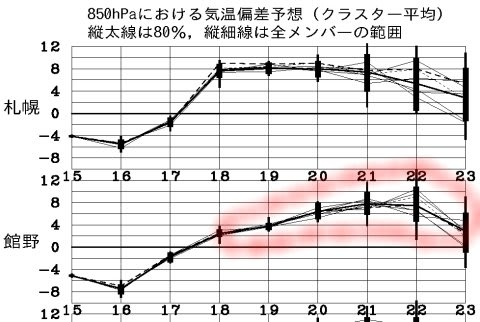

# 今週末の志賀高原はGoodコンディション！焼額1ゴン・ダイヤクワッド・一の瀬クワッド・高天ヶ原クワッドが動くよ！

📅 投稿日時: 2016-12-17 00:23:54

ということで．

いつも通り，この週末も．

1泊2日で志賀高原を滑ってます～！

明日から，

焼額第1ゴンドラ

ダイヤモンドクワッド

一の瀬クワッド（天狗コースのみ）

高天ヶ原クワッド

丸池トリプル

サンバレークワッド

が動き出すようで．

かなり，滑れるエリアが広がりますね～！

ついに．

わがホームゲレンデの．

私の住み家ともいうべき1ゴンが動き出します！！！（ぱちぱちぱち）

いやーー．

12月の20日を待たずして，第1ゴンドラが

動き出すのって…

2009/2010シーズン以来ではないでしょうか？？

まさか，先週滑れなかった1ゴン・2ゴンともに

今週滑れるようになるとは…（感動）

土曜の朝は新雪10cm，朝のうち小雪，

昼からは雲が減っていき，午後は日も射す

天気になりそう．

気温はかなり寒いよ！

日曜は，朝から晴れ．

朝は冷えて最高のコンディション！

終日天気も良く，絶好のスキー日和です…

ってことで．

今週末は，楽しみましょう！

…そのあとは．

これですから…（涙）

＃この予想だと，24日くらいには平年並み程度に

＃戻ってくれそうな気配になってきたけど…

## 💬 コメント一覧

### 💬 コメント by (かず)
**タイトル**: おそらく朝ゴンドラで一緒だったと思うのですが
**投稿日**: 2016-12-17 17:33:38

正面にいた方ですよね?　朝一忙しいと思い落ち着いてから挨拶するつもりだったのですが　自分の今年買ったブーツが痛くて締め直しばかりして余裕が無くなりました　次回声かけます

### 💬 コメント by (Skier_S)
**タイトル**: かずさま
**投稿日**: 2016-12-17 22:33:37

あれれれれ～！

お会いしてましたか！

おそらく，2万mクラブの方＆

GokurakuSkierさんと

一緒だったときでしょうか？？

あらー．全く気づきませんでした…

またお会いした時は，よろしくお願いします．

