# 2017年8月，小学生の子連れで座間味でダイビングその12…ダイビング2日目，午後のダイビング

📅 投稿日時: 2018-07-21 01:29:09

私はマニュアルを読むのが大好きで．

購入した物品のマニュアルは，

隅から隅まで読み込むのですが．

…今回，LEVORGのマニュアルを読んでいて，

ちょっと驚いたことが…

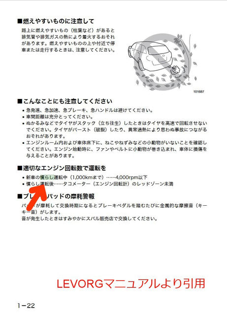

このマニュアルの，矢印部分に

書かれている内容を拡大すると…

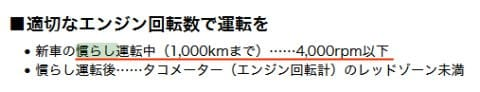

なに！？？

慣らし運転？？

最近の車で，慣らし運転が必要とマニュアルに

明記してある車，見たことない気がするんですが…

ふーーーん．

1000kmまで，4000回転超えさせちゃダメなんだ…

でも，この車．

4000回転までぶん回すと，すごい加速するので．

まぁ，普段は使わない回転数ですね（笑）．

…ってな感じで．

ここしばらく，プロジェクトXネタが続いてましたが．

本日は，「徒然スキーヤー日記」本来のダイビングネタ．←なんだか，すごい矛盾した表現だ…

しばし中断していた，ダイビング旅行記です．

でも，明日からまた車ネタに戻りますが…（ぼそ）

では，どうぞ～！

---

お昼休みにさんざん泳ぎまくった子供たちを載せたボートは…

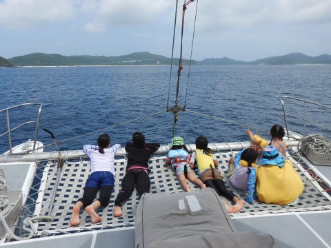

お昼休みの場所を離れ，午後のダイビングポイントへ

向かいます．

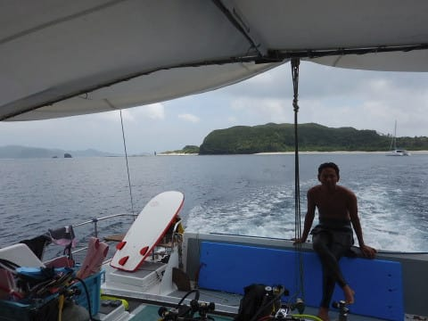

…午後のダイビングポイントも，お昼休みを

とった安室島のすぐそばなんですが…

ぐるっと島を一回りして，

反対側までやってきました．

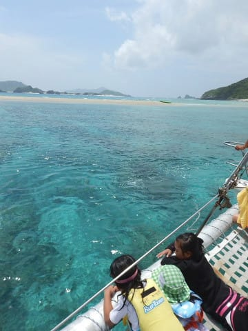

どうやら．

2本目のポイントはこのあたりのようです．

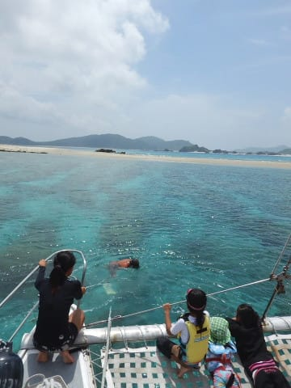

太陽も出始めてきて…

うーん！

きれいなポイントですね～！！

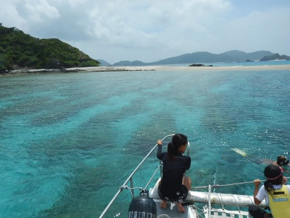

本日の午後のダイビングポイントは．

「シルキンメの根」．

これまで何回も潜ったポイントです．

エントリーして進んで行くと…

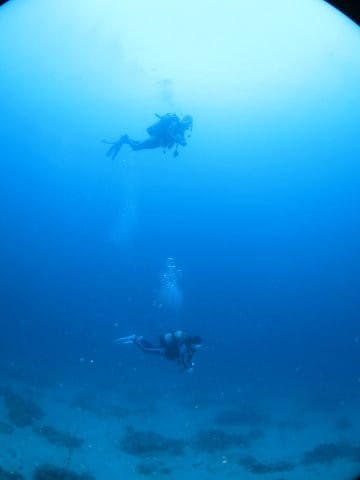

砂地の中に，こんな感じの直径3-4mほどの

孤立した根があって．

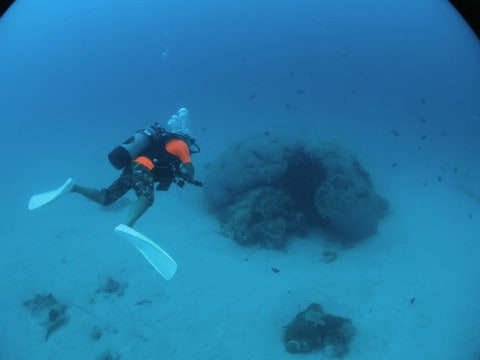

この根に，キンメモドキがどっちゃり

居着いています．

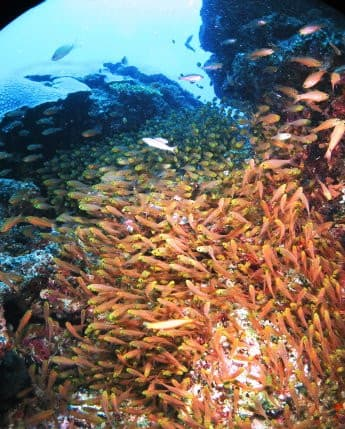

もう，どっちゃり．

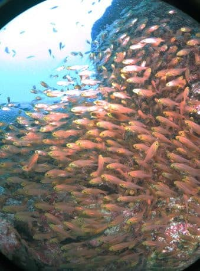

ええ，どっちゃりと．

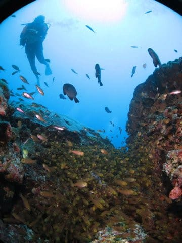

ってな感じで．

キンメモドキの大群を見た後は…

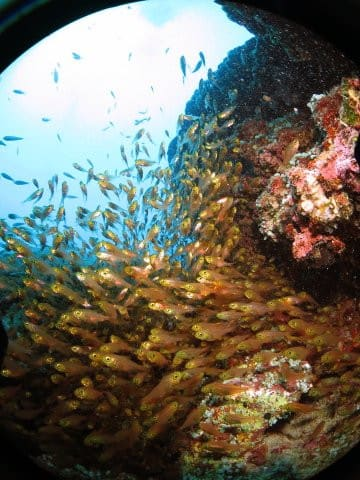

根から離れて，しばらく泳いでいきます．

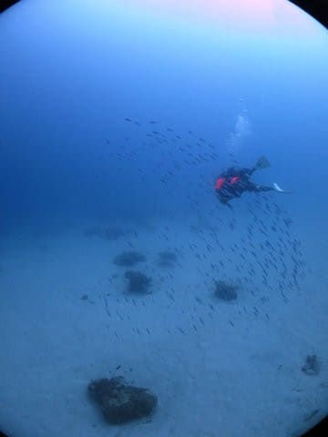

…結構泳ぐなぁ…

と思ったら．

隣のポイントの「東牛（あがりうし）」まで

泳いできていたようで．

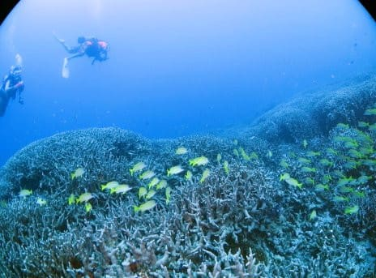

東牛名物の，ハマエダユビサンゴの群生に

やってきました！

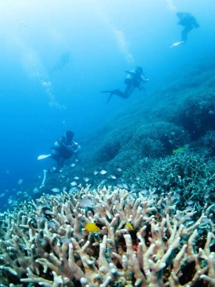

いや…

ここのエダサンゴがずっと広がる景色．

なかなか圧巻．

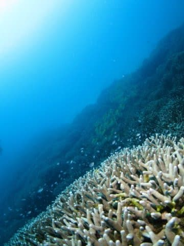

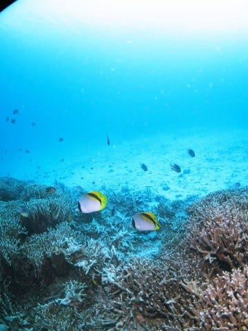

そして，いかにも沖縄…という感じの

お魚たちがお出迎えしてくれます．

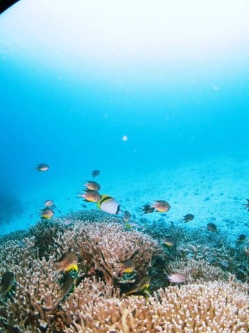

こんな感じのサンゴの群生を満喫した後は…

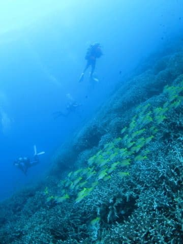

ダイビングもそろそろ終了タイム．

ボート下に戻って，深度5mの安全停止

タイムですが…

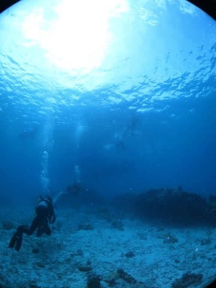

…子供たち．

まだ泳いでいるようですね…

ホントに飽きないのね，お前たちは…

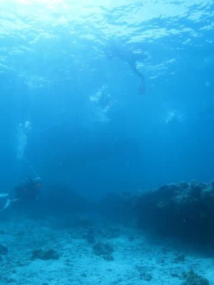

と，思っていたところ．

娘，いきなりの潜行！

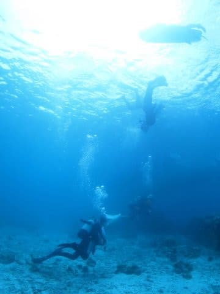

その瞬間は撮りそびれましたが（ちょっと残念…）

5m安全停止をしていた妻にタッチして，

浮上していきました…！！

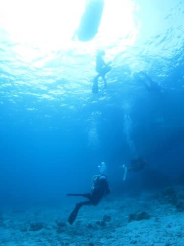

これはびっくり！

娘が，まさか5m近くまで素潜りできるとは…！

うーむ．

私がまだ小学校4年のころは．

こんなに深く潜れなかった気が…

なかなかやるじゃないか…

ってな感じで．

安全停止も終わり．

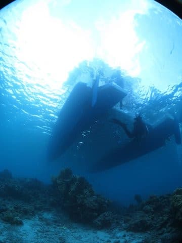

浮上しますが…

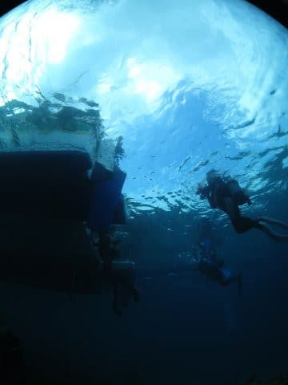

今日のこのダイビングのログブックの

見た生物の記録として．

キンメモドキでも，エダサンゴの群生でもなく．

「安全停止深度まで潜ってきた娘」

を書いておこう…
