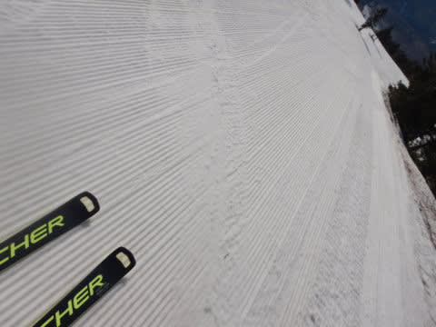

# 2022/5/5(木・祝)の志賀高原スキー場は…晴天，高温で全く滑らない雪(涙)．一の瀬エリア終了，最後までぎりぎり雪は持った感じ．ヤケビはまだOK！

📅 投稿日時: 2022-05-05 21:58:43

🏷️ カテゴリ: [2022スキー滑走日記](cc9cb73e4320f6a97af6fccc37587a61a.md)

ってなことで．

中1日，自宅に戻りましたが．

また志賀高原に舞い戻ってきました～！！！

今朝はまた3時発で，早朝から参戦

だったのですが…

今日は早朝スタート時の山頂で…

気温がすでに+8℃超え（涙）

これはヤバい…

気温が高い上に，強烈晴天で容赦なく

太陽光が降り注ぐので…

一応，朝イチはシマシマだったけど，

すでに表面はしっとりして滑りが

良くない感じ（涙）

そして．

あさイチなのに，急斜面はやはり圧雪が

荒れ気味で，さらに早朝2本目の段階で

雪が早くも緩んでます…（泣）

うーん．

まぁ，昼間にもっとザブザブになっちゃうことを

考えれば，まだ早朝はマシなんだろうけど．

GW前半の-5℃の早朝と比べると…

かなり残念な感じ（涙）

でも，

パノラマコースが今日も8:30オープン！

オープンしたてのパノラマコースは．

早朝のGSコースと違って，下地が人工雪

だからか…

凸凹しておらず，完全フラットなシマシマ！！

雪は緩んでたけど，いい感じの無人フラット

シマシマを2本ほどは楽しめました！！

…が．

9時ごろには+10℃を超え，

かなりの日差しも降り注いだ本日．

朝9時過ぎには…

雪面も汚れ始め，すでにほぼ全面，滑らない雪に

なっていきました…（涙）

これまでほぼコース幅いっぱいに

滑れたGSコースですが．

高温＆日差しのせいで，そろそろ雪が薄く

なってきたところも出て来ちゃいました…

まぁ，まだ一度圧雪整備すれば，穴は

埋まりそうな程度ですが．

ただ，まだほとんどのコースは幅いっぱい

雪が着いてますよ～！

営業終了予定の5月8日まで，雪の量は

心配なさそうです…！！

とはいえ．

今日は午前9時を過ぎると，コース全面

ほぼ滑りの悪い雪になり．

午前11時過ぎには，気温も+12℃を超え．

ゴンドラ降り場から乗り場までほぼ直滑降

じゃないと止まっちゃうような雪になり．

ひたすらゴンドラ乗り場を目指すだけの

スキーになっちゃいました…（涙）

そのせいもあり，10時ごろには

焼額を滑っている人はほとんどいなく

なり，ゲレンデはもうガラガラ．

ざんねんながら，焼額の雪の滑りも悪くなり．

あんまり楽しくないので．

今日は一の瀬エリア最終日ということもあり．

午後は久しぶりに一の瀬方面へ遠征してみました！

…実に久しぶりの一の瀬エリア．

かれこれ2か月近く滑ってない気が…

でも…

正面バーン，かなり穴が開いてますよ！！

これ，大丈夫かな？？

と，思っていたら．

今日の午前まで滑れたらしい，一の瀬正面バーン．

午後までもたず，閉鎖になってました… （涙）

まぁ，こんな感じだからしょうがないのかな．．

滑れたのは天狗とパノラマのみでしたが．

パノラマも結構土が出てて，ヤバそうな感じ…

正面バーン下半分は，人工雪をしっかり

つけてあるからか，土はそんなに出て

なかったですが．

途中で止まるかと思うような，悲しいほど

全く滑らない雪（涙）．

一の瀬ファミリースキー場全体で，

午後は10人も滑ってなかったかも？？

ってなことで．

一の瀬ファミリーンに早々に見切りをつけ，

今度は高天ヶ原に移動しましたが…

うーん．

モーグルバーンはもう終わってる感じですね（涙）

メインバーンも…

所々雪が薄く，もう土が出かかってますね（泣）

まぁ，営業最終日の午後なので，こんな感じ

ですかね．

まだまだいっぱい雪があったら，もったいない

お化けが出そうなので，ちょうど雪が終わりそうで

シーズンラストってのがいい感じなのかも…

クワッド降り場からの廊下も，一部

ヤバそうなところがありましたが．

まぁ，4月の異常高温が続く中，良く

ここまで雪がもったもんだ…

NHKバーンもボコボコで，ところどころ

土が出かかってるけど．

地雷エリアは回避可能で，硫安が効いていて

板が滑ったので，割と楽しかったかも…！

高天ヶ原メインバーンも，ところどころ

地雷原になってたけど…

でも，全体的にまだ雪はいっぱい残っていて．

そして，コース下半分も硫安が効いていて

滑りが良かったので．

今日の午後は，高天ヶ原が一番良かったかも…

でも．

残念ながら，一の瀬＆高天ヶ原は本日で営業終了．

名残を惜しみながら，今シーズンラストの

高天ヶ原を滑っていたのでした…

ってなことで．

GW3連休の最終日，こどもの日が

終わったわけですが．

これから営業が続くのは，

焼額第1ゴンドラ，奥志賀第2＆第3ペア，

熊の湯第2ペア，横手＆熊の湯ですね…

とりあえず，私は8日まで焼額で滑ってます～！！

## 💬 コメント一覧

### 💬 コメント by (大阪のK)
**タイトル**: Unknown
**投稿日**: 2022-05-06 05:04:34

Sさん、激烈滑らない雪の１日、お疲れさまでした。

私は熊の湯にいたのですが、全く同じ状況で、

馬の背も2Aも9時前には滑らなくなりました。

そんなわけで、11時30分に21～22年シーズンを終了させていただきました。

Sさんをはじめ焼額山の皆様には大変お世話になりました。

来シーズンも元気に戻って来れるよう、サマーシーズンを過ごしたいと思います。

皆様、本当にありがとうございました。

### 💬 コメント by (なるなる)
**タイトル**: Unknown
**投稿日**: 2022-05-06 15:51:45

昨日、早朝営業から高天ヶ原で滑っていました。早朝は穴も開いてなったです。

カリカリでしたけど…

通常営業から一の瀬へ移動したのですが、そろそろヤバいかもと思いつつ、暑さに

耐えきれず撤収している時に、何か閉鎖みたいなアナウンスがこれだったのか。

私は、心置きなく今シーズン終了。

Sさんはまだまだ続くんですよね?w　面白い記事期待しています。

### 💬 コメント by (Skier_S)
**タイトル**: 今日は楽しくなかった…（涙）
**投稿日**: 2022-05-06 20:51:22

＞大阪のKさま

今シーズンもお世話になりました~！！

最後お会いしないな…と思ったら熊だったんですね．

熊の湯も滑らなかったんですね…

では，また来シーズンお会いしましょう！

＞なるなるさま

お久しぶりです～！！

昨日は高天ヶ原だったんですね．

午後3時くらいから私も高天滑ってました．

穴だらけだったので，早朝は穴がなかったというのが驚き…！！

私の今シーズンはまだしばらく続きます．

これからもご愛読よろしくお願いします～！！

