# プロジェクトX2第2章…LEVORG E型にKENWOODナビ取り付け・部品が来たからナビ取り付け作業再開！

📅 投稿日時: 2018-08-21 02:28:58

🏷️ カテゴリ: [車](cba0e8330b3f2ded7c1addfacc75d4547.md)

ってな感じで．

思わぬC型までとD型以降の仕様の違いにより．

[ナビ取り付けがいったん中断](ea3966b6fe017a75f08b9b8661e6e5c63.md)となりましたが…

無事，部品が届いたので．

次の週末に，ナビ取り付け再開です！

…部品を待つ一週間の間．

一部内装を取り外したまま走っていて．

どうも落ち着かなかったので．

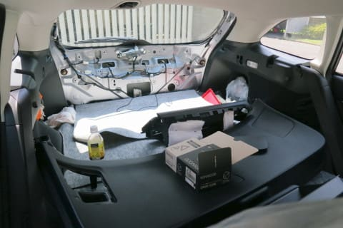

今日こそ作業が無事完了して，

ちゃんと内装がすべてついた車に

乗れますように…！←お願いごとのレベルがおかしい

ってことで．

購入したのは，こちらの部品．

まずは5ピンコネクタ用ケーブル．

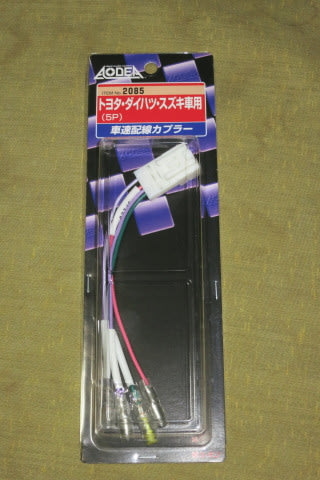

エーモン社の，車速配線カプラー2085です．

アマゾンで普通に買えます．

お値段は500円でお釣りが来ます．

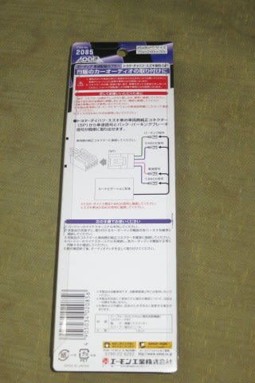

トヨタ，ダイハツ，スズキ用と書いてありますが．

D型以降のLEVORGも，C型までの15ピンコネクタの

代わりに，この仕様になったようです…

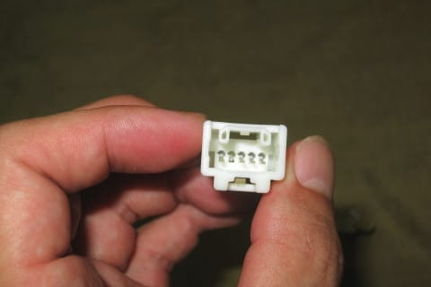

5ピンコネクタのうち，4本が結線されてますが．

そのうち，SPEEDと書いてある線が車速パルス．

PARKINGと書いてあるのはパーキング線です．

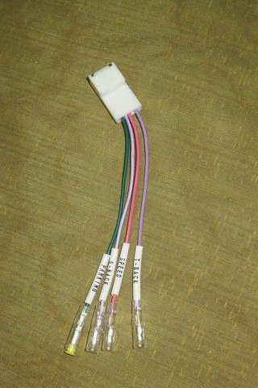

で．バックを検出するリバース線が，

「T-BACK」と「S-BACK」の2本ありますが．

S-BACKはスズキ車用．

スバル車はT-BACKの線を利用します

そして．

これはスバルのディーラーで注文した，

ナビ取り付けブラケット．

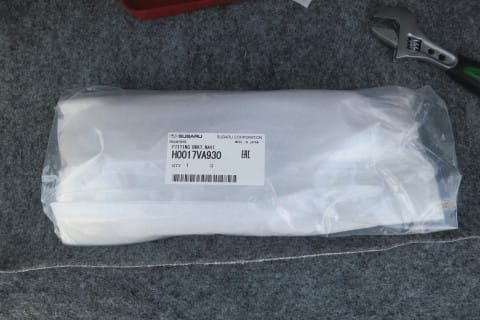

品番は，

H0017VA930

です．

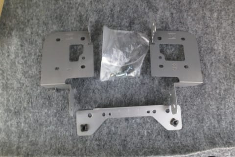

こんな感じの，ナビを車両に取り付けるための

金具です…

こいつが2500円もします．

高い…（涙）

ってな感じで．

とりあえず，部品は揃った．

…これで足りない部品は無いはずだと信じて…

作業再開っ！！

まずは新たに購入した5ピンコネクタを，

ナビ側ケーブルに繋ぎこめるように，

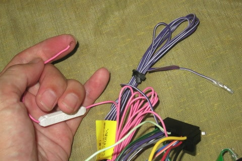

速度線とリバース線にギボシ端子を取り付けて…

（5ピンコネクタにつなぐはずのパーキング線がアースに

つながっているように見えるけど，良い子はマネしちゃダメよ）

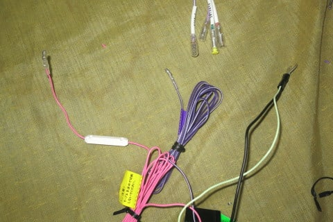

で．

以前繋ぎこんだケーブルに，新規購入の5ピンコネクタを

繋ぎこみました～！

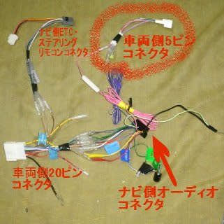

これで．

残る作業は，このケーブルを使って車両側コネクタと

ナビを繋いで，本体を固定するだけ．

ってなわけで．

ケーブル取りつけとナビ本体取り付けのため．

まずはセンタークラスタパネルを外します．

これもクリップで固定されているだけなので．

隙間に指を突っ込んで引っ張ります←内装はがし買おうよ…

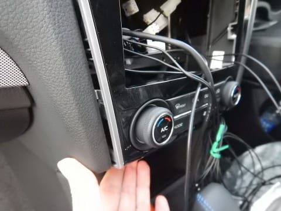

かなりクリップは固いので，最初は

手こずると思いますが．

ゆっくりゆっくり引っ張っていけば，

クリップがポコポコと外れていきます．

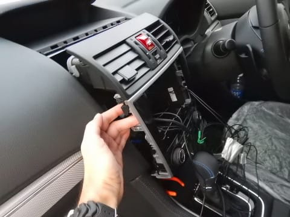

ここまで外れたら．

ハザードスイッチのコネクタが見えてくるので…

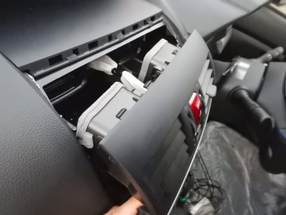

ハザードスイッチのコネクタを外します．

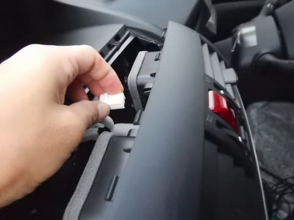

ハザードスイッチのコネクタの下側には，

マルチファンクションディスプレイ

表示切替スイッチのコネクタもありますので．

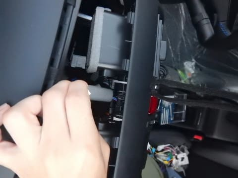

こいつも外します．

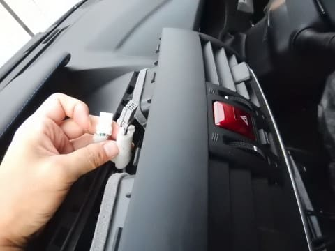

この二つのコネクタを外すと，

こんな感じで，べろーんと外れますが…

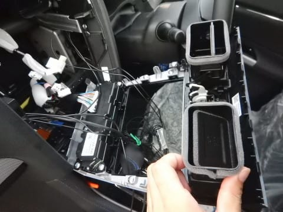

まだ，エアコンコントロールの

ケーブルコネクタが刺さってます．

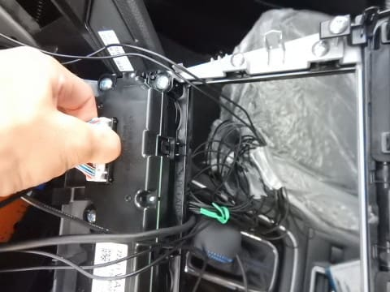

だもんで．

このコネクタも外しましょうね…

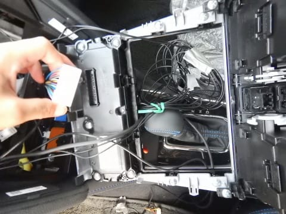

ここまですれば．

センタークラスターが外れます…

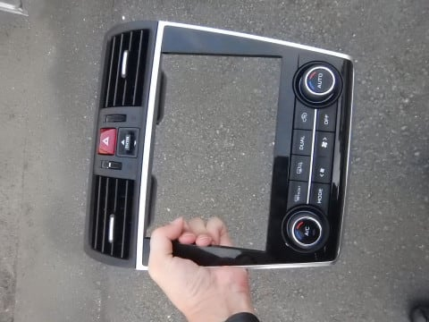

裏側はこんな感じですね．

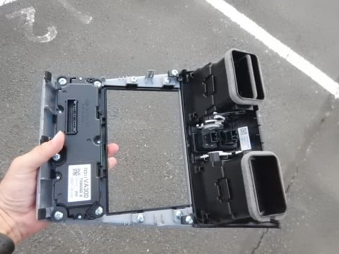

センタークラスターが外れたナビスペースは

こんな感じ．

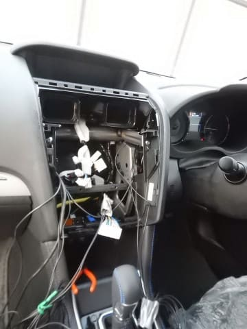

ちなみに．

購入したナビ取り付け用ブラケット．

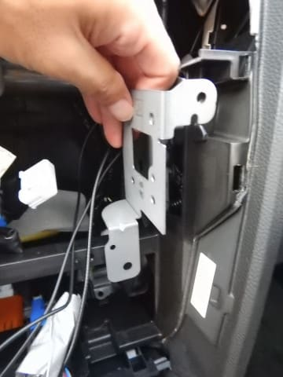

ナビの左右に取り付けて，こんな感じで

ナビスペースにねじ止めするものです．

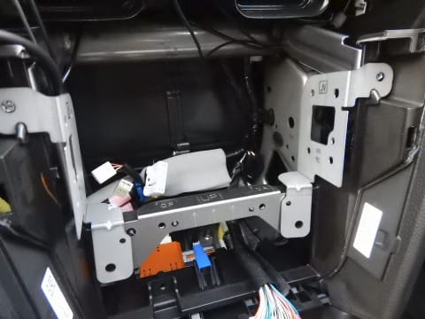

この下側のプレートは，ナビに取り付けるのではなく，

車両にねじ止めしてナビを支えるモノなので．

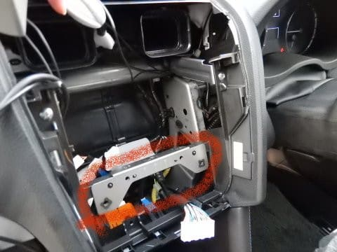

まずはこいつをねじ止めします…

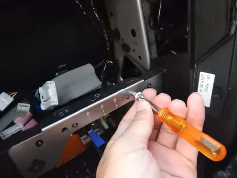

こんな感じで無事固定できたら．

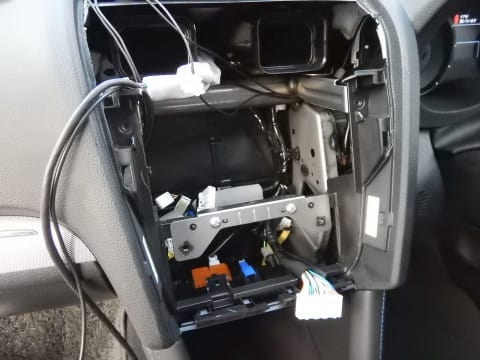

次は，左右のブラケットをナビに固定．

固定用のネジはナビに付属のモノを利用しましょう…

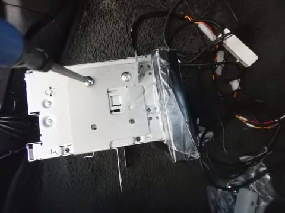

ブラケットを取り付け終わったら，

こんな感じになります…

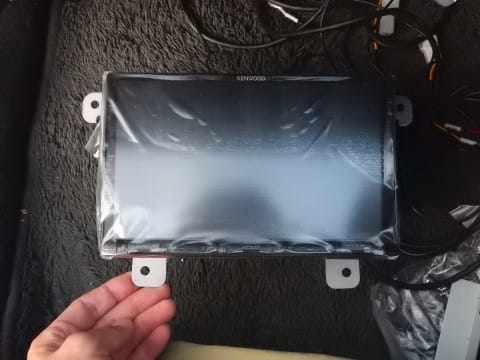

これで，ナビ本体をナビスペースに

固定できるようになりました．

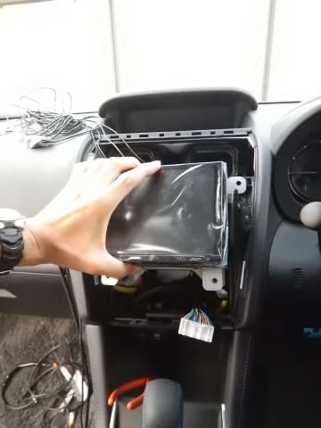

ここまでできたら．

次はナビスペースのケーブルの繋ぎこみです！

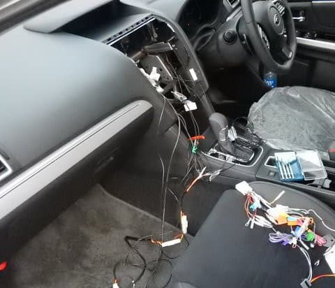

（続く）←いったい，あと何回で終わるんだ？？
