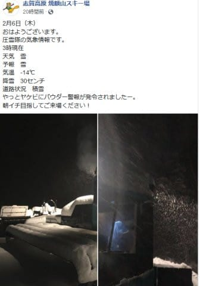
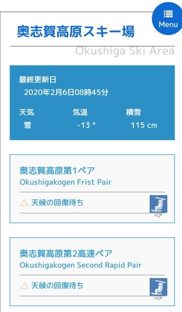
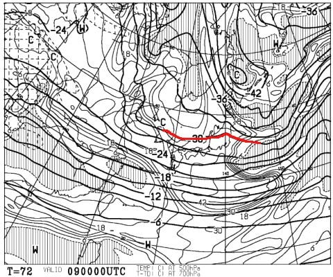
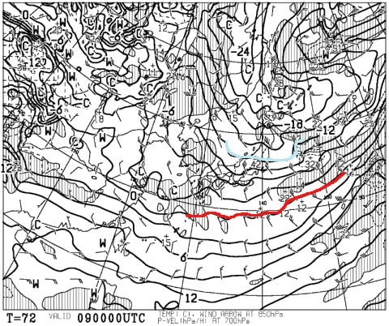
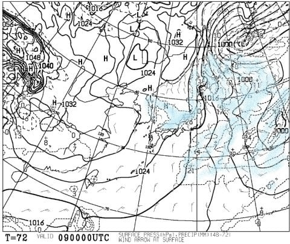
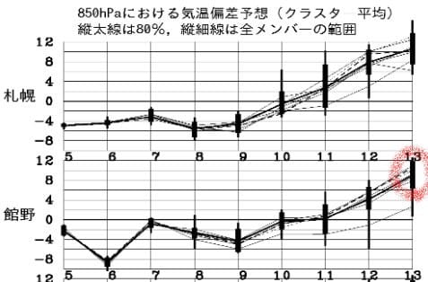
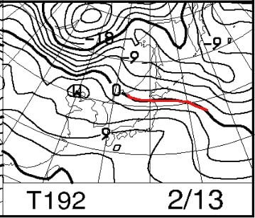
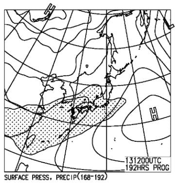
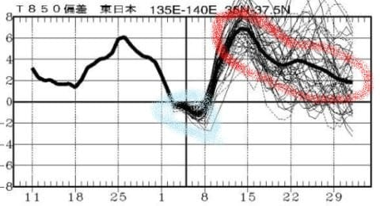

# 8日の志賀高原，結構雪が積もるかも？9日朝も新雪か？…そして，そのあとの13日から…冷え冷え祭り終了のお知らせ（涙）

📅 投稿日時: 2020-02-07 00:30:01

🏷️ カテゴリ: [日記](cc4b5682fb7b8b144980957a978653fb0.md)

えー．

本日の志賀高原ですが．

予想通り，朝は30cmほどの積雪が

あったようです！！

（[焼額山Facebook](https://ja-jp.facebook.com/yakebitaiyama/posts/2690467154381947?__xts__[0]=68.ARCxabqlJp2SoWjjLtSVQHUKOdJ_31JgpJMDY8-quBUpPT5Tb6JqrNhmyr1M73k8uxiCYdEORE2cFLNACavSZQaZXWys0sOoqu6jSklLiLUO6GchXVKZfaW08MuW2tjGI2Es1v6-RNAT3KjVEGu8c9p2Gq0KbjiMtyHbWOTMxB-36JGorooFqnoxRa7TCFBYKal-_kRT5VbLwJPnHvQOLuNUQ7KJqX00h97LI03hE2Hd38FI4r_y61E0lIKyVMcMBMuHVOeIPBb06X70p0Nt2If3LAph85Uwqgc_1G254mP0d8unNmrTOakbXVya2sJA8Vatu-175gbz3LpcFBGo3-7gRg&__tn__=-R)より）

朝はブーツパフから脛パフという予想でしたが，

今日の焼額特派員より，膝パフだったという

報告が入ってきました…！

そして，終日，予想通りの激冷えだったようですね…

うむ．

やっとトップシーズンがやってきたかな！

…ただ．

ここも予想通りなんですが．

奥志賀はゴンドラが強風で朝から

動かなかったみたいですね…

…っていうか．

リフトもほぼ全滅だったようで．

志賀高原の他のスキー場，南風に弱くても

北風には強いので，北風が多少吹いても

止まらないんだけど．

北風には弱い奥志賀．

やっぱりダメだったか…

そして，腰の調子ですが．

まだ本調子と言えないまでも．

痛みはかなり治まりました…

ごくたまに，特定の角度に腰をひねった時や，

ドアノブを強く引っ張るなどの動きで

鈍痛がありますが．

受傷直後みたいに，激痛が走ることは

無くなったので．

今週末は，不整地荒れ荒れじゃなければ普通に滑れるか？

…と，期待しています…

で．

本日，9日（日）の詳細天気図が出たので，

500hpa図を見てみましたが…

うむむっ！！！？？

これは…

9日になっても，そこそこの雪の目安，

赤い-30℃線が志賀高原にかかってますよ！！

そして，850hpa図を見ると．

水色の-12℃線が志賀高原にっ！！

これは，冷える．すごい冷える．

そして，地上天気図を見ると…

をを！！見事に降水域が日本海側に！

…これは，8日は終日雪が降って，

9日朝まで雪が降り続けそうな感じに

なってきました！

…昨日の予想では，

8日朝は10cmくらいの積雪，

9日はほとんど積もらない…

と書きましたが．

どうやら，

8日朝の10cmほどの積雪予想は変わらず．

雪は8日一日中降り続け，昼間もゲレンデに

雪が積もっていくくらいで．

9日朝まで降り続け．

9日朝も，10～20cmくらい積もってそう！

という予想になってきました…！

この週末は，土日とも，冷え冷え新雪の，

いい週末になりそうだな～っ！！

…

…

…え？？

えええええ！！！！

なに～っ！！？？

この13日の，平年より10℃ほど高くなりそうな，

異常な高温予想は…っ？？

って…

うむぅっ？？

0℃線が，津軽海峡まで北上…

ってか，志賀にかかってるのは+6℃線？？

まさか．

これで降ったら即死なんだけど…

降水域，志賀高原にかかってないよね…っ？？

（即死）

ダメだ．

13日～14日にかけて．

2月中旬というのに，

空から液体が落ちてくる恐怖をに

震えねばならぬのかっ！？？

いや．

気温が高いの，一瞬だよね．

13～14日の高温を乗り越えれば，

その後また，平年並みの気温に

戻るよね…っ！！

…

…

（再起不能）

…水色で括った，先週から今週の

1日～9日ごろまで，冷え冷え祭りが

ありましたが．

それ以降，また赤で括ったように．

平年比4℃～8℃高い，異常高温の

日々が続くのか…っ！！（激烈涙）

ということで．

先週末，やっと今シーズン初の柔らかい雪が

滑れ，今週末も冷え冷えの雪が滑れそうですが．

まともな雪が滑れたのは，わずか2週間だけ．

…その後はまた，雨にやられたガチガチ雪や，

3月のような春雪になってしまうようです…（涙）

ようやっとやってきた，平年同様の冷え冷え

雪が楽しめるトップシーズンは，

今週末にて終了することを，

皆様にお知らせいたします…（チーン）

とりあえず．

先週からようやく踊らなくてよい日々が

来たかと思いましたが．

今シーズン，まだまだ踊り続けねば

ならぬようです…（泣）

## 💬 コメント一覧

### 💬 コメント by (m&t)
**タイトル**: Unknown
**投稿日**: 2020-02-07 00:57:22

Sさん。お久しぶりです。腰痛お大事に!

実はmの方もふくらはぎの肉離れで２０日間程安静にしていましたが、9日、10日と2日間志賀にリハビリに行きます!

今度は駐車場ではなく、ゲレンデで会いましょう・・・。

とは言っても朝イチ奥志賀スタートで、その後高天が原の方にランチに移動して行くので、む・むずかしいかも?また駐車場か・も。

### 💬 コメント by (ほっぽ)
**タイトル**: 2/8
**投稿日**: 2020-02-07 06:43:44

Ｓさん

腰痛、回復傾向で週末に間に合いましたね。

人造人間だから腰のパーツ交換で復活かと思いましたが、

取り合えず補修で間に合ったようで何よりです。(^^;

今週末は１週空けて久しぶりの志賀高原なので楽しみです。(^^♪

私もファットスキー積み込んで明日早朝志賀に向かいます。

### 💬 コメント by (なるなる)
**タイトル**: Unknown
**投稿日**: 2020-02-07 12:47:08

今週末も行かれるようでなによりです。

しかし、皆様、ロキソニン飲んでとか、色々と巻いてとか、そこまでして滑るのとか、思ってしまいますw

「２００００メートルクラブのスキーは痛みとの戦いです。」「痛いが勝つか、楽しいが勝つか の勝負です」との迷言、心に刺さりましたw

すごい、すごすぎる…

私も常に腰が痛いので、ロキソニン常備していますが…

明日から、某H様(お会いしたことはありません)に影響されたのか、志賀高原に1週間籠ります。

13日からダメですか…　腰が砕けるくらい踊ってくださいw

### 💬 コメント by (Northfox)
**タイトル**: 明日から4日間志賀です！
**投稿日**: 2020-02-07 20:36:45

S様、スキー滑れるくらいに回復したようで良かったです。

私は飛び石連休に有給を投入し、明日から4日間志賀高原で滑りまくる予定です。

今シーズン最初（で最後？）の極上コンディションで滑れそうでとても楽しみです。もうブッシュを気にせずどこでも滑れますね。

．．．現時点で20000mにどこまで迫れるかプレ・チャレンジも考えていましたが、ゴールドの皆様の身体の状況をきくと恐ろしくなってきました。今なら"終わって”しまう前に引き返せますね．．．

とりあえず焼額でスタートの予定ですのでお会いできましたら挨拶させて頂きます。

### 💬 コメント by (Skier_S)
**タイトル**: 3泊4日で志賀高原！
**投稿日**: 2020-02-07 23:18:43

＞m&tさま

あら！ふくらはぎの肉離れですか！

それでもう滑れるんですか…？？？

とりあえず，志賀高原でお会いしましょう～！！

＞ほっぽさま

うーむ．

思ったより積もらなさそうですが…

まぁ，9日朝は上手くいけば脛パフ行くかもです．

では，明日志賀でよろしくお願いします～！

＞なるなるさま

いやー．

古参の20000mな方々は，やっぱりすごいですね（笑）．

体壊しながら滑ってますから．

でも，明日から1週間ですか！

14日までってことですよね…

13，14日に液体が降ってこないことを祈ってます…

＞Northfoxさま

滑れそうですが，攻めた滑りをできるかどうか…

とりあえず，雪が柔らかいと凸凹になるので

腰に辛いかも．

20000プレチャレンジですか？

今週は雪が柔らかく，午後は荒れるので体力的に

きついと思いますよ（笑）．

また焼額でお会いしましょう～！

### 💬 コメント by (西館)
**タイトル**: バファ○ン、セ○スの立場は｡｡｡
**投稿日**: 2020-02-07 23:30:45

いやぁ、あまりにもロキソニン一択で、ちょっと笑ってしまいました。

「直す」は敢えて突っ込まなかったんですが自爆してしまうＳ様はす・て・き（は～と）。

私も５年ほど前に相棒くんを追いかけて、追いかけて崖からのジャンプの着地に失敗して膝をやってしまったんですが、雪がね、雪があったんですよ極上の雪が！。雪があるのがいけないんだ～～！！

当日は勿論、翌日も翌々日も滑って、その翌週も当然滑って、翌々週も滑っていたなぁ｡｡｡（遠い目）

でも、それからロキソニンと湿布とを持参するようになりました。

明日は最上の雪がありますね－、明後日もありますね－、きっとその翌日もありますねー。

でも、控え目の滑りでお願いします。（そしたら私でも追いつけるかも知れないので♪）

### 💬 コメント by (Skier_S)
**タイトル**: ＞西館さま
**投稿日**: 2020-02-09 00:07:09

いや．ホントにロキソニン一択でしたね．

でも，効きます．ロキソニン…

しかし．

雪があったら滑りますよね．

そうです．

雪があるのがいけないんです！！

（すごい責任転嫁）

ちなみに，今日は焼額にいらっしゃらなかったのですか…？

