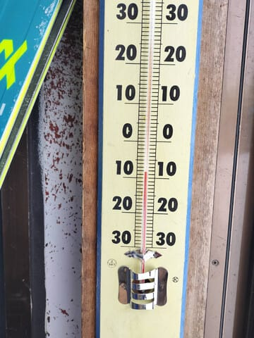
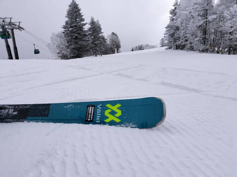
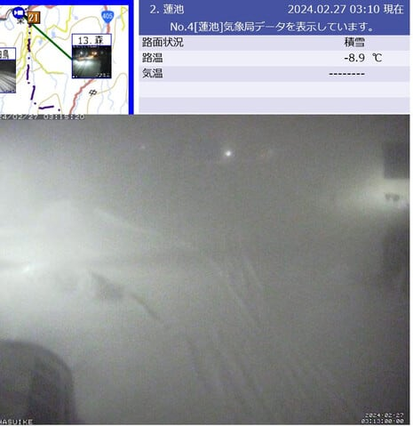
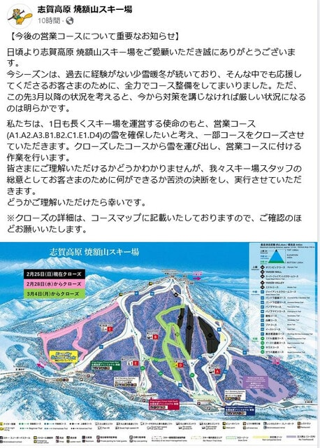

# えええ？？焼額山スキー場，2/28(水)で白樺・ブナコースがクローズ，3/4(月)でSGS・イースト・ミドル・ミドル連絡がクローズ

📅 投稿日時: 2024-02-27 03:35:37

🏷️ カテゴリ: [日記](cc4b5682fb7b8b144980957a978653fb0.md)

えー．

土曜は3時間睡眠で朝4時出発でナイターまで

滑ったうえに宴会して深夜0時半に寝て．

日曜は朝7時に起きてラストまで滑り，

渋滞を乗り越え300㎞運転して23時頃に

帰宅，その後朝5時まで仕事してたので…

今日，朝起きれずに死ぬかと思いました．

そして，今日も仕事からの帰宅は0時近く．

で．

今も仕事やっつけてます…（涙）

ってなことで．

すごい眠いので，今日は手短に更新！

本日の志賀高原ですが．

特派員情報によれば，朝は-9度と

結構冷え冷えで…

昨晩から5cmほどの積雪があり，

アイスバーンは隠れて滑りやすかった

みたいです…！

午後も5cmほどの積雪があり，

終日日曜のようなツルツルバーンに

なることなく過ごせたようです…！

で．

志賀高原は今も雪が積もってますが…

夜の間でもう10cmくらい積もってるかな？

運が良ければ，明日の朝まであと10cm

くらい積もって，トータル20cmの積雪に

なってくれるかも…

（[北信建設事務所道路気象状況カメラ](http://hokushin.pref-nagano-roadcamera.jp/)より）

このあと，28日朝ごろまでは雪が降り続け

そうですが…

まぁ，27日に昼間に10cm，

28日朝までに10cm積もるかどうか…

という程度なので，オリンピックコースが

滑れるほどの積雪にはならなさそう…

そして，ニュースでは3月2日ごろに

雪が降るといっているけど．

うーん．

今の天気図だと，志賀高原は西風で

そこまで積もらないパターン…

今シーズン，志賀高原は冷えると

積もらないんですよね…

ってな感じで．

異常に雪が少ない今シーズン．

このままだと雪解けが早く，春スキーの

営業期間が短くなりそう…

と思った焼額山．

一部コースをクローズし，クローズした

コースから雪だしすることで，

GSコース・パノラマ＆サウスコースの

春の営業期間延長を図るという，

苦肉の策に出たようです…

ってなことで．

・オリンピックコース…すでに営業終了

・白樺・ブナコース…2月27日で営業終了

・SGSコース・イーストコース・ミドルコース・ミドル連絡コース…3月3日で営業終了

となるようです（涙)

（[焼額山Facebook](https://www.facebook.com/yakebitaiyama/posts/pfbid0mYncF4LSeRDnuAY7CoZ1vxzJFrzNZVYP5xEVpTEz4jkthWgD9ihrreG2DwAmPSdPl)より）

うーむ．

春シーズンがちょっとでも伸びるよう，

努力してくれるのはすごいありがたいし．

こちらも滑れる期間がちょっとでも

伸びるのは感謝の限りなんですが…

それにしても，普段なら4月第1週まで

滑れるGSコースやSGS・イーストコースが，

2月末から3月末に雪不足でクローズって…

ちょっと寂しすぎる…(激涙)

これまで長いこと志賀高原に来ていますが．

これまででぶっちぎりで積雪が少ない，

史上最低の積雪量のシーズンですね(泣)

あぁ…

とりあえず．

3月4月は奇跡の冷え込みで，

これから一発逆転のGWまでの

営業を期待…！

## 💬 コメント一覧

### 💬 コメント by (ねも)
**タイトル**: Unknown
**投稿日**: 2024-02-27 07:18:21

Ｓさん　いやぁ衝撃のニュースです(^-^;

先週21日、焼額山で滑ってましたが、たしかに地面が見えそうな箇所があって(ﾟ-ﾟ)

Ｓさんは、まだまだ頑張るんでしょうが(笑)、私のシーズンはそろそろ終了かなって感じです😅

### 💬 コメント by (大阪のK)
**タイトル**: Unknown
**投稿日**: 2024-02-27 12:52:10

焼額山では、2月27日正午現在50センチ程新雪が積もっていますが、これでも白樺が終わってしまうのかしら？

リスタートしないのかな？

ねえSさん。

### 💬 コメント by (地元民)
**タイトル**: Unknown
**投稿日**: 2024-02-27 13:40:49

昼になっても里もすごい降りで30㌢に迫る勢い。

こりゃ、山は猛吹雪ですよ。50〜60㌢くらいは降ってんじゃないかと・・・

### 💬 コメント by (レインボー76)
**タイトル**: Unknown
**投稿日**: 2024-02-27 18:13:15

大阪のK様、そんなに積もったのですか？

明日は嵐が収まるので、圧雪された斜面は、上手くなったと勘違いできるバーンになるかも？

### 💬 コメント by (副院長)
**タイトル**: Unknown
**投稿日**: 2024-02-27 23:06:51

レインボーさんのおっしゃる通り。朝の状況で、志賀はあきらめて、知り合いが、こっちに来いと、五竜で、滑ってました。上部はガス、オージーがわんさかいて、なんかイベントが、あるらしいと。今週末に期待です。一度ぐらい、志賀の粉雪滑らせて下さい。

### 💬 コメント by (Skier_S)
**タイトル**: コメント回答遅れました
**投稿日**: 2024-02-29 02:49:26

＞ねもさま

衝撃のニュースですよね…(涙)

でも，もうシーズン終わりは早いですよ．まだまだ滑れます！！

＞大阪のKさま

ダメでしたね…やっぱり今日白樺・ぶなクローズしましたね(涙)

オリンピックコースともども，もうオープンしないと思った方が良いかも…

＞地元民さま

焼額は積雪50cmだったみたいですね…

予想以上に積もりました！

この雪があと数回降ってくれると嬉しいんですが…

＞レインボー76さま

結構積もったみたいですね…

ゲレンデ状況はこれで改善するはず…！！！

＞副院長さま

おっと．五竜へ行かれたんですね…

でも，今回の積雪で志賀は今週末は良さそうな感じです！！

浮気せず，今週末は志賀高原へ…

