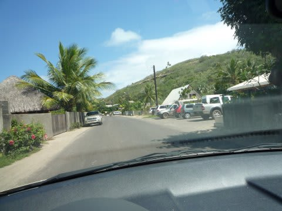

# 2009年　初の海外子連れダイビング旅行記　3　Drive around Borabora

📅 投稿日時: 2012-08-29 00:23:26

さて．

ノボテル・ボラボラに到着したわけですが．

ハネムーナー仕様だったのか？

デフォルトでこうなのか？

お花で飾りつけがしてありましたね～．

ちゃんと，移動式のベビーベッドも準備されてますね～

で．

ホテルに到着はしたものの．

時間はまだ昼なわけで．

まだ午後たっぷり時間がある，と．

…20時間にもなる移動時間で疲れているので，寝たいところですが．

ここで寝てしまうと「時差ぼけ地獄」突入は必至ですので，

何とか起きてないといけません．

…半日レンタカーを借りて，島を一周でもしてみましょうか．

レンタカー屋さんは，我々が泊まったノボテルの前にあります．

「日本の免許証しかないんですけど…」

「No problem!!!」

…日本の免許証でぜんぜん問題ないみたい…

で，車は2人乗りのバギーみたいなやつと

4人乗りのマニュアルミッション車とオートマチック車が選べます．

マニュアル車はものすごく古いフィアット．

オートマチックは比較的新しいヒュンダイ．

どっちも排気量1L程度のコンパクトカーで，4時間5000円ほど．

…ちと高いなぁ…

んで．

ボラボラ島ですが．

止まることなく車で回れば1時間かからない島です．

島には信号が一個もありません．

道も，島一周道路が1本．あと，わずかな枝道のみ．

島一周道路でもこんな感じのローカルな道です．

とりあえず，車に乗り込んで，まずはお昼ご飯を食べにGo!

向かった先は…

ホテルから5分ほど走ったところにある「スナック・マティラ」

4年前に行った時結構おいしかったので，今回もリピート．

オープンスペースのスナックで，景色はバツグンっ！！

…こらこら．おなかが減ってるからって，机食ったらいかんぞ．

グリルしたマヒマヒが入ったバーガーが美味い！

うーん．

タヒチのくいものって，全般的に美味いんだよな…

…しかし，このバーガーが1000円しますが…

＃物価高すぎ(涙)

でも，こういう景色を見ながら，のんびり食事できるのは幸せ．

最高ですな～．

んで，食後は，こういう感じのきれいな海岸を見ながら走っていきます．

途中，景色のきれいな海岸でちょっと一休み．

娘を砂浜に下ろしてみたんですが．

沖縄ではあれだけ嫌がったのに，

なんと．

嫌がらずに遊んでます．

ををっ！

成長したの～．

砂がイヤじゃなくなったか．良かった～．

…と，

喜んでいたのもつかの間．

うぎゃぎゃぎゃーっ！！！

海に座り込んじゃ駄目～っ！！！！

…という間もなく，ペチャンと海に座り込むわが娘．

オムツが海水をたっぷり吸って見事に膨らんでますが，

娘はゴキゲン．

やはり，幼児は何をしでかすか分からん…(涙)
