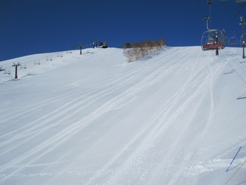

# 3月13日（日）の志賀高原は…

📅 投稿日時: 2011-03-14 00:10:53

えーーー．

どうやら．

スキー場がどうなっているか，情報が欠乏しているようですね…

とりあえず．

本日…っつーか，日付が変わってますが．

日曜の志賀高原は．

天気は晴天！

朝は，大体のリフトが予定通りの時間に営業開始しました．

ただ，運行リフトは減らされてます．

例えば，一の瀬ファミリーはクワッド1本とペアB線のみ．

普段動くペアA線，第3クワッドは動きません．

ダイヤモンドもクワッド1本のみ．

山ノ神も第2の1本だけ．

焼額も，第1ゴンドラ，第2高速，第3高速，第4ロマンスのみ．

　…普段なら動く，第2ゴンドラ，第1高速，第3ロマンスは

　動かなかったです…

で，朝，この時期としては良い雪，良い天気を楽しんで

いやー，3月中旬にしてはいいなぁ，と思ってましたが…

余震が何度かありましたね…

大体震度1程度，あっても震度2だったと思うんですが．

リフトは私が見た範囲で4回止まりました．

リフトに乗っていたり，ゲレンデにいても揺れには気づかず，

いきなり全てのリフトが止まるので，地震で止まったという

放送があるまで「あれ？地震があったの？」と気づきません…

止まるのは1分程度です．

すぐ運転再開します…

しかし．

お昼ご飯中．座っていたので気づいた程度のゆれなんですが．

「お，ちょっと揺れたなぁ…」

と思うほどの，ごく短い（10秒も無いくらい）の余震が

ありましたが．

＃3度目のリフト停止かな？

これで，奥志賀の全リフトと奥志賀の第1ゴンドラは

営業をやめちゃいました．

でも，焼額第2，第3高速と第4ロマンス，

山ノ神，ダイヤモンドとファミリーなどは，

そのまま営業再開．

うーーん．

現在のスキー場の問題は，

「金曜の地震で設備に影響があった」

というより，

「余震でリフトが止まっちゃうことがある」

ということですね…

しかし．

ゲレンデ自体は．

3月中旬と思えない良い雪です．

…昼間，気温がプラスに上がったので，

日向はちょっとやわらかい，クリーミーな感じの

春の雪になりましたが．

南側ではないゲレンデは，結構いい感じです．

あと．

人が少ないです…

がらがらです．

平日並みです．

…平日以下かな？

これだけ人が少ない志賀高原は，4月の平日クラス

ですね…

家族連れとかはほとんどいないです．

来てるのはスキー馬鹿ばっかり（笑）．

あと，志賀から下山する途中のスーパーや

ガソリンスタンドは全く普通に営業してます．

首都圏に戻ってきて，ガソリンが売り切れで，

スーパーにも食料が無いのにびっくり．

とりあえず．

リフトは余震で止まることがありましたが．

それ以外は，全く普通の志賀高原でした…
