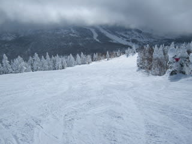
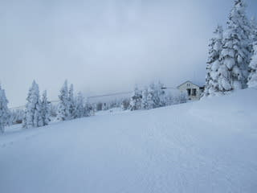
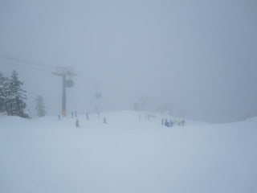

# 今日の志賀高原

📅 投稿日時: 2011-01-22 22:43:56

今日の焼額はがらがらでした．

ゴンドラ待ちがまったくなかった！！

土曜でこんなことでいいのか？？

雪質は最高．雪が軽く，滑っても体の負担にならないし，

人が少ないので荒れない！

夕方までほとんどフラットなまま！

これで天気さえよければ…

昨日から今日にかけての積雪は数2－3cmってところかな．

今も降ってません．

明日はパウダーになりそうにないなぁ…
