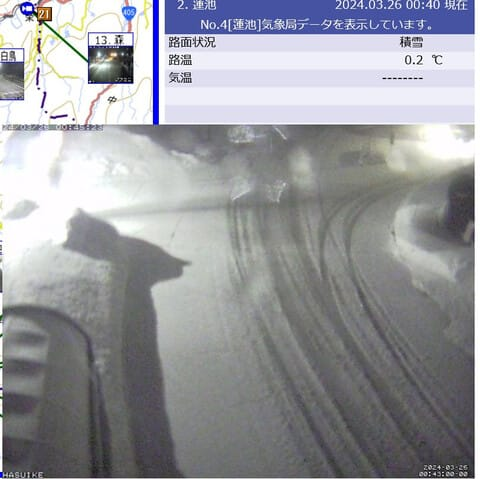
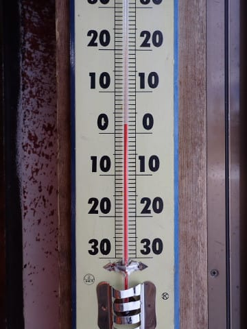
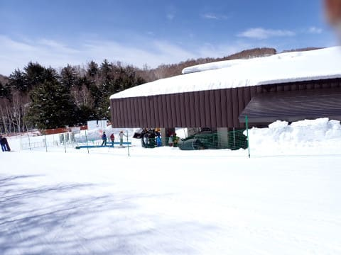

# 2024/3/24(日)の志賀高原スキー場詳細レポート！…暑いくらいの晴天の1日だけど雪はザブザブにならず．そして3月25日の志賀は終日雨，ときどき雪混じり

📅 投稿日時: 2024-03-26 02:14:45

🏷️ カテゴリ: [2024スキー滑走日記](c453f687e8a0f05679e95831d0a02cd0c.md)

えー．

本日，25日の月曜の志賀高原．

雨は降ってもせいぜいポツポツ程度…

という予想に反して．

特派員からのレポートによると．

そこそこの雨になったようです…(泣)

あさイチの気温は+3℃と，

朝からプラス気温(泣)

でも，あさイチの天気は，まだ曇り

わずかに雪も舞う程度で．

バーンは割としっかり締まった感じで，

そこそこいい感じのシマシマ！！

ただ…

朝のうちは良かったけど，

朝9時半ごろから小雨が降りだしたらしく．

10時から12時近くにかけて，

本降りの雨になったようです（泣）

うーん．

こんなに降る予想じゃなかったんだけどなぁ…

ただ，

雨のおかげでゲレンデはガラガラになり，

板も滑るので楽しかった…

と，えらいポジティブな報告でしたね…

雨は昼前に止んで，

最高気温は+5℃以上まで上がったものの，

午後は時折湿っぽい雪がぱらついたり，

わずかに雨もぱらついたこともあったけど，

午後はそこまでひどい降りには

ならなかったようです…

湿雪でエッジがしっかり噛んで，

人も少なくガラガラで，

バーンも荒れなかったので．

好きなように滑れて楽しかった…

と，某特派員のコメントでしたが．

この特派員は極めて良く鍛えられた人なので，

普通の人なら楽しいという発言以前に，

午前中の雨で帰っちゃってるんじゃないか…？

という疑問を呈したくなる報告だった

わけですが．

とりあえず，本日の雨でも，雪はそこまで

ひどく解けることはなく．

バーン状況もそんなに悪化しなかった

ようです…！！

そして，26日t午前1時現在．

志賀高原は雨じゃなく雪で，

そこそこ積もってます！！！

（[北信建設事務所道路気象状況カメラ](http://hokushin.pref-nagano-roadcamera.jp/)より）

このまま明日までずっと雪で

いてくれるといいんですが…

おそらく，朝のどこかの段階で

雨になります（泣）

そして，火曜の昼過ぎには雪になり，

雪に変わってから，またそこそこ積もって

くれそうです…！！！

これ，水曜のゲレンデコンディション，

結構いいかも…？？

まぁ，火曜午前はかなり本振り

雨になりそうだけど…

今回の雨と雪で，積雪量はちょうど

差し引きゼロくらいの感じかな…？？

ってなことで．

意外と明日の火曜の雨も，雪が

そこまで減ることなく乗り越えて

くれそうな感じですが，

次は金曜に，またかなりの液体が

降り注ぎそうな予感…

うーん．今晩と同じく，何とか固体に

なってくれるといいんだけど…

今のところかなり気温が上がりそうなので，

固体になるのは期待薄です（泣）

まぁ，土日は晴れてくれそうなので．

週末に降るよりマシかな…

…と，自分を慰めておこう．

ってなことで，本題へ．

日曜の志賀高原の詳細レポート…

というより，ここまでで記事がすごい

長いので．

昨日のレポートに多少の写真を追加する

程度で，ちょいと短めに…

えー．

まず．

いつも通り，この日も朝8:30からの焼額の

通常営業開始スタートに並ぶわけですが…

うん．やはり悪天候予想の昨日よりは

並んでいる人が多いですね…

とはいえ，人は少なめ．

今日もあんまり混まなさそう．

そして，ゴンドラで山頂へ行くと…

あさイチはうっすら雲が空に広がって

ましたが．

このあとすぐに，すっきり晴天に！

予想に反して，晴天でスタートです！

ただ…

山頂の気温は，朝から+2℃と．

あさイチからプラス気温…（涙）

でも…

あさイチのバーンは，最高級の

シマシマバーンですよっ！！！

うひょーーーーーっ！！！！！

昨日積もった重めの雪がしっかり圧雪

された，硬すぎず柔らかすぎず，

職人が見事に調整したかのように

絶妙にエッジが効くのに柔らかさを

感じるという．

極上の圧雪バーン！！

うははははははは！！！

朝からプラス気温とはいえ．

今日のあさイチの雪質は，今シーズンで

一番いい…っ！！！

楽しいっ！！

…ってなことで．

今シーズンではほとんど履くことがなかった

189cmのGS板を本格出動！！！

いやー！

GS板，やっぱりいい…

もう，最高雪をトップスピードで

かっ飛ばせる，最高に快感な雪質…

それも，こんな晴天で人の少ない

バーンを飛ばしたい放題！！！

朝10時ごろまでは，間違いなく

今シーズン一番の快感を味わえる，

最高デーでした…！！

ただ．

やはり気温が高いので…

朝10時ぐらいには雪がダマダマの

カタマリ状態になってきましたが…

でも，昨晩雪が降りたてなので，

ザラメやザブザブ雪になることなく，

気温が高くてもこんな感じの雪質で

とどまってくれました…

ただ，すっきり晴れなのはいいけど，

やはり晴天で日差しも強いというのもあり．

ザブザブにならないけど，雪の表面は

しっとりしてきて…

麓に近いところは，雪が板に張り付いて，

雪の滑りが悪くなるところも…（涙）

でも．

気温が高いけどざぶざぶ雪にはならず，

さらに人が少ないのもあり…

昼を過ぎても，バーンはかなりフラット

ですよ！！

ゴンドラのピークはせいぜいこの程度で，

ゴンドラ待ちは最大3分くらい，

10時半から11時過ぎのわずかな時間を

除けば，ゴンドラ待ちはせいぜい搬器

数台程度しかなく．

第2高速リフトに至っては，

もうずっと飛び乗り状態！！

こんな晴天で，こんなガラガラバーンを

滑れていいのかなぁ…

という状態が続きます！！

で．

今日は曇りの予想だったところ，

なんで晴れたのかな…？

と思ってたけど．

どうやら雲の高さが低すぎたのか，

志賀高原は雲の上だったようで…

眼下に雲海が広がってますね．

下の中野市街はすっぽり雲に

覆われて，曇り空だったようですね．

ってなことで．

予想外に，朝からラストまで，

ひたすら晴れた本日．

でも，雪は思ったほどは緩まず．

日差しが当たる一部で，この程度に

緩んで，ちょっとだけ荒れたものの…

それ以外のバーンは，午後になっても

結構フラットなんですけど…！？

午後3時ごろになると，気温も冷えて

麓近くの滑りが悪いところもなくなり．

そして，ラストに近くなると，

バーンが完全貸し切りなんですけど…！？？

…さらに，気温が高い晴天デーだったと

言うのに．

雪質は営業終了時でもこんな感じで

ザブザブの春雪になっておらず．

こんな程度の荒れ方で，ほとんど

フラットなんですけど…！？？

ってなことで．

今日もラスト16:15のリフトぎりぎりに

飛び乗って．

3月下旬と考えれば，かなりのいい

コンディションのゲレンデを．

日が傾く営業終了タイムまで，

いつも通り昼休みも取らず，

ひたすら滑り倒したのでした…

いやー．

でも．

晴れてガラガラで，

朝は最高だったし．

当初危惧してたより，ずっと恵まれた

週末で．

かなりシアワセ度の高い週末でしたよ～！！

## 💬 コメント一覧

### 💬 コメント by (いか)
**タイトル**: Unknown
**投稿日**: 2024-03-26 09:02:43

日曜日よかったとはさすが志賀ですね。八方は朝は緩めで良かったですが、早々にどぼどぼになりました笑。金曜日終日GS履いてられるくらいの神コンディション、土曜日大雪日中+25cm、と目まぐるしく変わる春ですね。

焼額山の早朝営業が楽しそうなので、4月は何日か伺おうと思います。お会いしましたらよろしくお願いします～。(八方はやる気がないのか、今週から一気にリフトが減ります、4月からはゴンドラ+上部だけ…)

### 💬 コメント by (レインボー76)
**タイトル**: Unknown
**投稿日**: 2024-03-26 10:41:47

火曜日の志賀高原情報

朝の蓮池+1℃、志賀高原は雲海の上だけど、強風、雨、アラレの三重苦。ゴンドラ運休で四ロマとニ高のみの営業。ニ高は私ら４人のみ。９時過ぎまでは全くの貸切状態。でも、仲間の２人は１本でリタイア。私は頑張って6本滑ったけど、びしょ濡れで楽しくない。

今日は自宅待機が正解でした。

### 💬 コメント by (モイストシルバー)
**タイトル**: Unknown
**投稿日**: 2024-03-26 20:59:20

初滑り以来、志賀に来ました。一の瀬滑りましたが、10:00過ぎには強風で運休してしまいました。しっかり降って、ビショビショになりました。Sさんの予報的中ですが、強風は予想できませんでしたね。15:00過ぎには雪に変わりましたので、明日に期待です。

### 💬 コメント by (副院長)
**タイトル**: Unknown
**投稿日**: 2024-03-26 21:58:41

S様、お先にスキーシーズン終了しました。

月曜日五竜は、なんとか、ポツポツぐらい、なぜか、47に行くと本降りて、火曜日は、あさから、本降り。スキーあきらめ、パタゴニアや、モンベルや、お蕎麦を堪能して、終了です。26日夜現在、志賀高原は、雪積もってますやん。S様お怪我のないように、残りシーズン楽しんでください。

### 💬 コメント by (アツシ)
**タイトル**: Unknown
**投稿日**: 2024-03-26 23:17:48

えー、雨男です(笑) でも、せっかくの平日春スキー、妖怪まつりにならなくて良かったです。

でも他にも「雨降りで人が少なく板も滑るので楽しい」と言う人がいるとのことで驚きました。

私の周りの某市スキー協会の方々に

・冬の間毎週末、1人で大阪⇆志賀

・土日とも朝イチからラスリフまで休憩なし

・もちろんお昼ご飯休憩なし

・雨が降ると板が滑るし空いてるから楽しい

・ナイターは天国。もちろんノンストップ

と言っても誰からも共感を得られず、変態扱いされてます。でもSさんの周りにはそーゆー人が集まるようですね。

ちなみに私は普段は強烈な晴れ男なのです。節目で雨降った記憶がありません。なので、月曜日の雨は恵みの雨だったと思ってます。普通の感覚の人に怒られますね(笑)

### 💬 コメント by (Skier_S)
**タイトル**: 金曜もまた雨（泣）
**投稿日**: 2024-03-27 03:37:10

＞いかさま

日曜は多少湿った雪になったとはいえ，板が潜るほどの雪にはならなったです…

もし焼額にGWごろまでしっかり雪が残ってゴンドラ2本とも営業できたなら，

ヤケビの今年の早朝営業はいいと思いますよ…！！

＞レインボー76さま

今日もレポートありがとうございます．

悪天候だから，てっきりお休みしているのかと思ってました（笑）．

明日は昼前後から晴れ間も見えて，コンディションいいと思いますよ~！

＞モイストシルバーさま

あら…久しぶりの志賀で今日のような強風雨はちょっと惜しい感じでしたね…

明日は楽しめると思いますよ！！

＞副院長さま

やっぱりこれでシーズン終了ですか…

月，火と雨にたたられましたね…

また来シーズン，志賀高原でお会いしましょう！！

＞アツシさま

このBlog読者は朝から晩まで止まらず休まず，毎週滑るって人が多いですね…

こんな偏った人が志賀には集まりますね（笑）

