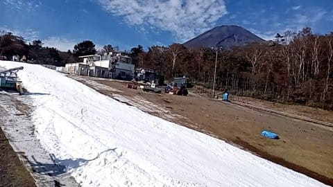
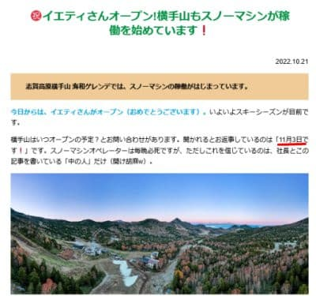

# 熊の湯スキー場は11月19日オープン予定．横手山は…え？？？11月3日オープン！！？？？

📅 投稿日時: 2022-10-22 02:37:12

えー．

本日．

…というか，いつものパターンでもう日付が

変わって昨日ですが…

イエティが予告通りオープンしました～！！

そして，やはり．

志賀高原の某特派員が，オープン日から

イエティを攻めていたようです…

まぁ，滑ってないと死んじゃう人たち

ですからね（笑）

今日のイエティは晴天で，結構雪が緩んだみたい

ですが．

でも，雪の厚みは十分ありそうに見えますね～．

すぐに雪に穴が開いたりはしなさそうかな．

さて．

私もついに日曜に初滑りなのですが．

ここ数日，最後のWeb会議が終わるのが

深夜12時近く（泣）

…今日も今やっと仕事が終わったところで．

まだほとんどスキーの準備ができてません…

が．

スキー板やブーツは年中部屋に

出しっぱなしだし．

グローブやゴーグルなどの小物も，シーズン

終了時に洗ったり干したりした後，

そのままいつでもすぐにもっていけば

使える状態でブーツバッグに

入れっぱなしだし．

スキーの準備って…

あとはクローゼットの中にかけてある

スキーウェアを出すだけで終わりだよな…？？

という．

いつでも一瞬でシーズンインできる状態なので．

シーズンに入る準備は万端！←いつでも年中準備万端ってことだよな…

ってなことで．

イエティがオープンした2022/2023シーズン．

そろそろ次にオープンするスキー場が

気になるわけですが．

昨シーズンは10月30日にオープンした

狭山スキー場．

今シーズンはオープン日がまだ公開されて

いないので…

オープンまではもうしばらくかかりそう

ですね．

だとすると．

次にオープンするのは，11月3日の

軽井沢スキー場

と

ウイングヒルズ白鳥

になるわけですが…

本日．

横手山スキー場のホームページを見ると…

…

…

なに～！！！！？？？

オープン予定，11月3日っ！？？？

（[横手山ホームページ](https://yokoteyama2307.com/news/18495/)より）

いや…

アイスクラッシュじゃない普通のスノーマシンで，

11月3日オープンは無理があるでしょう…さすがに．

…でも．

もし冷えて条件さえ整えば，11月3日にオープン

させてやる！！

という，気合を感じる意気込みはすごい！！！

ある意味，感動を呼ぶ．

ぜひ，11月3日オープンを目指して頑張って

欲しいところ…！

で．

熊の湯スキー場は，[本日のブログ](https://ameblo.jp/kumakumanoyu/entry-12770419300.html)に

「熊の湯スキー場ですが

OPEN予定は11/19としています。」

と書かれてました…

ふむ．

20日前後，勤労感謝の日の前の週末

ということで．

だいたいいつも通りのオープン予定日

ですね…！

そして，アサマ2000改め高峰マウンテンパークは．

11月26日オープン．

鹿沢も11月26日だし，

丸沼も11月26日．

そのほかの11月オープン常連の湯の丸や白馬山麓は

まだオープン日が明らかになってないし…

うーん．

昔は11月23日の勤労感謝の日の前の週末，

11月20日ごろには，

丸沼，鹿沢，アサマ，湯の丸あたりがオープン

していたものですが…

ここ数年，11月の冷え込み不足で11月20日

前後のオープン予定が軒並み遅れたからか…

どこもオープンを遅らせて，11月最終週を

公式のオープン日にしちゃいましたね（涙）

今年は勤労感謝の日までにオープンするのは，

あとは11月23日にオープン予定の

かぐらぐらいですか…

11月26日にオープンするスキー場は

結構ありますが．

それ以前に滑れるスキー場，すごい減ったなぁ…

わしが若いころには，丸沼や鹿沢も

10月にはオープンしていたもんじゃが

のぉ…

と．

遠い目をしながら，ついつい老人のように

昔を懐かしんでしまう，Skier_Sなのだった…

## 💬 コメント一覧

### 💬 コメント by (なるなる)
**タイトル**: Unknown
**投稿日**: 2022-10-22 05:03:51

色々とボロボロでどうしようかと…

つー事で、明日長岡まで行ってきますわwww

板も欲しいんだよな～　勧められたらいってしまうかもw

### 💬 コメント by (m&t m)
**タイトル**: Unknown
**投稿日**: 2022-10-22 09:15:10

遠い遠い昔は、苗場や鹿沢などアイスクラッシャーのスキー場がもっとありましたよねー。

### 💬 コメント by (カトウ)
**タイトル**: Unknown
**投稿日**: 2022-10-22 16:05:05

一瞬でシーズンイン！とはさすがです。冷えて、降るシーズンになりますように！

### 💬 コメント by (アリス)
**タイトル**: イエティー
**投稿日**: 2022-10-22 17:05:12

Ｓ様

明日は初滑りですか♪

イエティーのオープン動画見ましたが、やたらコスプレの人が多いです♪

どうやら、コスプレの人はリフト料金が無料のようですね♪

テレビで紹介していました。

### 💬 コメント by (Skier_S)
**タイトル**: 明日ついに初滑り！
**投稿日**: 2022-10-22 23:20:34

＞なるなるさま

長岡まで行かれるんですね！！

絶対正解です．行って後悔はないと思います…

ただ，寝不足とか飲みすぎで足がむくんじゃった状態で行った方がいたようなので（笑），

そういうことが無いように体調万全で行ってください．

板も掘り出し物があったりしますよ～！

ぜひ物欲選手権に大敗してきてください…

＞m&t ｍさま

苗場も鹿沢も丸沼もアイスクラッシュやってましたよね…（遠い目）

＞カトウさま

一瞬でシーズンイン！

というより，いつでもシーズンインOKです！

そもそもオフシーズンが3か月ちょいですから…

＞アリスさま

明日初滑りです～！

イエティは例年オープン初日だけは仮装するとタダなんですよ…

初滑り，行ってきます！

