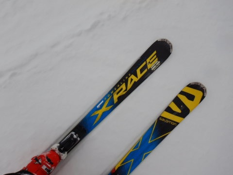
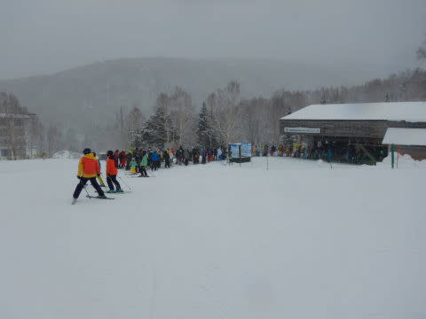

# 2020/2/23(日)3連休中日の志賀高原スキー場は…一日雪降り，今シーズン一番混んだよ…

📅 投稿日時: 2020-02-24 03:59:55

🏷️ カテゴリ: [2020スキー滑走日記](c282e9230de179e245c7334eabeb0a3b3.md)

ということで．

3連休中日の志賀高原ですが．

本日，ナイターラストまで滑った上に．

夜，飲み屋で飲んできたあと．

さらに宿に帰ってきて，部屋で

飲み会に巻き込まれ．

今は一体何時なんだ？？

という状態になってしまってます（涙）

明日も滑らなくてはならないので．

本日は，いつもより短めレポートで…

（それでも，書いてるだけ偉い！！，と自分をほめてみる）

まず，本日．

昨晩からの積雪は10㎝ほど

あったでしょうか…

そして，いつも通り朝イチの焼額

スキー場に並びますが．

うーむ．

ものすごい人で．

今日は混みそうな感じ…

あさイチの山頂の気温は，金曜深夜に

-8℃と予想したのがぴったい当たって，

まさに-8℃！

冷え冷えで寒いよ！！

そして，山頂の天気は…

冷え冷えの雪降りですね．

ゲレンデは，圧雪の上にうっすら

5cmの軽い新雪が乗ったバーン

コンディション！！

圧雪の上のうっすら積もった

冷え冷え雪を蹴散らしながら

滑っていける，志賀のトップシーズン

らしいコンディションで．

春の雪だった昨日とは偉い違い！

志賀高原の冬が戻って来たよ…！！！

と．

喜んでいたのはつかの間．

さすがトップシーズンの3連休中日．

ゴンドラは，いつもならまだガラガラの

朝9時過ぎからかなりの列がつき始め…

1ゴンは，正月休みより激しい混みの

10分以上待ち（涙）

2ゴンは20分待ち以上まで行ったようで…(泣）

間違いなく，今シーズン一番の混雑．

激混みです（泣）

当然，ゲレンデもすごい人口密度で…

ゴンドラだけではなく，

第2高速リフトもすごい列（涙）

焼額では一番混雑の少ない第3高速も，

5分以上待ちました…（激涙）

さすが3連休中日．

焼額のスタッフの皆さんも，

「今シーズン一番の入りです」

というほどの，激烈混雑（涙）

本日は，昼間も-5℃くらいまでしか

気温が上がらず．

終日冷え冷え雪が降り続いたので，

ゲレンデの雪質はすごい良かったのですが…

急斜面で，かつ昨晩の気温が高いうちに

圧雪をかけるオリンピックコースは，

下地がピステンの跡の形でガチガチに

凍った上に新雪が積もっているという，

かなりエキサイティングなバーンで．

急斜面は，予想通りツルツル下地の上に

モサモサ雪が積もった，かなり

手ごわいバーンコンディション（涙）

とはいえ，それ以外のバーンは，冷え冷え

雪が乗ってくれたので，昨日の春の

雪と違って，

TOPシーズンのいいコンディションが

戻ってきましたよ～！！

ゴンドラ待ちは，昼の11時半ごろから

2時過ぎまではいったんおちついたものの…

なぜか，午後2時過ぎになってもまた

列が伸び始めたりして（涙）

営業終了の午後4時過ぎまで，

ゲレンデは結構な人口密度で．

かなりの人が滑ったゲレンデは，

最後にはちょいと凸凹した

バーンになって．

ラストまで人が多かったうえに，

荒れ気味でちょいと飛ばすには

厳しいバーンコンディションと

なってしまったのでした…（ちょい涙）

まぁ．

TOPシーズンの3連休．

このくらい混んでもらわないと，

スキー場も経営的にヤバいだろうし．

まぁ，雪質も真冬のいい雪に

戻ってくれたし．

さらに久しぶりにスキー場がにぎやか

だったので，良かったとしておこう…←とりあえずポジティブシンキングでとらえてみる

…しかし．

昨日の4月の雪と打って変わって．

昼間も冷え冷え雪が降り続き．

昼間の積雪は5cm程度だったとはいえ，

昨晩からの積雪で，ゲレンデはほぼ

TOPシーズンの冷え冷えやわらか

ゲレンデに戻りましたよ～！！！

…

…となれば．

行くしかあるまい，ナイターへ！！

本日の一の瀬ダイヤナイター．

…最高のシマシマでした！！！！

んもう，シーズンでもそうそうない，

やわらか最高冷え冷え雪の，

激烈快楽傾きたい放題シマシマバーン！！

あぁ…シアワセ…

これは，今日の朝イチよりも

いい！！

と．

2時間半，ひたすらシマシマを切り刻み

続けたのでした…

明日の朝イチは，この最高冷え冷え雪が

圧雪されたシマシマで．

そして，朝から晴れそうなので…

今シーズン最高級のシマシマが味わえるのでは

ないかな～！！

…ってことで．

もう深夜4時なのに．

気づいたら，いつも通りの長さの記事を

書いていたことに気付いた，Skier_Sだったのでした…

でも，もう夜遅いので．

すみません．コメント回答はまた明日！！

## 💬 コメント一覧

### 💬 コメント by (m&t)
**タイトル**: Unknown
**投稿日**: 2020-02-24 05:05:24

Sさん、やはり貴方はサイボーグです!

### 💬 コメント by (ゆーき)
**タイトル**: Unknown
**投稿日**: 2020-02-24 06:16:22

昨日はよかったですね、奥志賀は何故か、ゴンドラが動くけどリフトが止まるって半な話でしてが、、、

ところで昨日Sさんらしき人と、1ゴンになったんですが、気のせいでしたかね。

ミミを、ネズミのように小さくしていたのですが、小さめな女の子を含めた、

合計5人の会話が聞こえてきました。

土曜は想定外に、ダイアモンドのナイター

日曜はダイアモンドのナイター

宿を移動して、一ノ瀬だから、歩いていける

ウエアーの、汚れについての会話、

そしてオレンジに、ヘルメットではなくて、帽子な方かなと、、、

### 💬 コメント by (西館)
**タイトル**: 昨日は西館でも突風が吹きました。
**投稿日**: 2020-02-24 06:51:18

昨夜はサンバレーナイター最終日でしたが、ダイヤモンドにしたんですね。

我が家の昨日は、リフト運行開始待ちをする練習から開始しましたが、西館クワッド(西館一番下)は点検作業が長引き、10分遅れのスタート。

西館山頂付近も時々突風が吹き、何度も煽られてしまいました。

そして若干湿っぽい雪質だったため、ゴーグルにどんどん積もって凍り付く｡｡｡

減速走行を余儀なくされ、この際だからスピンとかワンエイティー（車ではなく、ジャンプしてくるっと反対向く技の方）の練習をしたのでした。

我が家は何をめざしているのでしょう。ま、楽しければいっか（＾-＾；

### 💬 コメント by (ほっぽ)
**タイトル**: 昨日は
**投稿日**: 2020-02-24 07:12:42

Ｓさん

昨日はゲレンデ以外でばったりでしたね。

３高で前に並ぶＳさんをＧｏｋｕさんご夫妻と眺めていました。

昨日は流石の３連休中日、激混みでサンバレーまで旅に出てしまいました。

東館からサンバレーまではゲレンデもリフトもガラガラでラッキーでした。

混雑したら空いてるエリアに逃げられる志賀高原のメリットを享受しました。

リフトは寒かったですが。

最終日の今日は天気良いので、

息子のように年齢の離れた若者連れて、奥志賀まで旅に出る予定です。

昨日の滑走日記をあげておきました。

http://www2.tokai.or.jp/nana_hoppo/

### 💬 コメント by (Northfox)
**タイトル**: やっぱり板が欲しい．．．
**投稿日**: 2020-02-24 13:13:26

この土日、志賀高原は色々残念な状況だったようですね。

私は土曜に白馬乗鞍へ。午前からずっと雨で山頂が雪に近い霙。

身体は濡れるし板は滑らず修行状態。リフト終了を待たずして上がりました。

翌日曜日は栂池へ。雪が降ったのは良かったのですが、駐車場にクルマが入りきれない位の混みよう。目当ての太板の試乗会には参加できましたがゲレンデは荒れており。。。

でも太板も面白いですね。かなり欲しくなってしまい困っています。

今日は物欲に悶々としながら家で休養してます。

### 💬 コメント by (なるなる)
**タイトル**: Unknown
**投稿日**: 2020-02-24 22:17:51

今日はラスト搬器ご一緒させていただきありがとうございました。

KonSuke様、S様とあまりにオーラが凄すぎる搬器。

どうしようかと迷いましたが1席空いていたので勇気を出して突入してしまいました。

想像はしていましたが、やはり右足のみ脱いで高速ワープなんですね。凄すぎます…

>しんちゃん様

20000mおめでとうございます。

朝、リフトで少しお話しさせてもらった者です。

何度かリフト上からお見掛けしましたが、あのスピードなら余裕だんじゃないですか?

あまり、ヤケビには行きませんがよろしくお願いします。

### 💬 コメント by (いちと)
**タイトル**: Unknown
**投稿日**: 2020-02-24 22:53:47

本日は、コンディションも良くラストまで滑れました

わたしは、一年に一回の志賀高原なので、来年に向けて踊る事にします！

### 💬 コメント by (Skier_S)
**タイトル**: 今日はよかったよ！
**投稿日**: 2020-02-25 02:53:48

＞m&tさま

いや…私は赤い血が流れている人間です(笑)．

＞ゆーきさま

…その会話，私とnaoちゃんねるさんです…

あらら．

ぜひ次は，会話に参加してください(笑)．

＞西館さま

いや，昨日は一の瀬に宿を移ったので，ダイヤナイターになりました．

でも，最高のナイターでしたよ！

…しかし，日曜も西館はコンディション良くなかったのですか…

私は寒さに弱いので，雪が降りつける寒い日は焼額の

ゴンドラに籠ります(笑)．

寒い日はゴンドラのありがたさが身に沁みます…

＞ほっぽさま

東館からサンバレーは空いていたのですね…

でも，日曜は寒くてゴンドラ以外の選択肢はありませんでした(笑)．

＞Northfoxさま

日曜の栂池，混みましたか…

太板，荒れていても新雪で滑れたなら結構楽しかったのでは

無いでしょうか．

ぜひ，物欲スイッチをOnにしてやってください(笑)．

＞なるなるさま

あ！すみません．

ラスト搬器乗りあったの，なるなるさんだったんですね…

KonSukeさんとの新規20000m達成者の話題で

盛り上がってしまってました．

右足だけ脱いで高速ワープは，私の基本行動です(笑)．

＞いちとさま

今日はいいコンディションでしたね～．

私もかなり楽しめました！

年に一度と言わず，何度でも来てくださいね(笑)

