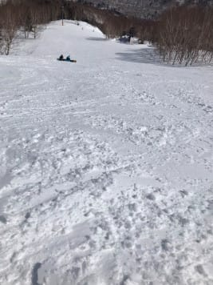

# 今週末の志賀高原は…土曜はやはり晴天で昼間+5℃程度，日曜は+7-8℃まで上がりそう．そして14日月曜は雨（涙）

📅 投稿日時: 2022-03-12 00:21:12

本日も，志賀高原からの写真が送られて

来ましたが…

予想通り，すっきり晴れてます！

…で．

もう，これだけ見事な晴天シマシマ写真が

連日続くと…

うらやましいという言葉すら出てこなく

なりますね…（涙）

あさイチの気温は高めながらも，

一応マイナスまで冷えたので…

朝は昨日緩んだ雪が固まった，

結構固めのシマシマだったようです．

コロコロは出なかったようで，

滑り良かったみたいですね～！

で．

やはり昼間は気温がかなり上がって

プラス4℃まで上がってしまい…（涙）

そのせいで，ゲレンデの雪はさすがに

ちょっと緩み始めたみたいですが．

まだ気温が高くなったばかりで，下地の

雪が十分冷えているからか，そこまで

ひどく緩むことは無く，

ちょっと日当たりがいい一部，

それも標高が低いところだけ

ちょっと重めの雪になった程度で

済んだみたいです…

で．

今日は特派員の中に，一の瀬ファミリーの

ナイターへ行った猛者もいたようですが…

何だか今シーズン，一の瀬ファミリーの

ナイターは圧雪しないことになった

みたいです…（泣）

いや．

平日の一の瀬宿泊者なら1000円割引で

滑れるからいいけど．

土日2300円払って，遅いペアリフトで

非圧雪バーンを滑る人はいないんじゃ

ないかな～…

うーん．

志賀高原中央エリア，ちょっと残念な感じ…

ってなことで．

今週末の志賀高原スキー場の天気ですが．

概ね水曜段階の予想の通りです．

12日(土)：朝は-2℃程度．

　この日も朝から終日晴れ！

　あさイチはカリカリした硬めの

　圧雪バーン．ところどころ

　コロコロっぽいのが出るかも？

　昼間は最高+5℃くらいまで上がる．

　日差しの強いバーンはずっしり重い　

　雪になっていき，バーンも荒れていく．

　標高が高いところ・日差しが弱い

　ところは比較的荒れずに済むかも．

13日：朝の山頂はおそらくプラス気温．

　天気はあさイチは晴れて，最初は

　一部硬いかもしれないけどすぐ緩む．

　朝からグングン気温が上がり，

　雪が一気に緩む(涙)

　昼間最高気温は+7-8℃まで上がる．

　日差しの強いバーンは，ちょっと

　ストップ雪になるくらいかも…

　昼ごろからは雲が増えていき，

　うす曇り～曇りになっていく．

　早めに雲が増えれば，日差しで雪が

　そんなにザクザクに緩まずに済みそう．

って感じですか．

で…

昨日の段階では，

15日は液体が降ってくる危機

と書きましたが．

最新の天気図を見ると…

14日の月曜日の850hpa図．

うげ．

志賀高原には水色の+6℃線がかかってますよ？

そして，地上天気図を見ると…

この日，水色の降水域が本州を覆い

そうなので…

はい．

そうです．

850hpaが+6℃で，降るとなれば．

志賀高原でも，降ってくるものは

液体

です．

ということで．

15日ではなく，

14日の月曜の午前中から雨になりそうです…

月曜滑る方は，ご覚悟のほど

あぁ…ついに今シーズンも，志賀高原に

雨が降るのか…（涙）

## 💬 コメント一覧

### 💬 コメント by (大阪のK)
**タイトル**: Unknown
**投稿日**: 2022-03-12 01:39:06

遂に志賀高原に、焼額山に雨が降るのですね😅

でも、そのあと雪が期待できるのではないでしょうか？

来週の三連休、期待しています。

Sさん、躍り狂ってください🙇

### 💬 コメント by (副院長)
**タイトル**: Unknown
**投稿日**: 2022-03-12 12:28:58

月曜日から雨ですかぁ。覚悟して、ラストの志賀高原楽しみます。

去年のラストも雨だった。あきらめついていいかも。S様今年は雪も多いし、梅雨入りまで頑張ってください。楽しみにブログ拝見します。

### 💬 コメント by (レインボー74)
**タイトル**: Unknown
**投稿日**: 2022-03-12 15:52:16

土曜日の志賀高原情報

朝の上林+2℃　蓮池+1℃。暖かくも迎えたくない春うらら。

朝からニゴンは長蛇の列。希望が絶望に変わりました。(期待度100→0)

ワックスが良かったせいのか、硬めの雪のせいなのか、出だしから、(漫才師には禁句の)滑る滑る！

相も変わらす軽快な白樺のあと、オリンピックもまずまず。

GSも然り。いろんな人と話ができて、これだけで今日は満足。

超早あがりして家事いろいろ。帰路の高天+7℃　蓮池+10℃。

これだけ暑くなってくると、ウエアも考えないとだめですね。

### 💬 コメント by (Skier_S)
**タイトル**: 今日は意外とよかったよ！
**投稿日**: 2022-03-12 23:50:55

＞大阪のKさま

残念ながら，月曜は雨です…

来週3連休が良くなるよう，皆さんで祈って歌って踊りましょう！！

＞副院長さま

残念ながら，月曜は雨っぽいです…

志賀はGWまでやっているので，ぜひまたGWにお越しください！

いや，GWと言わず，4月の週末に…

＞レインボー74さま

今日はお世話になりました～！！

明日はもっと気温が上がりそうですが，まだまだシーズンは続きます！

雪はまだいい状態をキープしてますよ！

明日のあさいちも，いいコンディションだと思います…

すぐ緩みますが(涙)

