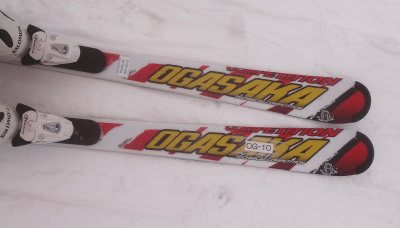
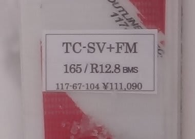
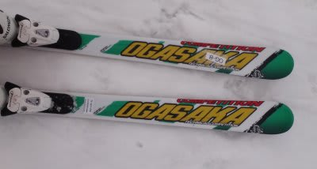
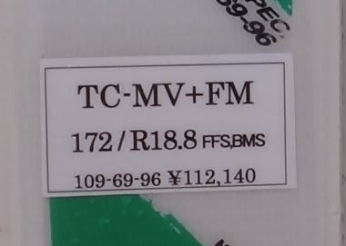

# お待たせ！　2012/2013シーズンモデルのスキー試乗レポート　OGASAKA編

📅 投稿日時: 2012-03-22 00:47:58

さてさて．

4日間お待たせしました…

[SALOMON編](e45f18347b987d02d75088b7704399c80.md)，[ATOMIC編](eeea1d5e73c2df261178519bab7793bd8.md)に引き続き，来シーズンモデルの試乗会での

インプレッションをお送りします．

今週はOGASAKA編です．

どうぞ～

○OGASAKA

TC-SV＋FM600プレート　165cm

小回り基礎板．

エッジグリップで滑るより，ずらしを作って行ったときの

トップ部分の抵抗力で旋回力が発生するタイプの板．

かっつり角を立てるのでなく，雪面をなでるようにずらしていけば，

トップ部分が抵抗を受けて板が回り始めます．

フレックスはかなり強いですね～．

普段からトップ部分が引っかかる感じがする板です．

外足の迎え角を作って動いていけば弧が描けますが…

非常にOGASAKAっぽい，マニュアル操作チックな感じがします．

エッジグリップで板の方向に走る去年のTC-SXとはかなり変わってます．

エッジを立てて，サイドカーブ＆たわみに乗っていく板ではない感じです．

むしろ，積極的なずらしでコントロールすることを狙った

2シーズン前のTC-QRの操作性に近い感じ．

TC-QRはフレックスがかなりマイルドな感じだけど，

この板は結構固いので，フレックスが強くなったTC-QRって感じかな？

＃TC-QRに乗ったことがない人にはわかりにくいコメントだ…

TC-MV+FM600プレート　172cm

中回り基礎板．

今乗っているKC-RV17に近いかな？

でも，KC-RVよりマイルドかも…

Rも18.8とKC-RVよりちょっと大きめです．

とりあえず，小回り用のTC-SVとはぜんぜん全く完全に違います．

TC-SVよりはエッジグリップが強く，フレックスもしっとりした

感じで板がたわんでくれます．

たわんだエッジに乗って，エッジグリップで曲がることもできますし，

ずらしを作ってターンしていくことも可能です．

どうやっても滑れる板．

ミドルターン用って言ってるけど，普通のゲレンデスキーヤーが

履くと大回り用に感じるかな．

トップが109mmと結構細いですし．

あーー．

でも，ズラしも作りやすいので，上手く滑れば小回りもできます．

これといったとんがった特徴はなく，ある意味面白みもないけど，

どんな斜面でもどうやっても下りてこれるような万能性はありそうです．

ロッカー板を多数履いたあとでは，クラシカルに感じる乗り心地．

切り替えから谷回りに入る際に，センターからトップよりにポジションを

戻して，トップを押さえた方がきれいに回っていく感じがします．

確か，今年のTC-MEはトップロッカーじゃなかったかな？？

FFSってのが，トップロッカーを示している

「フロントフロートシステム」だったと思うんですが．

このTC-MVは，フルキャンバー的乗り心地です．

これまでの板から全く違和感なく乗り換えられる，

どうやっても滑れる安心感がある板です．
