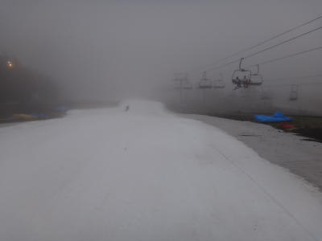
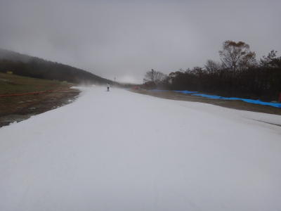
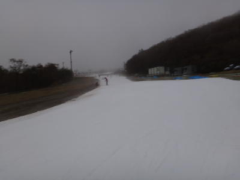
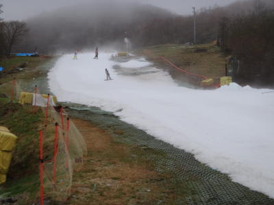
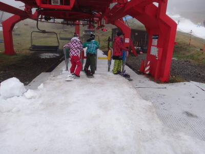
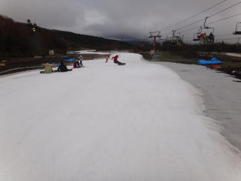
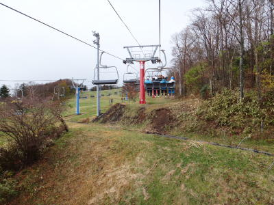
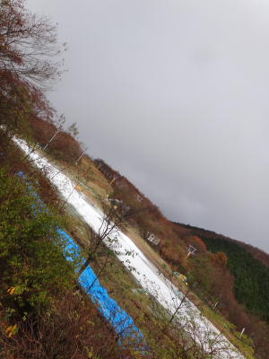
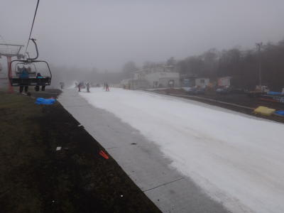

# 11月6日，日曜日のイエティ…曇り時々小雨

📅 投稿日時: 2011-11-06 23:29:02

というわけで．

天気予報では「日曜は土砂降り」とのことだったので．

土曜だけ滑って，日曜は行かないつもりだったイエティでしたが．

日曜の朝，わずかに意識（正気？）を失っている間に何かが起こったらしく．

知らぬ間に，ゲレンデに立っている自分を発見したわけで…．

んで．

日曜のゲレンデオープンは，昨晩の雨によるゲレンデ整備が入ったため，

予定より2時間遅れの10時から．

ゲレンデオープン直後にコースへ飛び出すわけですが…

うおおお！

がらがら！

人がいない！

コース貸切！

…今シーズン初めて，人をよけずに滑ったぞ！

って感じで．

そろそろ基本トレーニングも一区切りついて．

昨日あたりから．

「スピード出して滑りたい…」

という欲求がふつふつと沸き起こってきたのですが．

その欲求を満たせましたね～．ようやっと．

コースは硫安ががんがん撒いてあり，結構硬めに

仕上がってます．

ところどころ緩んでるところがありますが…

スピードが出る固めバーン．

人がいない！

うひゃー．

きもちいい！

飛ばせる！

リフト乗り場付近の，土が出かけていた部分ですが．

こんな感じで雪を寄せてあって，

コース幅を狭くするかわりに，雪の厚みは十分確保されており，

ここも今日は安心して突っ込んでいけました．

いやー．今シーズン初の爽快な1本．

これだ！これだよ！

スキーの醍醐味はっ！

それ以降も．

雨の天気予報だったからか，人は少なく．

リフト待ちもほとんどない感じで…

並行するペアリフトも，今日は動かさずに済んでました．

コース上も，1時間ほど経つと，やっぱり人をある程度は

よけないと滑れなくはなってきましたが…

それでもこの程度．

数本に1本，結構クリアラップが取れることも．

天気自体は，私の日ごろの行いがよかったからか．

12時くらいまではほとんど雨が降らず．

降っても「あれ？降ってる？」って言うくらい．

時々日が射すことも…

12時からは，しとしと降り始めてきましたが，ぱらぱらとした小雨程度．

この雨のために，ゲレンデに出てくる人が少ないんだから，

ある意味ありがたいかも…（すでに何か感覚がおかしい）

という感じで．

雨の天気予報だった今日，実はシーズン一番快適に滑れたかも．

なんにしろ，人が少ないのが良かった…

しかし

これだけ人が少なくて大丈夫か？このスキー場．

＃私は快適だったからいいけど
