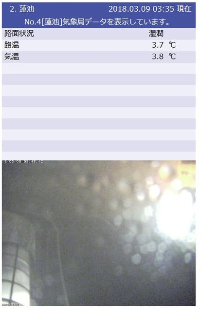
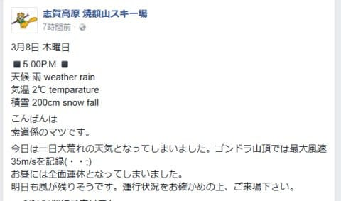
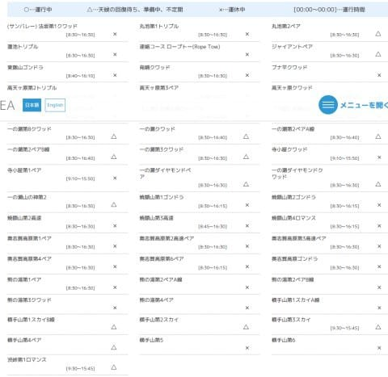
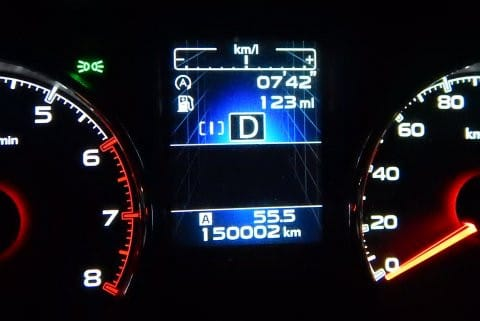
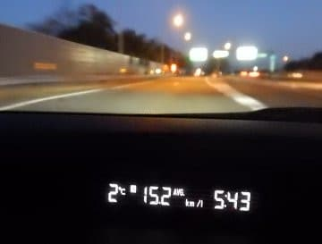

# 4年9ヵ月目にして，BRレガシィ君15万km突破…！

📅 投稿日時: 2018-03-09 03:56:22

えー．

現在．

木曜深夜…ってか，金曜早朝ですが．

志賀高原は，雨です．

空から降ってきているのは，液体です．

それも，かなり降ってるんですけど…っ！！

そして，深夜なのに気温が3.8℃って…

なにそれ！？？

3月としては，高すぎなんですけど（泣）．

で．

今日の昼間は，やはり強風で．

朝イチは焼額も2高，4ロマが動いていたようですが．

午後2時ごろには，動いていたリフトも運休に

なっちゃったようですね．

そして，午後の天気は，やっぱり雨（涙）．

この雨，今日の昼ごろから降り始めたようで…

いや．

しかし．

今日の午後の志賀高原のリフト運行状況を見てみると…

○になってるリフトがひとつもないんですけど…！？？

どうやら，午後の志賀高原．

強風で，リフト全滅だったようです…

なんてこった…！！

で．

…この雨は，昨日の予想通り，明日の朝まで

降り続けます（涙）．

ただ，明日の午前中から雪に変わり，

明日一日中降り続けそうです．

…それほど大量には積もらなさそうですが（泣）．

でも，金曜午前中から土曜の朝まで雪がちらつきそうで．

このわずかな雪のおかげで．

土曜の朝イチは雨で固まった固いバーンの上に，

柔らかい雪の圧雪がうっすら乗ってくれるので．

土曜朝は，昨日の予想通りの．

いいコンディションで滑れそうかな…

…急斜面はすぐに下地の固いのが出てきそうですが…

ってなわけで．

本題．

我がBRレガシィ君．

この週末の志賀高原往復で，無事15万kmを

突破しました～！

（15万kmぴったりで写真撮れなかった…（涙））

あの，[購入のドタバタ](eb1b0e385b422753c3e3aad5a58c12234.md)から4年と9か月…

もう，そんなに経つのか…

あれから年間3万2000kmペースで，

順調に過走行車と化してます（笑）

一回リコールでワイパーモーター周りの修理が

あったものの．

それ以外は，オイル，フィルタ類やワイパー，ライトバルブ

等の消耗品を換えた程度で．

全く無故障で15万km走ってくれてますね．

…私に似て，結構タフな車ですね（笑）．

…しかし．

あと3か月後．

この6月で，5年目の車検がやってくるわけですが．

そのころは，おそらく走行距離16万kmを超えるわけで．

さすがに次の車検を通すかどうか，考えるところ…

いや，まだ全く不具合はないし．

スタッドレス＆ルーフボックス付きで

4人乗っても，高速メインなら

燃費はリッター15km超えるし．

特に不満は無いんですけどね～…

でも，やっぱり16万kmを超えてくると．

そろそろ，プロジェクトX2をやらねばならぬのか…

うーむ．

でも．

車検が6月頭に切れるから．

車検前に買い替えようとすると．

プロジェクトX2の時期が，スキーシーズンに

もろにかぶるんですけど…←普通の人は6月はスキーシーズンじゃないから

どうしようかな…

## 💬 コメント一覧

### 💬 コメント by (サトシ父)
**タイトル**: プロジェクトX2に期待してます
**投稿日**: 2018-03-09 13:21:43

アテンザ4WDディーゼルありますね！我が家もディーゼルでいつも中野のイオンの近所で給油してます。満タンにすれば往復できるけど、自宅近隣よりリッター20円程高いですが凍結心配なので諦めてます。

### 💬 コメント by (ほっぽ)
**タイトル**: あと２年は、、、
**投稿日**: 2018-03-09 17:48:03

Sさん

Sさんの的確な油脂類交換を考慮すると、あと２年は問題なく乗れるのでは？と思います。

気になるのは下回りのサビですね。

何らかのコーティングをしてあるか、毎回高圧洗車していればサビの進行も最小限だとは思います。

私も車検の度にクーラント、パワステオイル、前後デフオイル、ATFは交換しています。

最近、デフオイルはワコーズを入れ、ATFはワコーズの添加剤を入れてます。

レガシィは13年落ちの115000km走行ですが、10万kmで延命措置を施したので、まだまだ調子良く走ってくれてます。

あと２年乗って、モデルチェンジしたレヴォーグを買うのは如何でしょうか？

### 💬 コメント by (michi)
**タイトル**: Unknown
**投稿日**: 2018-03-09 21:32:20

Sさんの物欲選手権 車編の始まりですね（爆）

レヴォのSTIとか、行っちゃいましょう‼️

### 💬 コメント by (Skier_S)
**タイトル**: 先立つものが…
**投稿日**: 2018-03-09 23:06:43

＞サトシ父さま

ディーゼルは燃費がいいんですが…

毎回長野で軽油を入れないといけないのが辛い．

中野の町中で軽油を入れると，家のそばの

激安GSのレギュラーガソリンと値段が

変わらないので…（涙）．

だったら，燃料が凍るリスクがない

ガソリン車に走っちゃいます．

うーむ．

マツダのディーゼル，惹かれてはいるんですが．

＞ほっぽさま

一応，こんな感じでタイヤ交換のたびに，下周りはメンテしているので．

https://blog.goo.ne.jp/tsakamot2001/e/055b5b744b654941d93c40de1fad1b0b

走行距離にしては，きれいな下回りです…

しかし．

4万km毎にデフオイル・CVTオイルを換えているので．

うちの場合は，車検ごとじゃなく毎年です…（涙）．

モデルチェンジしたレヴォーグも考えるのですが，

やはりA型は人柱になりそうなので．

素直に現行レヴォーグのD型かな…

とか考えています．

＃先立つものがありませんが（涙）

＞michiさま

STIですか！！

STI買ったら，スキーに行けなくなります（涙）．

スキーの足を買って，スキーに行けなくなるという

自己矛盾…

そういや，私の知り合いにスキー板＆ブーツの

道具を買って，スキーに行く資金が無くなった

人がいたのを思い出します…

### 💬 コメント by (ほっぽ)
**タイトル**: 流石です
**投稿日**: 2018-03-10 00:29:02

Ｓさん

流石ですね。下回りもバッチリ対策されてます。

ここまで丁寧に手入れしていれば、あと２年は余裕な気がします。

私も１３年落ちのレガシィ、先立つものも無いのですが、それより欲しい車が無くて買い替えで盛り上がらないですね。

最近はゴルフＲワゴン、アウディＲＳ４アバントなどが気になる一方、快適なスキー移動の足と考えるとアウトランダーＰＨＥＶとか、アルファードハイブリッド、新型デリカのディーゼルかＰＨＥＶも気になり、結局今のラインナップ継続です。(^^;

### 💬 コメント by (いか)
**タイトル**: Unknown
**投稿日**: 2018-03-10 01:39:56

2L300馬力の世界へようこそ〜

こちらは2ヶ月半で6000kmを超えて、順調に熟成が進んできています…(燃費が少し良くなってきました)

また来週かその次あたりには、志賀に出張しようかと思っていますのでよろしくおねがいします〜

### 💬 コメント by (Skier_S)
**タイトル**: あと2年だと，22万kmは行っちゃいそう…
**投稿日**: 2018-03-10 20:31:35

＞ほっぽさま

私は，車にしろ板にしろかなり酷使してしまうので，

メンテはしっかりするようにしてます…

でも，あと2年となると22万km．

ちょっとさすがにヤバそうです（笑）

通勤でも車を使うし，1台だけの車が

いきなり壊れるとどうしようもないですから…

アウトランダーも悪くなさそうですね．

うーむ．

しかし，やっぱりLEVORGかな…

＞いかさま

いや，300PSはちょっと厳しいです（笑）．

1.6Lかな～…やっぱり．

お財布がもちません（^^;

志賀にお越しの際は，またお会いしましょう！

