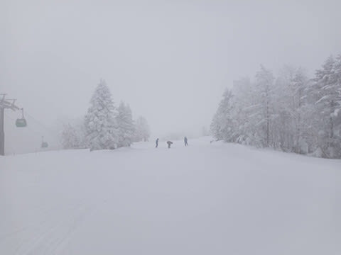
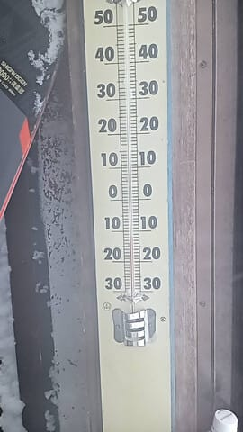
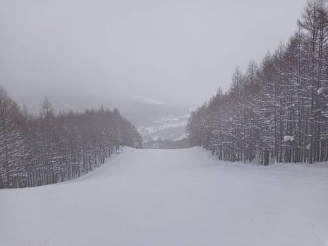
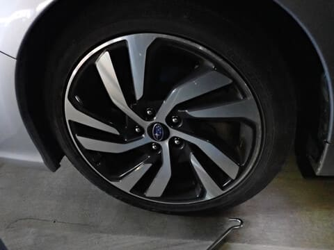
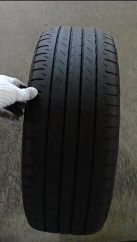
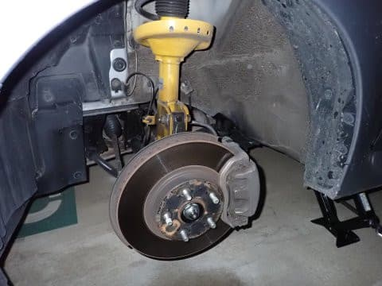
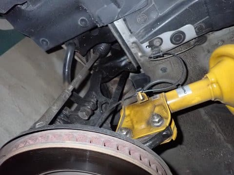
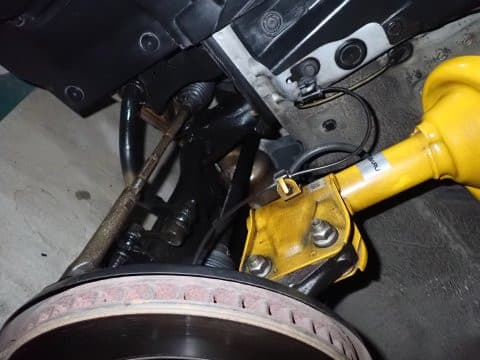
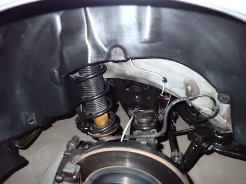
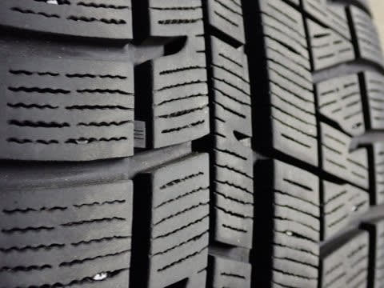

# VMG LEVORG君のタイヤをスタッドレスに交換したよ＠14.5万km＆12月24日の志賀高原，特派員情報

📅 投稿日時: 2024-12-25 03:45:14

えー．

本日も志賀高原特派員からレポートが

入りましたが…

今朝も志賀高原は雪が30cmほど

積もったようです…！

朝は圧雪コースでも5cm程度の

新雪が乗っていて，パフパフ！

朝の気温は-12℃と結構冷え込み，

昼間も-10℃を上回らなかったようで…

かなりの冷え冷えだったようですが，

朝までに30cmの積雪はあったものの，

昼間は雪はちらちら降る程度で済み，

そんなに積もらなかったようです…

で．

昨日からオープンのオリンピックコースは

硬めの下地の上に新雪30cm！

ただ，昨日に引き続き，ちょいと重めの

新雪だったようです…

かなり寒かった平日ということもあり，

滑っている人がホントに少なく…

朝からずっと，ガラガラバーンを

滑れたようです．

どの写真にも，怖いくらい人が写ってませんね…

ってなことで．

日曜からひたすら降り続けた雪は

これで一旦小休止して．

25，26日の志賀高原は積雪がなさそう…

ただ，すっきり晴れません．

25日は基本的に曇り空，ときおり日が射すかも？

26日も曇り空．時折雪が舞うかも…

という感じの天気です．

そして…

27日の金曜からしばらく，3-4日間は

また雪が降り続けそう…

日本海の海沿いはすごい積もりそうで．

…この冬は雪が多い…！！

という感じで，今シーズンは12月から

毎週本格的雪道を走って志賀高原に

通っているわけですが．

今シーズンも，11月末にいつも通り

我がLEVORG君のタイヤをスタッドレスに

交換しました～！

まずは夏タイヤを外しますが…

新車装着のこのタイヤ．

すでに6年半走ってますが，実質半年は

スタッドレスを履いており，さらに

夏の走行距離が冬より少ないので…

たぶん，まだ5万kmちょいしか走ってない

このタイヤ．まだもちそうですね…

タイヤを外した足回りを見ると…

凍結防止剤がまかれた道を走りまくる

冬に比べ，夏の間は足回りがそこまで

ひどく汚れてませんね…

とはいえ．

半年分の汚れが溜まっているので…

いつも通り磨く！

…さすがに早くも6年半，走行距離

14.5万kmを走っているので…

もう，新品の時みたいにはピカピカに

なりませんね．

磨き上げた後は透明のシャーシコート

スプレーをかけるのですが…

このシャーシコートスプレーでできた

被膜に汚れが着くと簡単には取れないため，

ダンパーの黄色部分の汚れがあまりきれいに

取れません（泣）

とはいえ．それは逆にシャーシコートが

効いているということで．

これだけきれいにして，全面さび止め

シャーシコートを塗ったから，

この冬も錆びないでもってくれるはず…

そしてリヤ側も同様にタイヤを外したら…

こいつも磨く！！

磨いたらシャーシコート！！

…まぁ，14万km走ってる車にしては

キレイになったかな．

ってなことで．

スタッドレスに付け替えますが…

スタッドレスはすでに3シーズン利用済みの

YOKOHAMA iG5PLUS．

コロナの影響で走行距離が少なめで，

3シーズンでもまだ約3.7万kmしか走ってなく．

前回も同じタイヤで5万km近く走れたし．

プラットフォームを見ても，まだ

2-3mmは残ってそうだし．

私の車としては史上初めての，スタッドレス

4シーズン目に突入です！！

…とりあえず．

この4シーズン目のスタッドレスで志賀高原に

すでに3回行っていて．

志賀の上り坂を土日合わせて計6回登り降り

してますが…

新品よりは効きは弱まってるけど．

まだまだ全然問題なく志賀の上り坂を

走れましたね～！

ということで．

シーズン中に交換しなくても行けそうな

感じなので，4シーズン目の最後まで

このタイヤで走り切ろうと思います…！！
