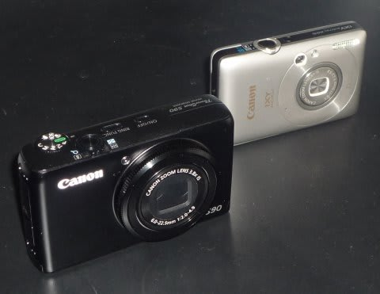
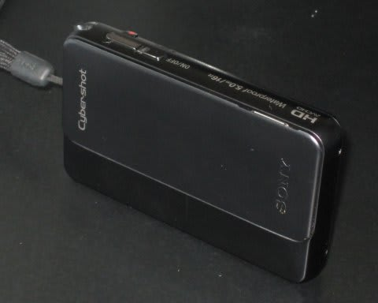
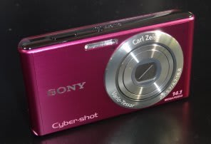
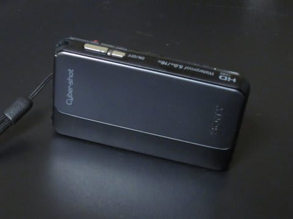
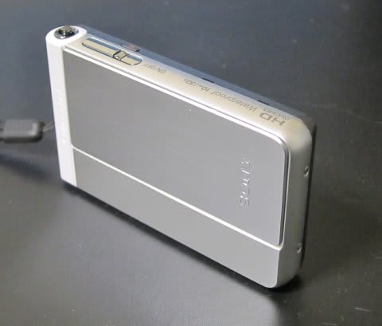
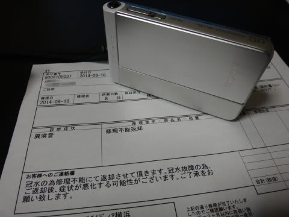

# 水中カメラ買い替え計画，発動！

📅 投稿日時: 2015-07-31 02:45:42

🏷️ カテゴリ: [PC,カメラ&小物](c0d8caed13e597efe97b661a8ae56bed0.md)

というわけで．

妻用水中カメラ買い替え計画が発動したわけだけど．

…ここ数年を冷静に振り返ってみると，だ

○2010年

　妻のダイビング用カメラ，Canon IXY210

　私のダイビング用カメラ，Canon S90

　カメラ2台+ハウジング2個を購入．

○2011年，

　[普段使い用防水デジカメ，SONY TX10](eeaa5caa0b3a71351813c7d734931dc0f.md)

　[バッテリー＆電池Get用，SONY W520](e38787d602a04193de6393f34154f0b04.md)

　2台購入

○2012年

　[TX20購入](ecf2754342d380ea1db09caa20d935657.md)

…TX10が不幸な事故でお亡くなりになったので…（私は悪くないのに…）

○2013年

　[TX30購入](e9d0187dffefa89fa8f4f8a86c24c0a22.md)

TX20がいとも簡単に水没したので，TX30を購入…

○2014年

　[TX30再び購入](e74a90d02680d75a3da9ee6c6ffdea8cd.md)

防水のはずのTX30が，水に入れてないのに

水滴が侵入しただけで水没故障（涙），買替え

…

…って感じで．

スマホが普及して，

デジカメが売れなくなった…

と言われて久しい昨今．

5年で7台もカメラを買うとは…

一体，この5年間．

デジカメだけでいくら使ってるんだろう…

そして今年もまた1台購入することになるのか…（涙）．

（続く）
