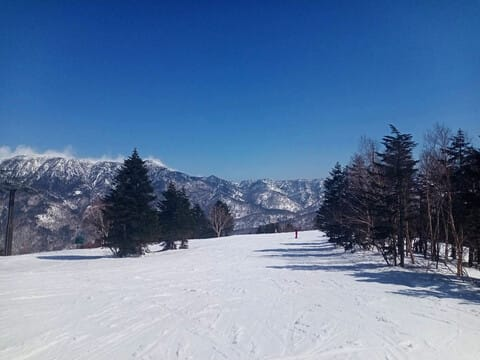
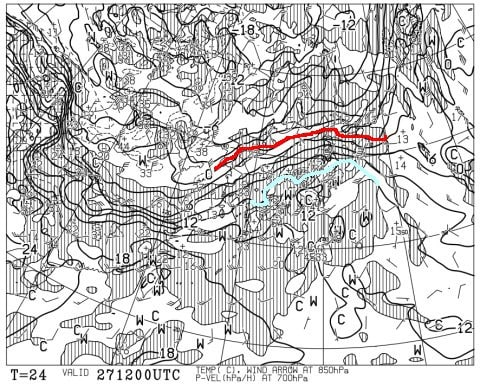

# 3月29，30日の週末の志賀高原スキー場の天気は…冷えるけどほぼ積雪が無くカリカリバーンの週末か…？

📅 投稿日時: 2025-03-27 01:38:10

🏷️ カテゴリ: [スキー天気予想](c6554f5c3c106093b511a8daae23757e8.md)

ということで．

本日も特派員から写真が送られてきましたが．

26日(水)の焼額山も気温が高かったようですが．

心配された黄砂の影響も少なかったのか，

青空も昨日よりはすっきりと見晴らしがよく，

まぁ，朝から気温は+3℃と高かったので，

雪は朝から緩かったようですが…

今日は気温が高く，日当たりがいいオリンピック

コーストかはザブザブに雪が緩んだわりに

ストップ雪にはならなかったようです！

とはいえ．

ザブザブ雪でも人が少なかったからか，

終日そこまでひどくバーンは荒れずに

済んだようで…

そして，今日も相変わらずガラガラだった

ようですね…！！

写真に誰も写ってません…！

ってなことで．

高温だったわりには板は滑るし，

悪くない感じだったらしい本日ですが．

こんな高温はいつまで続くのか？

今週末の志賀はちゃんと冷えるのか？？

…そのあたり，予想してみましょう…

まず．

27日(木)の850hPa気温ですが…

志賀高原に近づくのは，水色の+12℃線．

+12℃って…

GWでもこんな高温になるの見たことない

レベル(激泣）

27日は，めちゃくちゃ高温になりそう（涙）

そして，この日の地上天気図は，

西から低気圧が近づいているものの．

午後9時の子の天気図でも，志賀は

まだ降水域に入ってないので，

27日の昼間のリフト営業時間中は

降らずに持ってくれそう…

でも，夜は降る．

降るのはこの気温なので，当然液体です…（涙）

続いて28日の金曜日の850hPa気温は．

うーん．

この日，午後9時の天気図ではぎりぎり

赤い0℃線が志賀にかかってるけど．

昼間は0℃線が志賀より北に位置するので…

昼間は27日に続き気温は高め．

夜になってようやく冷えてくるパターン．

で，この日の地上天気図は…

うううーーむ．

志賀高原も降水域に入っているので．

降ります．

この日は一日降りそう．

それも液体が…（激涙）

そして週末，29日土曜の850hPa気温を見ると．

をを！！！

この日は一気に冷え込みますね！！

ようやっと赤い0℃線は志賀より南に下がり，

志賀高原には-6℃線がかかるので…

降れば雪なんですが．

ただ，この日の地上天気図を見ると…

志賀高原にはうっすら降水域の端っこが

ギリギリかかるくらいなので…

雪はそんなに降ってくれず．

雨で融けた下地が固まったアイスバーンが，

新雪で隠れてくれなさそう…

最後の30日の日曜の850hPa気温図を見ると．

この日も志賀に最も近づいているのは-6℃線と，

この時期にしては比較的しっかり冷えるので．

気温的には十分いい感じの気温ではあるけど…

この日も，地上天気図を見ると高気圧に覆われ

晴れそうな感じ…

いや．晴れなくていいから，冷えた日は雪が

降って下地のアイスバーンを隠してほしい…

ってなことで．

まとめると．

27日(木)：朝から晴れ．朝から気温は+5度以上と

　暖かく，朝から雪はザブザブ気味．

　昼間も気温は+10度を越え，日差しもあって

　雪はかなり緩む．

　夕方には雲が増えていき，夕方から夜のどこかの

　タイミングで，雨が降り始める．

28日(金)：前日の夜から雨が降り続ける．

　この日も朝から気温は10℃近くになりそうで，

　ゲレンデの雪はかなり解ける．

　昼間は雨は弱まり，降ったりやんだりかもしれ

　ないけど，気温と雨でかなり雪はやられる．

　

29日(土)：前日深夜から，雨は雪に変わり

　多少は積もるが…

　そこまでひどく積もらず，朝は積もって

　5cm程度．

　朝には雪がやみ，昼間は曇ったり晴れたり．

　気温はそんなに上がらないので，朝の積雪

　量によっては，バーンは前日に雪が融けた

　のが固まったアイスバーンの可能性も高め．

　おそらく，終日雨の心配はいらず，

　

30日(日)：朝から曇り？

　気温は朝は-7-8℃と，トップシーズン並みの

　冷え込みなので…昨日の積雪がそれほどなければ

　バーンはかなり硬くなるかも．

　急斜面は磨かれて，午後にはツルツルが

　増えていくかな…

ってな感じで．

土日は冷えるもののほぼ積雪が無く，

アイスバーンになりそうな予感です…

いや．

この予想は外れ，28日夜から29日まで，

ガンガン冷え込むので，集中的に雪が

積もってほしい…
