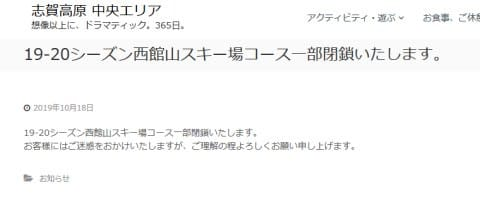
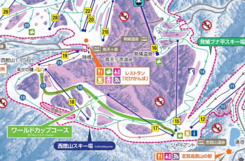
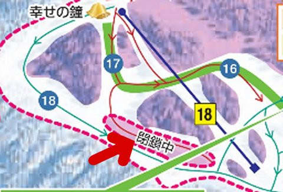
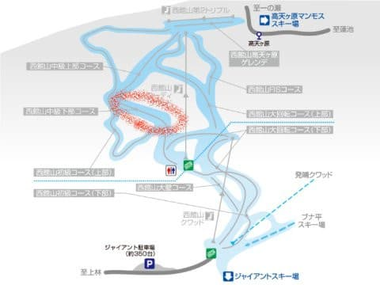
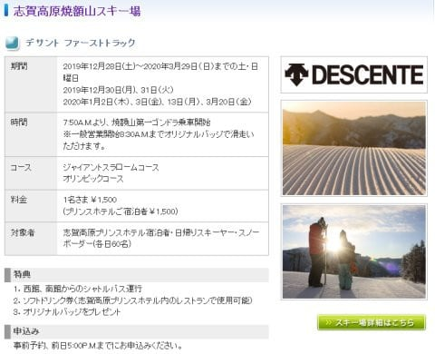
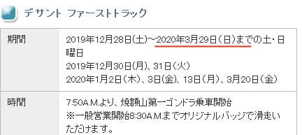

# 2020シーズン志賀高原スキー場の追加情報…西館山中級コース閉鎖！？？そして焼額の早朝は4月からなの？？

📅 投稿日時: 2019-10-19 01:18:32

えー．

2019/2020シーズンのスキーシーズン突入まで，

あと1週間に迫ってきた，Skier_Sです．

いやーー．

来ますよ～．

スキーシーズンまで，あとわずか！！！

ってことで．

本日，いつも通り帰宅後に，

ウェブページを巡回していたのですが．

志賀高原リゾート開発（中央エリア）の

ウェブページを見てみると．

お知らせのページに…

（[志賀高原中央エリアお知らせページ](http://shigakogen.co.jp/archives/4500)より）

うむ？？

なに？？

西館のコースの一部が閉鎖？？

…しかし．

はっきり言ってこのお知らせ．

極めて不親切．

一体どこが閉鎖になるのか，

全く分からないのですが…（涙）

うーむ．

閉鎖になるとすると，やっぱり

落雷でリフト小屋が焼けちゃった，

西館トリプル沿いのコースか？？

だとすると，高天ヶ原から

直接西館に行けなくなり，

高天ヶ原⇒東館⇒ブナ平⇒西館

と回らなくてはならなくなり，

影響が大きいんだけど…

それを知らせたいのかな？

いったい，中央エリアはこの

お知らせで何を知らせたかったのか…

良く分からん（泣）．

とりあえず，どこが閉鎖になるのか

ヒントが無いかと，

中央エリアのページをたどっていくと…

西館山のスキー場紹介ページの地図が，

こんな感じでアップデートされてました！！

（[志賀高原中央エリア，西館山スキー場ゲレンデ説明ページ](http://shigakogen.co.jp/highlight/nishitateyama)より）

…分かりにくいので，拡大すると．

…うむ？？

矢印をつけた，ここが

閉鎖エリアなのか？？

でも…

この地図だと，どこのコースが

閉鎖になったか分かりにくいので．

さらに分かりやすく，違う地図で

説明すると…

おそらく，ここが閉鎖になります．

（[志賀高原索道協会，西館山スキー場リフト運行状況ページ](https://www.shigakogen-ski.com/live-lift-status/detail?place-id=10)より）

そうです．

西館中級コース下部．

フード付きクワッド乗り場に向かって

落ちていく，急斜面．

ここがこのシーズンは滑れないようです…！！

なんと！！

おそらくここは，西館で1-2を争う

面白い斜面ではないですか…っ！

ここが閉鎖ですか…っ！？？？

どうでもいいのですが．

ホントにここが閉鎖なのか．

中央エリアは，もう少し分かりやすい

案内をしてほしいところ…（涙）．

でも，このコースは．

急斜面で雪付きは悪いし，

圧雪も大変なため，

コース維持が大変なので．

ここをクローズする可能性は

高いですね…

ついに志賀高原中央エリア．

リフト削減だけでは飽き足らず，

コースも次々閉鎖していくの

でしょうか？？（泣）

うーん．

ダメだ．ヤバすぎる…

次は，整備が大変な東館の

オリンピックコース急斜面とかも

クローズするんじゃなかろうか…（恐怖）

そんなことが無いように，

祈るばかり…

…そしてもう一つのニュース．

今度は焼額のホームページを

さすらったときに．

おっと．

今シーズンのファーストトラックの

案内が出てますね…！

うむ．

今シーズンも1500円で，値上げしないんだ！

これは素晴らしい…

（[焼額山スキー場，お知らせページ](https://www.princehotels.co.jp/ski/first_track/shiga.html)より）

…と思ったら．

え？

昨シーズンは割引があった

プリンスホテル宿泊者も今シーズンは

1500円？？

宿泊者割引が無いの？

…私はほとんどプリンスホテルに

泊まらないからいいけど．

某H夫妻には厳しいんじゃない

でしょうか…？？（焼額朝礼メンバーに個人的メッセージを送ってみる）

そして．

さらに詳しく見ると．

え？？

なに？？

ファーストラック，3月末までやるの？

去年は3月第1週で終了だったけど．

期間が延びるの？？

…ちょっと待て．

これって，逆に言うと．

3月末まで，6:30からの早朝営業は

無しってこと？？

昨シーズンは3月9日から始まった早朝営業．

このシーズンは，4月まで始まらないってこと？？？

…あるいは．

まさか．

焼額限定シーズン券から，早朝営業の

案内が消えてしまった今シーズン．

早朝営業やらないってことは無いよね…（恐怖）

ということで．

ダブルで志賀高原のちょっと悲しいニュースが

続いた本日．

あぁ…

このシーズン．

リフト券も値上がりするし．

何か…

なにか，志賀高原のいいニュースが，

これから出てきてくれないかな？？

と．

祈るような気分で願う，

Skier_Sだったのでした…

## 💬 コメント一覧

### 💬 コメント by (ぐー)
**タイトル**: Unknown
**投稿日**: 2019-10-19 11:20:34

はじめまして。

たまにブログ読ませていただいています。

西館1部閉鎖の話、

表には出てないみたいですが

どうやら台風19号の影響で中級コース内が

結構酷い土砂崩れに遭ったみたいで

復旧が難しいと聞きました。

ご参考までに。

突然失礼いたしました。

### 💬 コメント by (しんちゃん)
**タイトル**: 朗報が欲しい
**投稿日**: 2019-10-19 14:01:00

志賀以外の北信地区のｂｉｇゲレンデではいろんな楽しそうな企画や改善をしているのに。。。

志賀高原も朗報だなと思える施策にチャレンジしてほしいなぁ。

### 💬 コメント by (michi)
**タイトル**: Unknown
**投稿日**: 2019-10-19 20:30:36

シーズン券で早朝が滑れないのが悔しくて仕方なかったのですが、これを見てＳさん同様にまさか早朝無くならないよね？と思いました。ＦＴ優先ですか…

### 💬 コメント by (naoちゃんねる)
**タイトル**: Unknown
**投稿日**: 2019-10-19 21:24:22

志賀高原に明るいニュースが無いですね😢

ファーストトラックは40分で1500円となると…高いですよね…

特に案内も書いてないので、小学校も1500円掛かるのでしょうか…

前日17時までに申込みだし、あまり使い勝手良くないですね。

嗚呼、朝イチのシマシマのGSを滑る機会が減ってしまいます😭

### 💬 コメント by (Skier_S)
**タイトル**: いいニュースが欲しい…
**投稿日**: 2019-10-19 23:55:55

＞ぐーさま

初めまして～！！

コメントありがとうございます！

…そうですか．台風で崩れちゃったんですね…

だとしたら仕方ないことなんでしょうか．

でも，復旧させてくれるのならいいんですが，

このままずっと閉鎖にならないかちょっと心配…

志賀高原には良く来られるのですか？

もしいらっしゃるようなら，志賀高原で

お会いしましょう～！

＞しんちゃんさま

確かに，志賀高原でもなにか面白いイベントを

やってくれればいいのですが…

昔のアフタヌーンファーストとか，

面白かったんですけどね～．

＞michiさま

いや…

ホントに早朝営業してくれるのか，ちょっと心配です．

FTの方が，同じ金額をより短い時間で稼げるし，

シーズン券の人ばっかりの早朝をやめて，

今年はFTの期間を伸ばしたのかも…

＞naoちゃんねるさま

ファーストトラック，新春ファーストトラックは確か

小学生は無料だったと思うので，普通のファーストトラックも無料では

無いでしょうか…？

せっかく昨シーズンは1ゴン早朝が3月頭からGWまで滑れて

良かったのに，どうも来シーズンは残念な感じです…

でも．

早朝券を買う回数が減るので，お財布的にはちょっと優しいかも．

### 💬 コメント by (Unknown)
**タイトル**: Unknown
**投稿日**: 2019-10-21 15:09:43

西館の中級下ですが300m以上に渡って土砂崩れ、陥没しているので重機で土を盛らないとコースとして使えないらしいですが雪が降るまでに工事を終わらせられない為閉鎖との事です。

また土砂がフーディ線下沿いにある降雪用のプールに向かって流れたので、もし降雪できないとしたら西館のシーズンが短くなる可能性もありそうです。

### 💬 コメント by (Skier_S)
**タイトル**: >Unknownさま
**投稿日**: 2019-10-22 02:31:39

西館中級コース下部，かなりひどく崩れたんですね（涙）

今日，志賀高原に行ってきましたが．

見たところ，ゲレンデの被害は分かりませんでしたが．

道路がそこかしこで工事してたり，通行止めだったりで．

かなりの被害だったことが感じられました…

まさか，スキー場がこんな台風被害を受けるとは

思ってませんでした…

