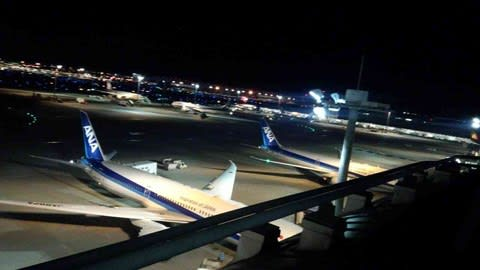
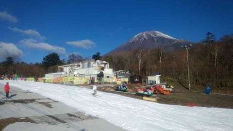

# 2018シーズンスタートから1か月…11月12日のYetiのゲレンデ状況速報モード

📅 投稿日時: 2017-11-13 00:06:30

🏷️ カテゴリ: [2018スキー滑走日記](c11b88dc181f34079ab41db74a3587646.md)

本日．

予告通り，朝からYetiに行ってきました～！

…で．

朝から滑ってきたのに．

今，こんなところにいます…

実は，これから米国（米どころ新潟のことではない）に出張のため．

空港から更新中です～．

いや…今日は夜日本発の飛行機だから．

午前中は滑れるな～…

と．早朝家を出て，午前中Yetiで滑って，

夕方空港へ移動，夜出国という，

これから乗り継ぎ含めて17時間の長旅です（涙）

まぁ，いつもの感じのご無体プランですね(笑)

で．

本日のYetiですが．

朝は晴天！！

冠雪した富士山がすっきり見える天気で．

朝イチゲレンデは，アイスクラッシュの雪が広げられた，

ザクザクする雪でしたが…

がらがらでGood！！

コース幅もそこそこ広がったかな～．

ただ…8時オープンから1時間ちょい経つと，ちょっと

混んできました…

でも．先週の3連休最終日，日曜ほどは混んでいない感じで．

リフト待ちは平均3分程度，並行しているブルーリフトを

動かすほどの混雑にはならなかったです…

だもんで，ゲレンデ混雑も，コース幅がちょい広がったってのもあり．

リフト2本動いているのに比べると，結構ましだったかな～．

天気は，朝イチは晴れたものの，その後9時過ぎからは

曇り空になり．

結構寒かったです…

とりあえず，午後2時ごろまで滑って切り上げましたが．

雪は厚み十分．

午後になってもそれほど混まず，意外と楽しめた

Yetiでした…

もし，明日時間があれば詳細レポートしますが…

時差があるので，いつもと違う時間にアップされるかも．

＃そもそもアップできるかも不明ですが（涙）

とりあえず，これから米国（新潟ではない）へ行ってきます～！
