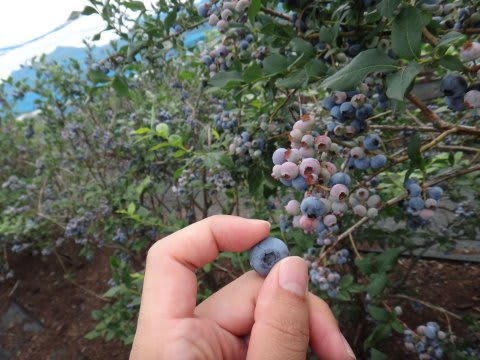
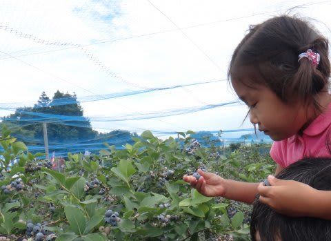
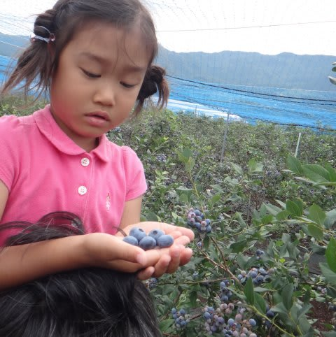
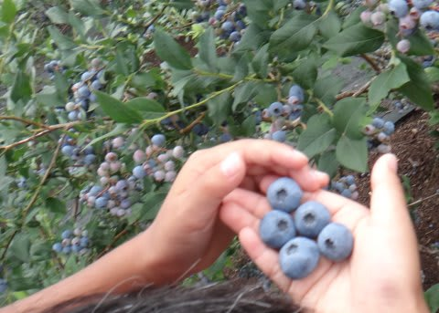
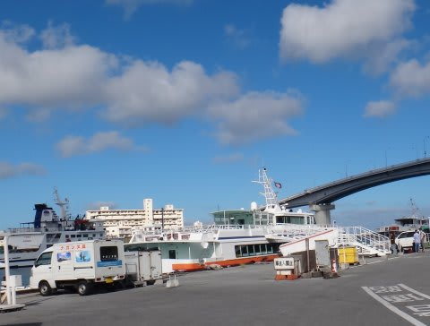
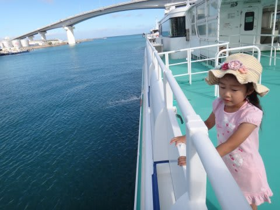

# 2013年7月　子連れ座間味ダイビング旅行記その２…座間味へ

📅 投稿日時: 2013-07-23 01:59:01

えー．

昨日は娘を連れて，某G馬県まで遊びに行っていました…

…目的は．

ブルーベリー狩りです．

いやー．ブルーベリー狩りって結構面白いんですよ～．

大人1人500円と安いですし．

木によって全然味が違うのも楽しめますし．

こーんな大粒ブルーベリーを食べ放題．

りんご狩りやぶどう狩りと違って，すごいいっぱいの数を食べられるので．

お得感が強くてお勧めです～．

ってことで．

昨日は更新が無かったのですが．

今日は（も？）帰宅が遅かったので．

今日の記事は，ショートバージョン．

自分で見直してても面白くないです…(泣）．

＃写真も少ないし．

が，ガマンして読んでやってください…

---

…って感じで．

那覇のホテルで目覚めた2日目．

本日は朝1便の高速船で，座間味へ渡る予定…なんですが．

…まだ風が強そうです．

果たして本日．

高速船は出るのかっ？

どきどきしつつ，

泊港へ行って…

建物の中に入ると．

な，なんじゃこりゃぁ？

チケットカウンターに，

ものすごい長蛇の列がついてるんですけど…！？

＃すごい列の写真を撮っておけばよかった…(後悔)

こ，これに並ばないといけないのか…？

っていうか．

それ以前に，今日は船は出るのか…！？

いろいろ情報を集めてみると．

どうやら，今日も波が高く，粟国島や久米島方面は

欠航が続くらしいですが．

座間味行きは，高速船もフェリーも出航が決定！

…

…良かった～っ！！

で．

4日ぶりの運行となった座間味行きの船には．

ここ3日間の欠航中に渡れなかった人が押し寄せてるみたいで．

この3日間に乗れなかった人たちが，ものすごいキャンセル待ちの

列を作っているようで…

＃返す返す，写真を撮っておけば…(涙)

日ごろの行いのよさのおかげか．

予約済みのわれわれはあっさりチケットを買えて，

キャンセル待ちのすさまじい列に並ぶことなく乗れたけど．

…このキャンセル待ちの人たち，今日の船には乗れないんじゃ

なかろうか…

まぁ，われわれのラッキーさに感謝しよう…

って感じで．

9時出航の高速船に乗り込み．

いざ，座間味島へ！
