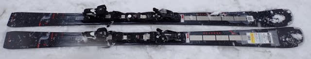
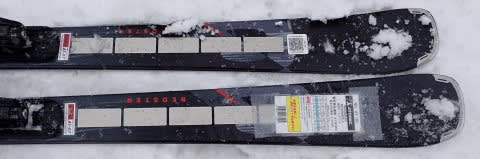
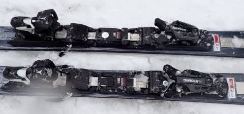
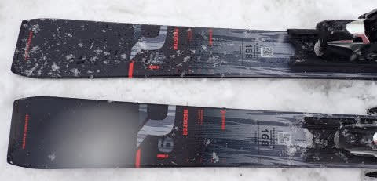
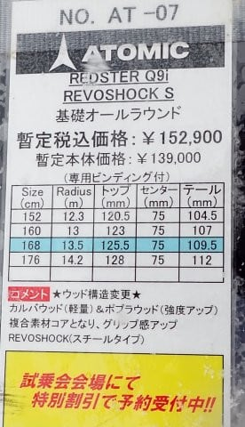

# 2024シーズンモデルのスキー板，試乗レポートその22…ATOMIC REDSTER Q9i Revoshock S

📅 投稿日時: 2023-07-03 03:22:35

え？

2023年って，もう半分終わったの？？

ちょっと待て．

2023年って，残りあと半分なの？

もう，1年の後半に入ってるってこと？？

確かついこの間までスキーシーズンで，

冬が終わったばかりだと思っていたん

だけど…←あなたのスキーシーズンがおかしいだけでは？

…ちょっと最近，時空が歪んでないかな？

どうせ時空がひずんでるなら．

平日は一瞬で過ぎ去って，

週末が長く続くように歪んでほしいけど…

全く逆に歪んでいる気がするのはなぜだ？

と不思議に思う今日この頃．

皆様いかがお過ごしでしょうか（時候の挨拶）

ってなことで，時候のあいさつの後は本題へ．

本日も2024シーズンモデルのスキー板の

試乗レポート．

今回はアトミック編です．

では，どうぞ～！

〇ATOMIC REDSTER Q9i Revoshock S 168cm

オールラウンド

ラディウスが13.5mと小回りベースながら

センター幅が75ｍｍと広めでオールマウンテン

性を持たせたのがＱ9iです．

見た目昨年から変わってない気がしますが…

どうやらコアの材質が変わったらしく，

モデルチェンジしているみたいです．

で．

この板は，コンディション最悪だった日の

一番最後のほうに試乗したってのもあり．

4月のざぶざぶ雪が蹴散らされて荒れ荒れに

なった後に急に冷えて固まり，

その上に重い湿った雪が数㎝積もるという，

シーズン中でもそうそうないだろう激悪

コンデションだったんですが…

でも，幅の広さと軽さのおかげで，

こんな難しい荒れ荒れ斜面でも，

そんなに難しくなく斜面を降りられます…！

履いた感じは，結構軽さを感じて．

安定性大丈夫か？と思ったけど．

この軽さゆえの取り回しやすさで，

荒れ荒れの雪の上でも板を好き勝手

動かせるので，リスクなく滑ることが

できます…

やっぱり軽い分，重い雪を蹴散らす安定感が

あるわけではなく，板がたたかれる感じは

あるけど．

幅の広さで荒れ荒れの重い雪の上に乗っかる

ような感じで滑って行けて．

重い雪の上に浮かび上がったところで，

板の軽さで自由自在に動かせるという，

難しさが全くない，すごく扱いやすい板．

軽さで板がたたかれても，動かしやすさを

武器に，しっかり圧をかけてずらしていけば，

板が雪面を捉えた，足場のしっかり感を

保ちつつずらしていけるので，難しい斜面でも

不安感なく楽に降りていけます．

荒れていない平らな斜面では…

板に圧をかけず，板の上で左右に傾いて

行くだけで，板が左右にターンしていってくれます．

Ｒ13ｍという小さめの半径で，168㎝という

小回りっぽいスペックの板ですが．

ラディウスから想像するほど小さい小回り

にはならず，楽ちんにクルージングできる

ターン弧が作れる感じ．

荒れ気味の斜面でも，右左に傾くだけで

全く力を使わずにターンに入っていけます．

整地では楽にカービングで降りていけて．

新雪ではその太さである程度の浮力もあり，

荒れた春雪でもその浮力と軽さで自由に

板を振り回すことができるので．

硬い斜面でがっつり体力を使っていくというより．

どんな斜面でも気楽に安心して滑っていける

という，まさにオールラウンド性といえる

性格を持っている板．

とりあえず，雪質を選ばず．

斜面を選ばず．

どんなところでも，楽に滑ってこられる…

という性格を突き詰めた板だなぁ．．．

と思いました．

これ一本で何でもできるし，

楽さを求める人にはいいと思います．

ただ，私にはもう少しがっつりグリップと

刺激が欲しい…
