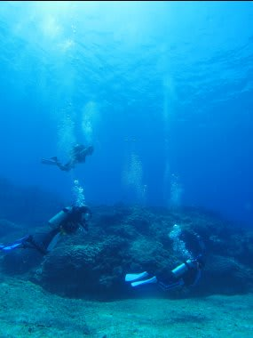
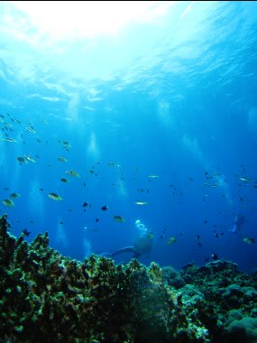
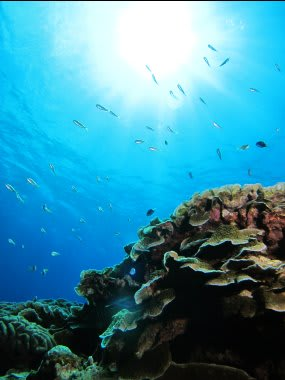
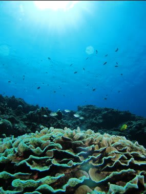
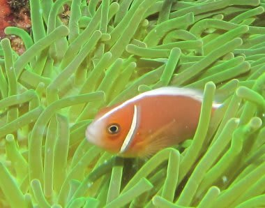
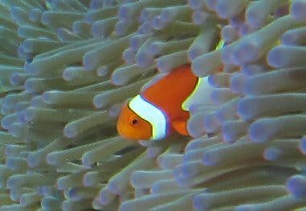
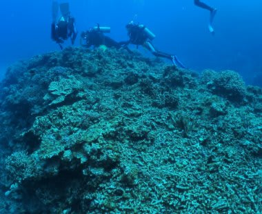
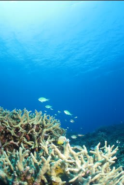
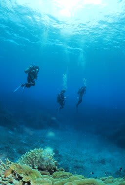

# 2012年7月　子連れ座間味ダイビング旅行記4　今年1本目のダイビング

📅 投稿日時: 2012-07-31 00:02:49

🏷️ カテゴリ: [ダイビング日記](ce3a7a8d424d112fce83ee85c81a0e344.md)

というわけで，超久しぶりのダイビング．

えーっと．

えーっと．

とりあえず，このままひたすら水面漂ってたらダイビングにならないから．

まずは潜らないとダメだよな…

潜るには…そうそう，BCのエアを抜いて，息吐いて，耳抜きして…

んで．それから…

…って感じで，潜行開始時に多少じたばた．

うーん．やっぱ久しぶりだとちょいと耳が抜けにくいけど…

なんとか無事潜行．

いやー．

10ヶ月ぶりの海だけど．

潜ってしまえば，まぁなんとか，勘が戻ってきますな．

とりあえず，カメラを起動…っと．

フラッシュも立ち上げて，各種設定確認して…

…

…

どうしたことだ．

水中写真の撮り方，忘れてる…

えーっと．

絞り優先でF2.0だとシャッタースピード警告が出てるから，

絞りを絞って…っと．よし．F4.0まで絞れば警告が消えたぞ．

…あー．

フラッシュフル発光，F4.0でこの距離だとフラッシュ光,

ちゃんと回るんだったかなぁ？？

とりあえず試しにシャッターを…

あらら．

フラッシュ回ってないじゃん．

もう少し近づかないとダメか…

って感じで.

どうも，絞り値と被写体までの距離とフラッシュ強度の

感覚が戻ってこないなぁ．

背景光とフラッシュ光のバランスが上手く取れない…

(これもちょっとだけフラッシュが弱い感じ…）

1本目にポイントは「儀名」ってポイントで．

リュウキュウキッカサンゴがきれいなポイントらしいんだけど．

まぁ，私にとってはリハビリダイブで，

カメラの感覚を思い出すのに精一杯．

まぁ，ぼちぼちと小物も楽しませてもらったし．

うーむ．

慶良間も，今年はちょっとサンゴがやられてる感じがするなぁ…

でも，元気なサンゴもいっぱい残ってるし．

ダイビング最後のころには，何とかカメラの感覚も戻ってきましたね．

この写真のころだと，手前のサンゴと魚の明るさと背景の海の明るさのバランスが取れてきたかな．

とりあえず，Exitしますか…

って感じで.

今シーズンの1本目，無事終了！
