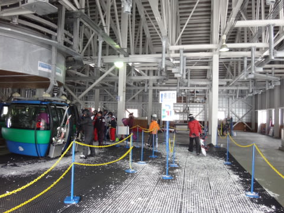
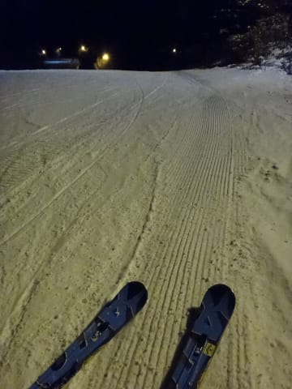

# 12月31日，大みそかの志賀高原…晴れ時々小雪．積雪は増えず（涙）

📅 投稿日時: 2015-12-31 22:28:43

🏷️ カテゴリ: [2016スキー滑走日記](c70c67ed5248e9432b899dcd5747048bb.md)

えー．大みそかも志賀高原にいる

Skier_Sです．

大みそかの本日も…

朝からすっきり晴天！

…って．

普通なら晴天は喜ぶところだけど．

…晴天ってことは．

昨日から1㎜も積雪が増えてないということで（涙）

朝イチは，気温もマイナス11度と冷え冷えでしたが．

そして，圧雪かけたてでシマシマで，

気持ちよかったですが．

天気も良くて，普通なら絶好のスキー日和でしたが．

冷え冷えで雪質もよいのですが．

…でも．

足りない．

今日も．

圧倒的に雪が足りないのだ（涙）

人工降雪をつけていない第1ゴンドラ側は．

当然昨日からの積雪の積み増しがないので．

朝10時過ぎにはもうこんな感じ…（涙）．

だけど…

なぜか，ゴンドラ待ちが長いんですがっ！！

で，なんだ，これはっ！？？

10時ごろには10分待ち…（涙）

でも，ゴンドラを待ったのは11時ごろまで．

それ以降は，昨日までと同じく．

大勢の人に蹴散らされたゲレンデは，

とんでもないことになり…

とても滑れたもんじゃないんで，

昼頃には第1ゴンドラはガラガラ飛び乗りに…

人工雪がつけてある第2ゴンドラ側は．

ブッシュはほとんどないものの．

相変わらずの混雑…（泣）．

とりあえず．

焼額は．

人工雪で雪は多いけど，人も多いコースか，

人は少ないけど，雪も少ないコースか．

どちらかしかない究極の選択なので．

…今日は，珍しく奥志賀方面へ逃げてみました．

うーん．でも．

ゴンドラコースは…

ちょっと土が出てて…

ああ．

ちょっとダメな感じですね．

…土がかなり出ていて，ちと楽しくない感じ…（残念）

っつーか，このゴンドラコース．

普通の年なら，まだオープンさせないレベルかも…

まぁ，そのせいでゴンドラはガラガラだったんですけどね～．

意外とよかったのは，第2ペアリフト沿いのエキスパートコース．

ごくわずかブッシュは出ていたけど…

完全天然雪なのに，雪は比較的よく．

リフト待ちもなかったので，

今日は奥志賀のエキスパートコースが一番よかったかな！

とりあえず．

今日も全く雪が積もらず．

ゲレンデの雪は減っていく一方で．

…ほんとにそろそろ雪が積もらないとかなり

厳しい志賀高原です…（涙）．

まぁ．

でもやっぱり．

今日も一番良かったのは，ナイターだったかな～．

ナイター営業開始に間に合わなかったので，

シマシマは味わえなかったけど．

人がいない，圧雪かけたて，リフト待ちなし…

ってことで．

やっぱりナイターが楽しかったなぁ…

とりあえず．

これから先の三が日までで，雪が降りそうなのは．

今晩くらいです…（涙）．

でも．

明日の朝までに積もる量は10㎝あるかな～（泣）．

劇的改善は望むべくもない感じです（極めて残念）．

ってことで．

スキー場にいると，そんな感じがないのですが．

どうやら本日で，2015年も終わりのようです…（ちょっと驚き）

今年もご愛読ありがとうございました．

また来年もよろしくお願いします…

## 💬 コメント一覧

### 💬 コメント by (komu)
**タイトル**: お世話になりました
**投稿日**: 2015-12-31 22:59:45

今日は一日中横手山で滑ってました。

今も熊の湯で滑ってます。

松明持って滑るのだ。

明日は焼額山行きます。

と言うわけで来年もよろしくお願いしまする。

### 💬 コメント by (Skier_S)
**タイトル**: komuさま
**投稿日**: 2015-12-31 23:13:26

あら。

志賀にきてらっしゃいますか…

私は明日はニューイヤーファーストトラック

やる予定です。

早朝から滑ってます…

来年もよろしくお願いします！

### 💬 コメント by (Goku)
**タイトル**: Unknown
**投稿日**: 2015-12-31 23:55:56

まさかこれほど雪が降らないまま年を越すとは・・・

長野市は現在雪が降っていますが、山にはもっと雪がたくさん降りますように。

では、来年も宜しくお願いします。

私の滑り初めは５日になりそう・・・

### 💬 コメント by (Skier_S)
**タイトル**: Gokuさま
**投稿日**: 2016-01-01 11:17:53

年越し5分前にコメントありがとうございます(笑)

今年もよろしくお願いします。

今日は、朝に10cmほど積もりましたが

まだぜんぜん足りない感じで小石がすぐ

出てきてしまいました(涙)

う～ん

ダメな感じです(泣)

