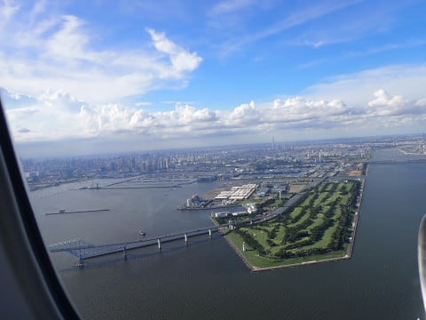

# 2023年8月，座間味で親子3世代ダイビング！ファイナル…さよなら座間味…そして帰宅

📅 投稿日時: 2023-10-14 02:04:46

🏷️ カテゴリ: [ダイビング日記](ce3a7a8d424d112fce83ee85c81a0e344.md)

ということで．

あと1週間後にスキーシーズン突入というのに．

まだ終わってないダイビング旅行記．

季節感のない南国のダイビング旅行記が

続きますが…

ついに今回が最終回です！

ーーー

ということで，[前回](efe86ccc6639e4c5efe9584b455856c67.md)の記事では，

朝6時に宿を出て，古座間味ビーチへお散歩

に行ってきたわけですが…

お散歩から帰ってきたら，

ちょうど朝7時の朝ごはんの時間．

あぁ…これが今回の旅行での最後の

朝ごはんか…

寂しい…

朝ごはんの後は，昨晩から干しておいた

ダイビング器材を回収して，荷物を

パッキングしますが…

いつも，このダイビング器材を片付ける

時間が，

「あぁ…旅行が終わっちゃったな…」

と寂しくなる時間．

この貸し切りテラスからの眺めも，

これでしばらくお預けです…

いやー．ペンション星砂さんの

貸し切り室，よかったなぁ…

座間味を離れる高速船は朝10時

発なので…

9時半ごろ，4泊お世話になった

ペンション星砂さんを後にします．

これでペンション星砂さんは7回目．

娘は2年に1回のペースで来てる

ことになりますが…

また来年も戻ってきます～！！

そして…

港の高速船乗り場に行く前に，

これまでお世話になったティンガーラ号の

横を通るので…

ザマミセーリングのスタッフの皆さんにも

ご挨拶．

「お世話になりました～！

　また来年もお願いします！」

あぁ…

これであとはもう帰るだけですね…（涙）

高速船待ちの列に並んだら．

しばらくすると…

クイーン座間味が入港．

あぁ…帰りたくない…

とはいえ．

無情にも乗船時間がやってくるので．

現実世界へ戻る第一歩，帰りの高速船に

乗り込みます…

ダイビング器材は船内の荷物置き場に

持ち込みますが．

帰りの高速船も，沖縄の海を最後まで

堪能しようと，座席は取らずに

デッキで過ごすことに．

みんな乗り込んだら，高速船は

慌ただしく座間味の岸壁を離れます…

さようなら，座間味島！

また戻ってくるよ～！！

座間味を離れた高速船は，次は

阿嘉島に立ち寄り…

その後は阿嘉島を離れ，一路那覇へ！

毎回恒例，阿嘉島のダイビングボートの

見送りを受けた後は…

慶良間諸島を後にして，那覇に

向かいます…

さよなら慶良間…

あぁ…

4年ぶりの慶良間が離れていく…

そして．4年ぶりの夏休み旅行が

終わっていく…（涙）

でも．

4年ぶりに来てみて．

やっぱり，座間味は楽しかった．

楽しすぎた…

楽しい旅行の毎日を振り返りながら，

潮風に吹かれること1時間弱．

那覇の街が見えるようになり…

11時過ぎ，那覇の泊港に到着！

下船したら…

飛行機の時間までそんなに余裕がないので，

急ぎ船乗り場前のタクシー乗り場から

タクシーで那覇空港へ向かい…

那覇空港では，お土産をちょっと買うだけで，

お昼ご飯を食べる時間もなく，慌ただしく

搭乗時間がやってきます…

ってなことで．

飛行機に乗り込みますが…

行きはレアな最新GEエンジンのB787-9

でしたが．

帰りは普通のB7-300ですね．

当然，座席にディスプレイはなく．

標準的な国内線仕様．

うーん．ちょいと残念…

行きは新しい機体で，さらに到着も

那覇空港の新滑走路と，私の初めての

新しいモノ尽くしでしたが．

帰りは，離陸も旧滑走路の

36Rからでした…

ってなことで．

さよなら，沖縄～！！！

あぁ…沖縄が去っていく…

と．

夢の世界から現実の世界へ戻る

フライト，2時間少々．

飛行機は関東上空に戻ってきました…

最近は機内WiFiを繋げば，スマホやPCで

フライトマップを見れるので…

羽田のアプローチを確認すると．

ここを真西に向かうのは…

[RWY22へのLDAアプローチ](e5a41c46842e2a17baa7d954ac9c6d63c.md)ですね．

江東LDAアンテナへ向かい，若洲を

右手に見るあたりで左バンクを打って

RWY22へ向かってアラインして…

B滑走路東側，RWY22へタッチダウン！

あぁ…帰ってきちゃった…

ってなことで．

4年ぶりの沖縄．

そして4年ぶりのダイビング，

さらには４年ぶりの飛行機…

と，いろんなところに「帰ってきた」

感があった，今回の旅行．

これにて無事終了です…

お疲れさまでした！！

（まだエピローグへ続く）

## 💬 コメント一覧

### 💬 コメント by (1kamakura)
**タイトル**: Unknown
**投稿日**: 2023-10-14 07:02:20

江戸の秋

うわー

飛行機についてもお詳しいのですね。

すごい‼️

ダイビングブログ、楽しかったです。

親子三世代というのがまた

素晴らしい👍

### 💬 コメント by (Skier_S)
**タイトル**: ＞江戸の秋さま
**投稿日**: 2023-10-15 01:59:59

飛行機も好きなんですよ…

乗り物は車でも船でも飛行機でも何でも好きです（笑）

ダイビングブログ，楽しんでもらえたならよかったです…

「このブログについて」のカテゴリの，このブログの目次の記事から

過去のダイビング日記がすべてたどれるので，もし気に入っていただけたなら，

他の旅行記も読んでやってみてください…

### 💬 コメント by (mae)
**タイトル**: Unknown
**投稿日**: 2023-10-15 23:02:39

わかります..

最終日の器材のパッキング、寂しくなりますよね。

それも海外だと、一層寂しくなりますよね。

私が良く利用していた阿嘉島では、ショップではなく

民宿のオーナーがいつもボートで見送りをしてました。

夏は予約困難な宿なのでここでは書けませんが....

### 💬 コメント by (Skier_S)
**タイトル**: ＞maeさま
**投稿日**: 2023-10-16 00:27:50

そうなんですよね～…

帰りの器材パッキング，寂しいんですよね～．

クイーン座間味，阿嘉島出港では大体いつもボートの見送りがあるんですが，

一体どこのショップだろう…と思っていたところ，ショップじゃなく

民宿のボートなんですか？？

