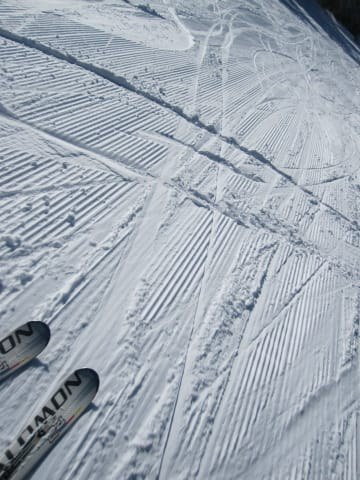

# 12月2日の志賀高原は…最高のスキー日和っ！

📅 投稿日時: 2012-12-03 01:13:11

さてさてさてさて．

[昨日のレポート](e9734ff5a8d7ae3c4d32cad476ef64966.md)で．

冷えた大雪が降り続き，かなりのGoodコンディションと報告しましたけど．

その後．夜まで一日中雪が降り続けており．

日曜のコンディションはすごいんじゃないか？？？

…と．予想したわけですが．

ふはははは．

予想通りっ！

さらに．

木曜に．

ねらい目は日曜かな．

土曜にゲレンデに雪が積もった後，

雪がやんで，うまくいけば晴れそう．

かなりの好コンディションでしょう！

って書いたとおりの状況で．

きれいに晴れ渡り．

…まさに．

まさに，好コンディション！

雪もよく．

天気もよく．

トップシーズンでもこれだけいい状況は無いぞ…

という．

絶好のスキー日和でした．

なんにしろこの日．

朝の気温は－10度．

昨日の夜から積もった雪はこの程度．

10cm程度でしょうかね～．

思ったほどは積もりませんでしたが，かなり冷えたいい雪です．

朝一は…

うははははっ！

シマシマだっ！

誰もいないっ！

最高．

最高だよ…．

天気がよく，北アルプスもきれいに見えたし．

昼間でも，最高－3度までしか上がらず．

日差しがあるにもかかわらず，雪は全く緩まず…

昼でも，こんなにいい雪！

ゲレンデの混雑もこの程度．

ゴンドラは，昨日よりは込んでましたが，

それでも最大で搬器を5－6台待つくらいかな．

3分以上待つことは無かったですね～．

昼からは待ち時間0．

ええんか？

12月第1週から，こんなにいいコンディションでいいのんか？？

って思いましたが．

午後からはちょっと雲が出てきて…

そして雪も荒れて，急斜面はちょっとこぶになり．

さらに，コース下半分の人工雪がつけてある部分は．

固い下地が顔を出してくるところもありました…

数箇所，この程度のブッシュが顔を出しているところも出てきましたが…

まぁ，こんな感じのが2－3箇所程度ですから，新しい板でも問題なし．

こんな感じで．

夕方まで滑ってしまった，超恵まれたこの週末でした…

一の瀬方面ももう真っ白です．

来週末の8日から，高天ヶ原，一の瀬ともにクワッド運転開始のようです．

あー．そうそう．

次の週末に向けて．

また冷えるのだ．

それも，かなり冷えるのだ．

積もるのだ．

今のところ，

次の週末も，好コンディションの予定！
