# 2月9,10,11日は3連休！志賀高原スキー場の天気は…結構冷えそうだけど，うーん．晴れ間は少なそう

📅 投稿日時: 2019-02-07 03:19:19

どうも，このBlog．

スマートフォン版は，デザインが結構変わって

しまったようですが…

この新デザイン．結構見にくくなった気がして．

…ちょっと残念な感じの，Skier_Sです．

ってな感じで．

日曜夜～月曜朝の雨で，志賀高原は全山

かなり固い斜面になってしまったようですが（涙）

コメントにも，奥志賀はツルツルという報告も

あったりして．

今週末までにまたトップシーズンの柔らかい雪に

戻るのか？？？

というところが気になるところ．

今週は，6日の夜から7日朝にかけて，

気温が0℃を超えそうな予想だったので

心配しましたが．

とりあえず，明日7日，木曜朝9時の850hpa図を見てみると．

…赤く塗った0℃線は，ギリギリ志賀高原より南にいますね．

そして，木曜午前中は降らなさそうなので．

まぁ，雨の心配は無さそうです…

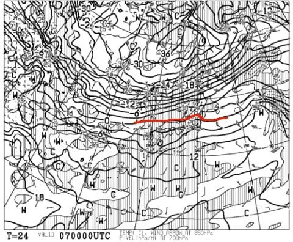

そして，木曜夜9時になると．

うむ．赤く塗った0℃線は，南に下がり．

志賀高原は，水色-6℃線がかかるほどの

冷えが戻ってきてますよ～！

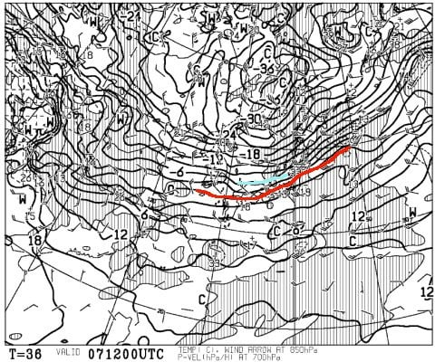

この時の地上天気図は．

見事に日本海側に，水色の降水域が

かかっているので．

…木曜は昼ごろから雪降りになり．

ボチボチ積もりそうですね…！

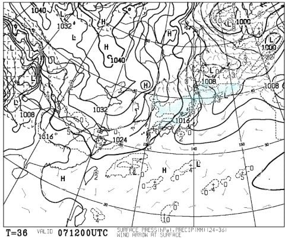

そして，金曜8日は．

…この日は，-12℃線が志賀にかかってますよ！！

朝は-15℃クラスの冷え冷えです！！

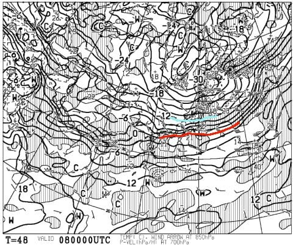

地上天気図を見てみると…

この日も，日本海側に水色の降水域が

かかっているので．

そこそこ積もりそうな感じ…

7日夜から8日にかけて積もってくれるので．

8日朝は脛パフくらいの新雪かな？？

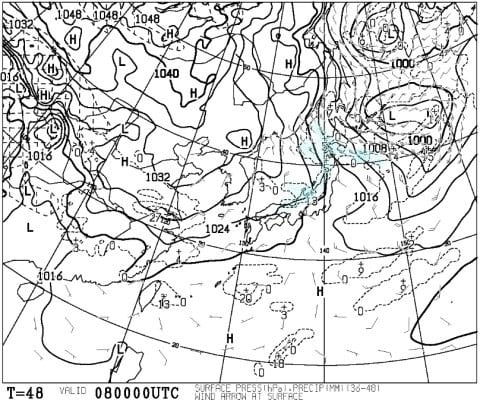

この，8日金曜の500hpa&湿数図を見ると，

こんな感じで．

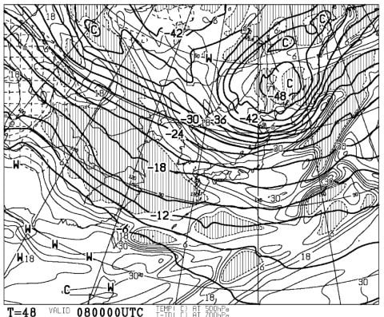

これを見ると

「山の上は降りそうだな…」

と思うんですが．

…なぜだか分からないと思うので，解説すると．

こんな感じで，網掛けになっていないエリアが，

帯のように北から南に流れてます．

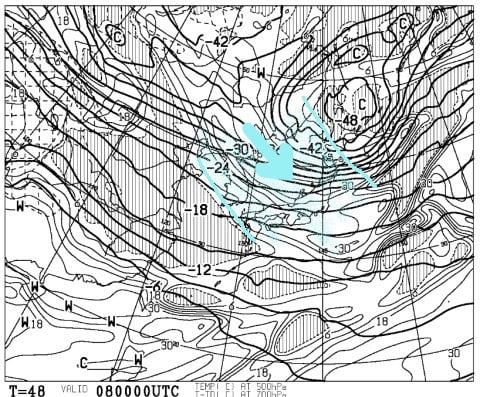

これは，湿数が大きい空気（北からの冷たい空気）が

日本海を超えて本州にぶつかっているということで．

このパターンの時は，麓で降らなかったとしても．

冷たい空気が山にぶつかって雪雲になり，

山の上で雪になるパターンです…

なので．

おそらく，8日は一日雪が降り続けます．

そこそこ積もるかも…

ってな感じで．

7日午後から8日にかけて，そこそこ雪が積もって

くれそうなので．

下のアイスバーンは結構隠れてくれてそうです…！

…雪が着きにくい，急斜面はダメっぽいですけど．

ってことで．

次は，3連休初日．9日の850hpa図を見てみますが．

この日も結構冷えますね．

水色の-9℃線が志賀高原に近づいているので．

朝の志賀の気温は，-10℃をわずかに下回る

程度でスタートしそう．

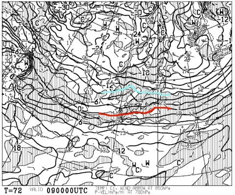

朝9時の地上天気図では，降水域の

水色が志賀にはかかっておらず．

朝はせいぜい雪がぱらつく程度だと思いますが．

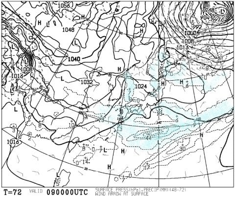

この，赤で囲った部分のプチ低気圧．

ホントにこいつがこの場所で発生するのか．

その後，どう発達するのかで，9日の

天気は大きく変わりそう…

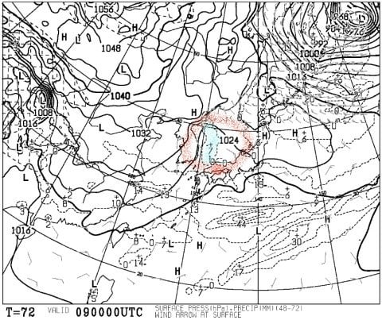

まぁ，このままの天気図なら．

9日は終日雪がぱらつく程度の

天気かな～．

で．

3連休中日，10日の850hpa予想図を見てみると．

うむ．

この日も，水色の-9℃線が志賀にかかっているので．

気っこく冷えそうですね．

朝は-10℃下回る冷え冷えになりそう．

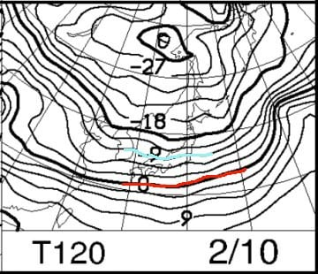

で，地上天気図を見てみると．

間隔は広めだけど，縦縞の天気図なので，

志賀高原は曇り～雪がぱらつく程度の天気かな…

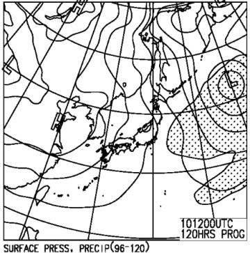

そして，3連休最終日の11日．

850hpa図を見ると．

この日も，志賀には-9℃線がかかっているので．

結構冷えそう！

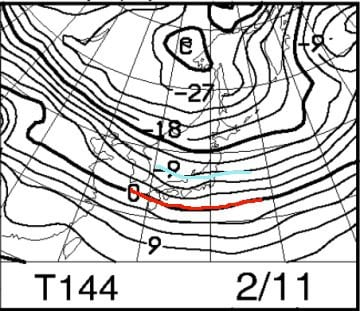

この日の地上天気図を見ると．

…この日は，西から高気圧が近づいて

来ているので．

朝から晴れるかは微妙ですが，

午後は晴れそうですね…！

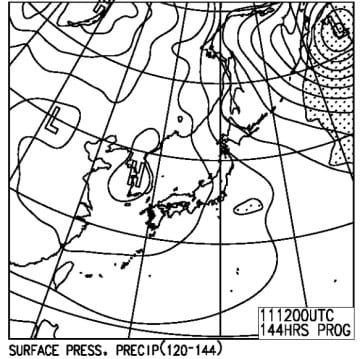

ってな感じで．

まとめると．

9日土曜：朝は-10℃程度の冷え冷えで，

　昨晩までの雪が圧雪された，やわらか圧雪で

　スタート．

　昼間も気温はそれほど上がらず，終日雪が

　ぱらつく天気．

　前日までの積雪で，朝のうちはアイスバーンは

　隠れているものの，急斜面や人が多い斜面では，

　じきに上の柔らかい雪がはがれて，下地の

　ツルツルが出てくる．

　午後はツルツルと柔らかい雪が入り交じる

　荒れ気味のコンディションに．

10日日曜：朝は-12℃程度程度まで冷え冷え．

　昼も-10℃くらいまでしか上がらない，激冷えの日．

　朝までうっすら積雪があり，朝イチのゲレンデは

　そこそこいい感じ．

　天気は終日曇り～雪．

　人が多い3連休中日なので，やはり，昼ごろには

　斜度のあるところはツルツルな下地が出てきそう…

　午後は底がツルツルの凸凹斜面になっちゃうかな．

11日月曜：この日も朝は-10℃を下回る，冷え冷えの朝！

　午前中は曇り空．小雪もぱらつく．

　昨晩からの積雪はほとんど無し．

　朝イチはきれいな圧雪バーンで気持ちいいかな．

　昼間も-5℃程度までしか上がらない．

　天気は，午後に向かって晴れていくかな…

　適度にバーンが締まって，午後は日も射して

　滑り良い一日になってくれそう．

ってな感じで．

3日ともそこそこ冷えて，曇り～小雪という感じで．

すっきり晴天や，パウダーはあまり望めなさそうな

3連休ですが．

逆に言えば，吹雪になることもなさそうなので．

まぁ，ぼちぼち楽しめる3連休になりそうかな…

うーむ．

月曜の雨で，下地がアイスバーンになったのが

惜しい…

## 💬 コメント一覧

### 💬 コメント by (しんちゃん)
**タイトル**: 参戦予定
**投稿日**: 2019-02-08 00:40:31

待っていました三連休ピンポイント天気予報！

3日とも冷え冷えコンディションのようで、3日とも参戦予定です。

どうぞよろしくお願いします。

### 💬 コメント by (Skier_S)
**タイトル**: しんちゃんさま
**投稿日**: 2019-02-08 01:12:47

3日とも，冷え冷えですよ～！

…でも，積雪があんまりないので．

じきに下地の硬いところが出てきそうですが…

で．

来週は，気温が上がりそうな予感…

とりあえず．

3連休，志賀でまたお会いしましょう！

### 💬 コメント by (MZMM)
**タイトル**: Unknown
**投稿日**: 2019-02-08 15:53:17

今日の志賀高原は、スキー天国。

志賀特有のはキュキュッと粉雪舞いとき薄青空と日。

東館山頂から一ノ瀬方向へ嬉々とスキーヤー途切れず。

昨日一昨日は、滑雪場転じ全面隅々まで滑冰場と化した一ノ瀬ファミリー最下部にボーダーも学習生徒も座り込み。

オーストラリアニュージーランド系より疎ら一般スキーヤー、NHK7時のニュース「大丈夫かスキー離れ」続々報。 奥志賀東館で(ビザの取りやすい)上海北京っ子スキーヤー、「下の湯田中は大陸客過半」とか。

大丈夫3〜5年すれば大陸客が上がってくる、哈哈😄

### 💬 コメント by (セツ)
**タイトル**: Unknown
**投稿日**: 2019-02-08 18:24:02

こんいちわ～、初めまして。

２日から５日まで志賀高原で滑っていた者です。（私自身はアキレス腱断裂のため実質３日までですが。）

３日まではいいお天気で、焼額も奥志賀もサイコーのコンデションでオリンピックコースも気持ち良く滑ることが出来ました。

４日日気温が上がってしまい、５日は特に高天が原なんぞは我々の強者でもエッジが掛からず、シャリシャリと言う音と共にまっすぐに落ちるしかなかったとのこと。

今シーズン私は終わってしまいましたが、３連休怪我無く安全にお楽しみくださいませ。

### 💬 コメント by (Skier_S)
**タイトル**: 今週末までは冷え冷え
**投稿日**: 2019-02-08 22:53:22

＞MZMMさま

今日も志賀高原滑ってらしたんですか？

いいですね～…

でも，やっぱり「滑氷場」ですか…（涙）

＞セツさま

始めまして～！

初コメントありがとうございます．

そして，アキレス腱断裂，ご愁傷様です…

今シーズン終了ですか…

志賀高原でお会いできないのが残念です．

でも，3日までは最高でしたね！

3連休は楽しんできます．

また来シーズン，志賀高原でお会いしましょう～！

…それまでは，またボチボチコメントください．

