# 2018/12/15(土)の志賀高原，焼額山スキー場は…積雪20㎝，2ゴン運転開始！冷え冷えで予想より良かったよ！

📅 投稿日時: 2018-12-16 01:35:17

ってなわけで．

焼額山．

昨晩から20㎝ほどの積雪があり．

本日から，ゴンドラも動き出しました～！！

（ぱちぱちぱち）

第2高速も昨日から動き出したので．

滑れるエリアは一気に拡大です！

えー．

まず．

須坂長野東ICからチェーン規制が入るほどだった

本日．

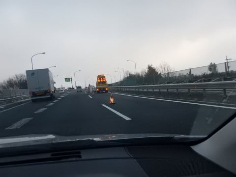

志賀高原への登り坂は本格雪道で．

完全に真冬の景色！

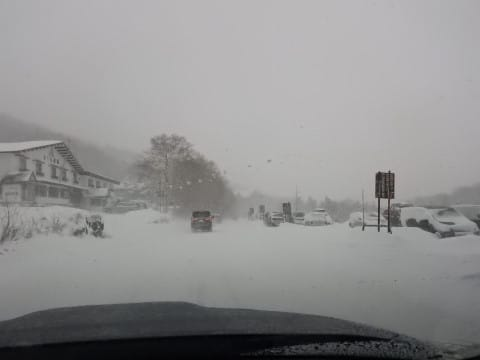

ようやく冬らしくなってきましたね～．

で．

本日の8:30の営業開始時点では，

まだ第2高速と第4ロマンスの2本しか

営業されてなかった焼額．

第2高速で山頂へ向かうと…

うむ．

先週とは打って変わって．

真冬っぽい景色！

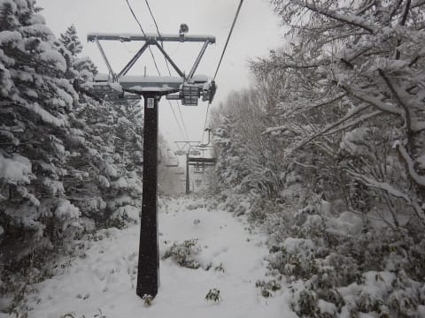

そして，ゲレンデに出てみると．

かなりの雪が降り続けており…

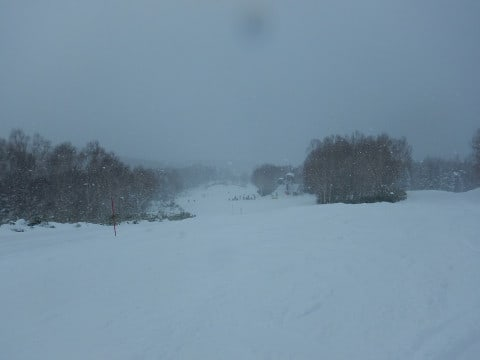

なんと．

コース上は，ブーツパフ！

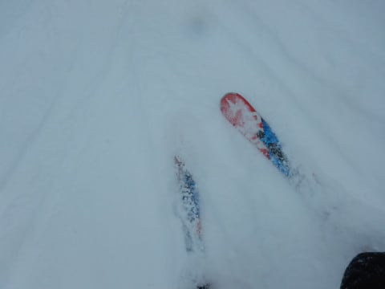

昨晩からの積雪は20㎝ほどはあったようです！

予想は10㎝だったんですけど…

嬉しい誤算！

人がいないあさイチゲレンデは，

ちょいとやわらかい雪の下に，

硬いバーンと氷のコロコロが

隠されている感じで．

超快感とまでは言えませんが…

でも，先週までに比べれば，

コース上の軽い新雪を蹴散らして

滑れるなんて…最高じゃないですか！！

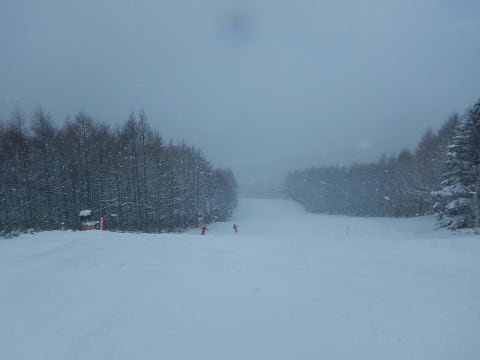

朝10時ごろまで，リフトは飛び乗りの

がらがら！

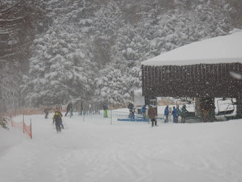

これで，ゲレンデの下地の硬いところさえ

無ければ…（ちょっとだけ残念）

ただし．

朝10時頃には，某都道府県連の

指導員研修会の団体さんが登場して，

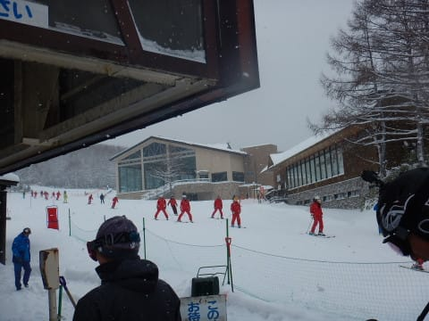

ちょっとだけリフトが混み始めました…

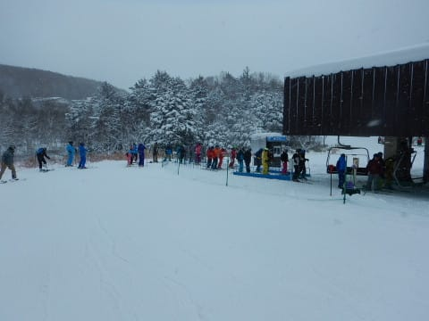

でも．

今日はリフト係員の方から，

「10時半目途で，第2ゴンドラ運転しますよ」

という嬉しい情報が！

なんと．

ゴンドラ搬器の準備が

進んでるじゃないですか！

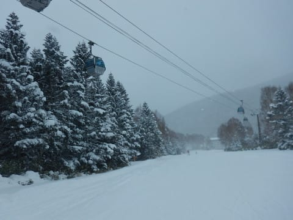

え？？

動くの？？

今日，ゴンドラ，動くの！？？

今週は絶対動かないと思った…．

嬉しい誤算っ！！

…と，運転開始直後のゴンドラに

飛び乗ると…

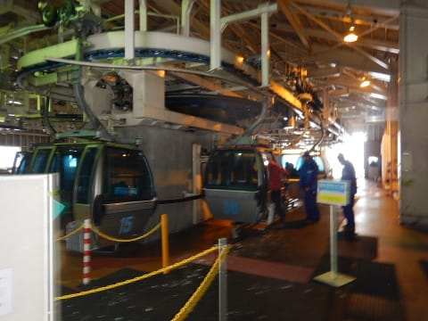

知り合いのゴンドラ係員の方から．

「今シーズンもよろしくお願いします～！

　若杉さんが今シーズンの焼額ゴンドラ

　第1号のお客さんでしたよ」

という報告をいただきました．

このBlogにコメントをいただく若杉さん．

ゴンドラ一番乗車，おめでとうござい

ました～

そして，やってきましたゴンドラ山頂．

うーん．

4月以来，実に8か月ぶりですね…！

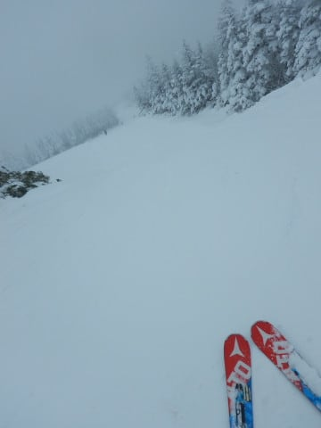

で．

久しぶりに，ゴンドラ山頂温度計とも

対面です．

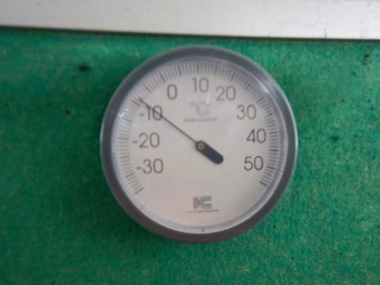

10:30過ぎでの山頂の気温は－8℃．

朝イチは－10℃を下回ってたんじゃない

かな？？

おおむね予想通りの冷え冷え！

そして，山頂のコース脇は…

うおおおおお！

脛パフじゃないですかっ！！

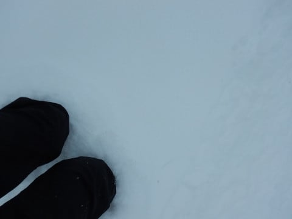

圧雪コースも，上に5～10㎝程度の新雪が

積もっていて…ようやく冬らしいゲレンデに

出会えた感じ！

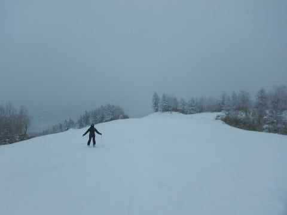

で，久しぶりにゴンドラのロングコースを

滑ってみて…

やっぱり，長く滑れるのは楽しい～っ！！

ビバ，ゴンドラ！

…ただ．

某都道府県連の研修会が入っていた

本日．

タイミングによっては，ゲレンデは

ちょいと人口密度が高くて．

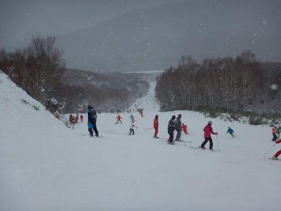

何班かが重なってゴンドラにやって

来た時なんかは，ゴンドラ乗り場でちょっと

待つこともありましたが．

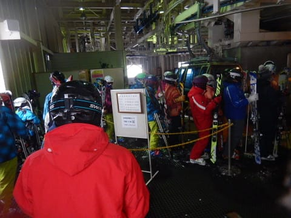

とはいえ．

ゴンドラは，運が悪いタイミング以外は

ほぼ待ちなし．

研修も，第2高速の唐松コースと

ゴンドラのパノラマ・サウスコースの

2コースの広い範囲に散らばっているので．

運が悪いこういうタイミングを除けば，

コース幅が広がっているのもあり，

それほど滑りにくくなかったです…

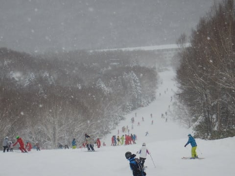

おおむね，ゲレンデの人口密度は

こんな感じだったかな～．

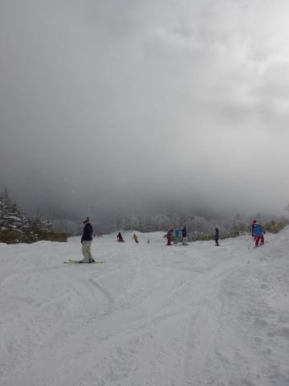

ただ，終日－5度を上回らないレベルの

冷え冷えだった本日．

雪質は良かったものの．

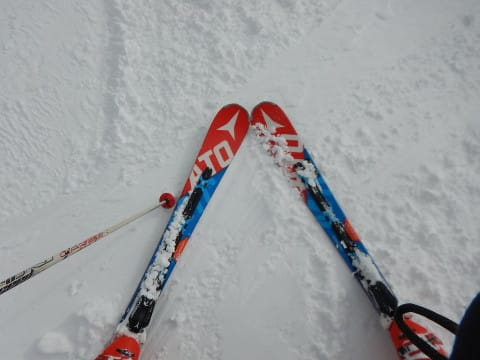

新雪が蹴散らされる午後には，

ゲレンデは荒れ荒れになり．

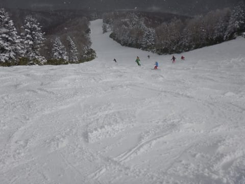

凸凹の溝がところどころ硬いという，

結構難しいコンディションに…（ちょい涙）

そして．

第2ゴンドラのパノラマコース．

第2高速降り場に向かって降りる

急斜面部分は…

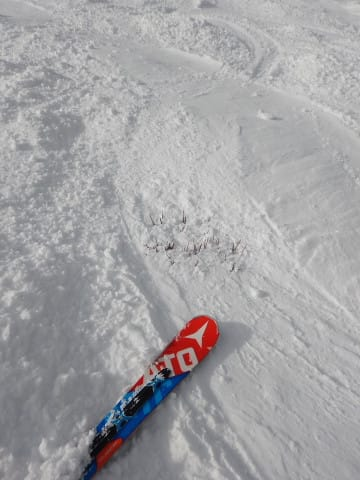

うむ！？？

コブ溝に，ブッシュさんがお出ましに

なってます…

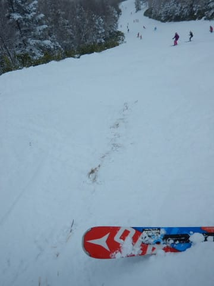

うーむ．

やっぱり，もう少し積雪が欲しいところ．

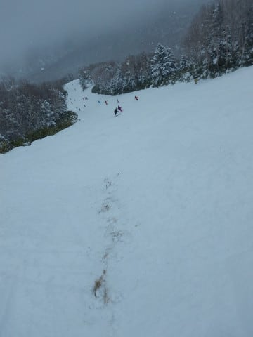

ってな感じで．

日が短い12月なので．

ゴンドラは15:30までと，短い営業時間

でしたが…

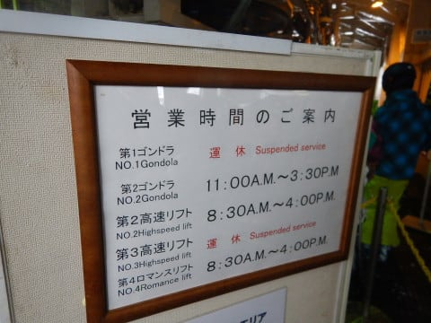

15:30を過ぎてくると，日も傾き

暗くなり始めてきます…

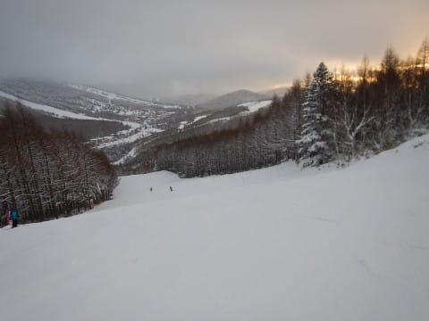

最後は，コースもかなり荒れ荒れで，

下地の硬いツルツルがところどころ顔を出す，

むずかしめのバーンコンディションでしたが．

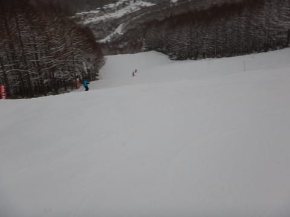

今日も16時のラストリフトまで，

たっぷり楽しんだのでした…

今晩から明日にかけては，積雪が

ほとんどないので．明日は朝イチは

ピカピカ圧雪が楽しめそうだけど．

明日もやっぱり，昼前には

結構硬い斜面が顔を出して

来そうな感じかな…

でも，久しぶりにゴンドラを滑ってみて．

激冷えだった本日．

ゴンドラが動くまでは寒くてたまらない

感じだったけど．

ゴンドラはやっぱりありがたい…

と思った一日だったのでした．

## 💬 コメント一覧

### 💬 コメント by (naoちゃんねる)
**タイトル**: 祝２ゴン運転
**投稿日**: 2018-12-16 17:18:21

土曜日はありがとうございました。

スーパーキッズに引っ張られたおかげで娘の滑走スピードが上がりました！

で、本日日曜日はタングラムで昼過ぎまで滑りましたが、スタートで遅れるとホントに追い付けなくなりました😅

リフト降り場から乗り場まで止まらず爆走する事がスキーの正しい滑り方だと学んだ様です(笑)

### 💬 コメント by (hsysmrkm)
**タイトル**: 初めまして  です。
**投稿日**: 2018-12-16 17:27:15

少し前からこちらのブログ読まさしてもらってます。素晴らしいレポートですね。ありがとうございます。自分もそこにいるような感じです。うーん、うらやましい限り。これからも西の国からおじゃまします。

### 💬 コメント by (Skier_S)
**タイトル**: コメント回答遅くなりました…
**投稿日**: 2018-12-17 22:59:24

コメント書いたのに，投稿ボタンを押してなくて

反映が遅くなりました．すみません…

＞naoちゃんねるさま

こちらこそ，土曜はありがとうございました～！

むしろ，巻き込んじゃったみたいですみませんでした．

しかし，間違った方向に教育されてしまったようですね…

20000mクラブのご子息さんは，みなさんどうもその方向に

進んでしまうようです…

＞hsysmrkm

初コメント，ありがとうございます～！

西の国から，ぜひ一度志賀高原にお越しください…

またコメントお待ちしています～！

