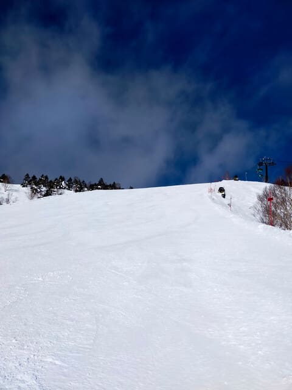
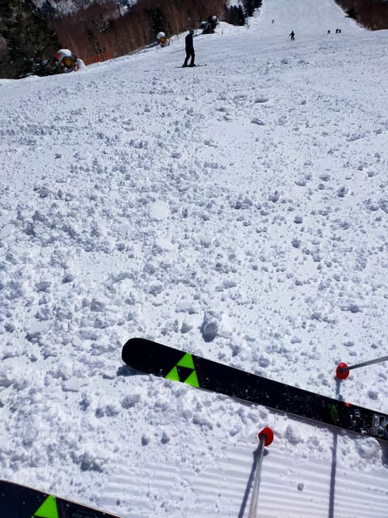
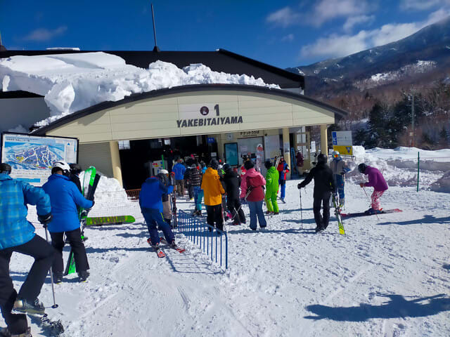
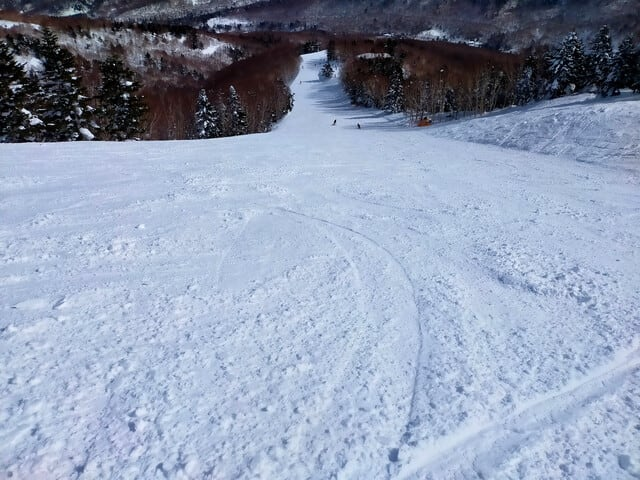
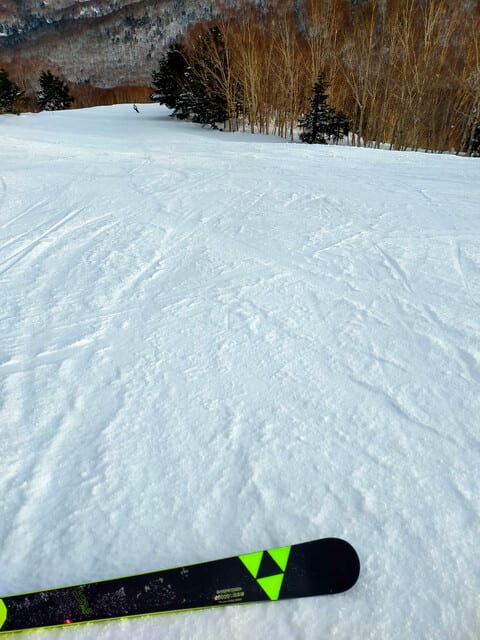
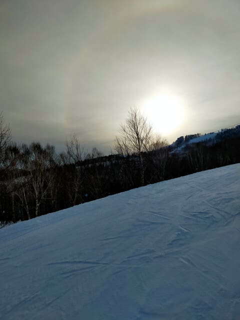

# 2025/2/16(日)の志賀高原焼額山スキー場，速報レポート！…晴れ時々曇り，気温は高めで昼間に雪は緩んだけど，雪は荒れずガラガラフラットバーン！

📅 投稿日時: 2025-02-17 02:49:51

本日もいつも通り，16:15のリフト

営業終了直前に最後のリフトに

飛び乗り，ラストまで滑って帰宅

しました…

全力でかっ飛ばして23時に帰宅して，

それからお願いされていた家庭の用事を

一仕事やっつけるともうこんな時間…

深夜2時半だよ（泣）

いつものことながら…

睡眠時間は金曜夜が2時間半，

土曜夜が5時間半．

そして2日間フルで滑ったあと，

今日もあと6時間後には出勤

せねばならないとなると…

明日朝，ちゃんと起きれるのかな…

とりあえず．

今日は早く寝ないと明日死ぬと思うので，

帰宅日のいつものパターンで，

本日の志賀高原レポート，速報モード

です！←Blog書いてないで寝ようよ…

まず．

本日の朝は曇り空でスタート．

曇り空だけど，気温は朝でも-5℃と，

この時期としては高めの気温でした．

で．

曇っていたのは朝のうちだけで…

9時過ぎには青空も見えるようになり，

9時半には雲が多いながらも晴れの

天気になりましたよ…！！

…ただ．

今日は気温が高く，昼間はプラス気温に

まで上がったので．

ときおり曇り空になることもあったとは

いえ，日差しが当たったゲレンデは，

雪がしっとりした感じになって，しまい…

うーん．2月としては雪質がちょいと

残念な感じ…

とはいえ．

2月の週末としては，ゴンドラ・リフトも

それほど混まず，ゴンドラはこの程度

並んだのがピーク．

これだけ並んだのも，10時から10時半の

30分くらいで，それ以外は搬器数台待ち

程度．

午後になると，ゲレンデ上の人もかなり少なく

なって，コースによっては貸し切り状態！

そして，日差しで緩んだ雪も，ザブザブに

なるわけじゃなく，ちょっとしっとりした

程度．

むしろこのしっとりした雪が踏まれて

いくことで，雪がしっかり押しつぶされた，

安定感のあるバーンになり．

午後になってもバーンはほとんど

荒れませんでしたよ～！

ってなことで．

今日もおおむね天気が良好で，

さらに人も週末にしては少なめで．

ラストまで大回りし放題のバーンを

好き放題かっ飛ばせたのでした～！

ということで．

この週末は土日とも天気が良く，

比較的気温が高めで穏やかな，

いい感じのスキー日和の2日間

だったわけですが．

…明日から一転します．

また17日(月)からは，激烈に冷えて

かなりの雪が降り始めます…

17日は朝から雪です！

17，18，19日と雪がひたすら降り続け，

そして風も強まりそうです…

18日以降は，リフトが動けば，パウダーの

チャンス！！

…とりあえず．

今日はもう眠いし，明日も仕事しなきゃ

ならないので，もう寝ます…

おやすみなさい…

## 💬 コメント一覧

### 💬 コメント by (富山県民)
**タイトル**: Unknown
**投稿日**: 2025-02-17 10:18:03

こんにちは。

2月16日も志賀高原を滑走したのですね。

2月16日も晴れてよかったですね。

私は2月16日はまず宿泊先の秋田県横手市から車で新潟県村上市にある村上市ぶどうスキー場に行き村上市ぶどうスキー場で2時間だけ滑走してその後長岡市にあるハイブ長岡まで行き長岡雪しか祭りを見物してその後自宅に帰宅しました。

村上市ぶどうスキー場は国道7号沿いにあるリフト2本のローカルスキー場で新潟県最北端のスキー場です。

リフト料金は1日券が3000円、4時間券が2000円、2時間券が1500円とリーズナブルです。

私は2時間券で滑走しました。

天気は曇り1時雨で雪質はザラメでした。

山頂からは朝日連峰や月山は見えませんでしたが日本海は何とか見えました。

村上市ぶどうスキー場には初めて行きました。

しかし村上市ぶどうスキー場は今シーズン（最終日は3月9日）をもって廃止になるので2月16日が私にとって最初で最後の訪問と滑走になりそうです。

### 💬 コメント by (副院長)
**タイトル**: Unknown
**投稿日**: 2025-02-18 07:47:22

S様、あきまへん。また、名神、新名神止めると、言うてます．三重県に雪降る風向きでないと、志賀高原にドサドサ降らないんだろうけど。帰れなくなると、次、行かせてもらえなさそうで、勇気ある撤退です。今週末まで、ドサドサ降って下さい。えーい、強風で、ゴンドラ止まれー。おっと失礼しました。

### 💬 コメント by (てつお)
**タイトル**: Unknown
**投稿日**: 2025-02-18 08:15:01

スキー場でお声掛けした者です。Sさんは滑りが上手いですね！というか、速い！あのスピードで１日中、滑っているなんて驚異の体力。感服しました…

### 💬 コメント by (よっちんこ)
**タイトル**: Unknown
**投稿日**: 2025-02-18 19:23:01

ブログいつも拝見しております。

お忙しい中いつもお疲れ様です。

１月29日から２月2日まで焼額山スキー場で四日間滑っていましたのでどこかで出会ってますかね？

今週、木曜から白馬で最終のシーズンを滑りに行く予定です！

最終ランも最高なコンディションで今年は良いシーズンになりました！

こちら、白馬にマンションがありますのでこちらには年間で何度か来ていますが徒然スキーヤー様は白馬には来られることはありますか？

### 💬 コメント by (Skier_S)
**タイトル**: コメント回答遅れてごめんなさい
**投稿日**: 2025-02-19 01:09:29

＞富山県民さま

村上市ぶどうスキー場…かなりマイナーなスキー場まで知ってるつもりの私も

初耳のスキー場です…そして今シーズンで廃止なんですね．

しかしなぜそんなマイナースキー場へ？？

＞副院長さま

いやー．また通行止めですか…！！

勇気ある撤退，素晴らしい判断です．ゴンドラは止まってないようですが(笑)．

また来週お会いしましょう…！

＞てつおさま

声をかけていただきありがとうございました～！

滑りもしっかり見られてたんですね…ちょっと恥ずかしい(笑)．

あのスピードで休まず止まらず，昼休みも取らずにナイターまで滑り続けてます～！

＞よっちんこさま

ご愛読ありがとうございます～！

2月1，2は滑ってたので…どこかですれ違ってるのかも？？

私は志賀高原のシーズン券をもっているので，リフト券代がかかるほかのスキー場へは

行かなくなりましたので，残念ながら白馬へはここ10年ほど行ってないです…

しかし，木曜でシーズン終わりですか！？？？

まだまだスキー滑れますよ～！！

