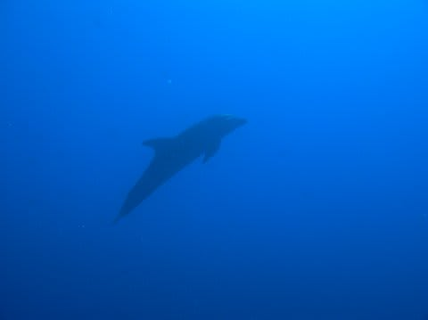

# 2009年　初の海外子連れダイビング旅行記　25　Final dive

📅 投稿日時: 2012-09-25 00:08:59

🏷️ カテゴリ: [ダイビング日記](ce3a7a8d424d112fce83ee85c81a0e344.md)

って感じで．

「空とお魚」って写真を撮っていたら．

午後のダイビングスタート時間が来てしまったので，撮影を切り上げてダイブショップへ．

3時30分ブリーフィング開始．

言うまでもなく，ポイントはいつものティプタパス．

…なんと．

早くも，これがタヒチで最後のダイビングです．

早い．早すぎる．

んで．

いつものゴムボートに乗り込んで，ポイントへ向かうと…

うおおお！

今回はエントリー前から，ボートの前でイルカが泳いでるぞっ！

これは，期待が高まるっ！

まっててよ，イルカちゃーん！

と，高まる心でエントリー．

エントリー後しばらくしたら…

現れましたっ！

水面にイルカが２頭っ！

でも，イルカは水面．我々の水深は20m．

ちょいと遠いなぁ…

数分間，水面のイルカと20mの我々で平行して泳いでましたが…

イルカは水面を泳ぐのに飽きたのか，1頭のイルカが頭を下にして，

まっすぐ垂直に潜り始めました．

よし，こっちに来い！

と思ったけど…

無情にも，潜った後，それほど近づくことなくすーーーーーっと

向こうに泳ぎ去ってしまいました．

（心の目で見ないとイルカがわからない程度の写真しか撮れなかった…）

残るもう1頭のイルカは，まだ水面にいます．

こいつもしばらく後，潜り始めました．

来い！と思う間もなく…

こいつは明らかにあさっての方向に向かって潜って行きました．

あああああ．

残念…

ラストダイブでも，イルカとの第3種接近遭遇はならなかったか…

でも，遠いとはいえイルカを見ながら5分以上泳いでいるんだから，

近づけなかったと嘆くのは贅沢というもんでしょう．

そして．イルカが通り過ぎた直後に今度はマンタが一瞬通過．

（これも心の目で見ないと見えないような写真しか残っていない…）

さらに底の方ではサメが2-3匹通り過ぎていきます．

そしてまばらながらもバラクーダやらカマスの群れ…

そして棚の上に上がると…

カメやらナポレオンやらを眺めながら流されていきます．

その後，フエフキダイのすさまじい群れやら，

カスミアジの群れやら単体のカイワリ？やら…

水面付近で魚の群れなどを眺めつつエグジット．

うーーーん．

世界広しといえども，1ダイブでイルカとマンタとカメと

サメとバラクーダとナポレオンとアジの群れを見ることの

できる「全部入り」ポイントは無いでしょう．

とりあえず，これでタヒチでの全ダイビングは終了…

で．ランギロアでのイルカ遭遇率は，

妻は3本中2本．66%．

一緒のボートの人5本中4本．80%．

という高確率！

だのに…私は4本中2本．…50%．

なぜか私以外は，イルカを外したダイビングは1本のみ．

私のみ，50％の確率でイルカを外しました．

…悔しい～．

日ごろの行いが悪かったのか…

でも，半分のダイビングでイルカにあえてるんだから，

普通に考えるとすごい遭遇率なんですけどね．ランギロア．
